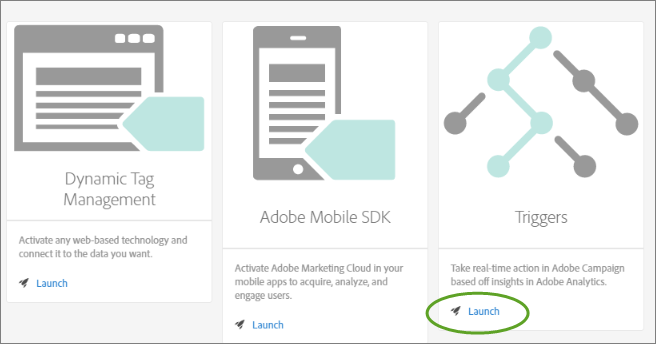

# Triggers

## Übersicht über Triggers {#topic_4F21FCE9A64E46E8B6D51F494FA652A7}

*Auslöser* ermöglichen es Ihnen, wichtige Verhaltensweisen von Verbrauchern zu identifizieren, zu definieren und zu überwachen und dann eine lösungsübergreifende Kommunikation zu generieren, um Besucher erneut zu interagieren. Sie können Auslöser bei Entscheidungen und Personalisierung in Echtzeit verwenden.

* Schnelles Remarketing für Warenkorbabbrüche oder Warenkorbabbrüche mit entfernten Produkten konfigurieren
* Unvollständige Formulare und Anwendungen
* Aktionen oder Abfolgen von Aktionen auf der Site

### Triggers-typen

Im Allgemeinen kann ein Auslöser 15 bis 90 Minuten benötigen, um eine Marketing-Kampagne zu starten. Dies hängt von der Implementierung der Datenerfassung, der Auslastung der Pipeline, der benutzerdefinierten Konfiguration des definierten Triggers und dem Workflow in Adobe Campaign ab.

* **Abbruch:** Sie können einen Auslöser für den Fall erstellen, dass ein Besucher ein Produkt anzeigt, es jedoch nicht zum Warenkorb hinzufügt. Konfigurieren Sie die [Tendenzauswertung](../activation/triggers.md#concept_A506150674AD45DB98D3CC07E560D334), um die Tendenz von Kunden zu verstehen, einen Einkauf abzubrechen.
* **Aktion:** Sie können Auslöser erstellen, die z. B. nach der Newsletter-Anmeldung, E-Mail-Abonnements oder Kreditkartenanträgen (Bestätigungen) ausgelöst werden. Wenn Sie ein Händler sind, können Sie einen Auslöser für einen Besucher erstellen, der sich für ein Treueprogramm anmeldet. Erstellen Sie in Medien und Unterhaltung Auslöser für Besucher, die eine bestimmte Sendung ansehen, und vielleicht möchten Sie mit einer Umfrage reagieren.
* **Sitzungs-Beginn und Sitzungsende:** Erstellen Sie einen Auslöser für die Ereignis zum Sitzungsende und Beginn zum Sitzungsende.

## Experience Cloud Trigger erstellen {#task_821F37183AC045E5AC8EED20317598FE}

Erstellen Sie einen Abbruchsauslöser und konfigurieren Sie die Bedingungen für Auslöser und Tendenzauswertung. Sie können beispielsweise die Kriterien für die Regeln eines Auslösers während eines Besuchs angeben, z. B. Metriken wie Warenkorbabbruch oder Dimensionen wie den Produktnamen. Wenn die Regeln erfüllt sind, wird der Auslöser ausgeführt.

>[!NOTE]
>
>Derzeit existiert eine technische Begrenzung von 100 Triggern.

1. Klicken Sie in der Experience Cloud auf  und dann auf **[!UICONTROL Activation]**.
1. Klicken Sie in der Registerkarte [!UICONTROL Triggers] auf **[!UICONTROL Starten]**.

   

1. Klicken Sie auf **[!UICONTROL Neuer Trigger]** und geben Sie dann den Trigger-Typ an:

   

1. Konfigurieren Sie den Auslöser, indem Sie die folgenden Felder vervollständigen und Metrik- und Dimensionselemente in die Regelbehälter ziehen:

   | Element | Beschreibung |
   |--- |--- |
   | Name | Der Anzeigename für diesen Auslöser. |
   | Beschreibung | Die Beschreibung dieses Auslösers, wie Sie ihn verwenden werden usw. |
   | Report Suite | Die für diesen Auslöser verwendete Analytics- [Report Suite](https://docs.adobe.com/content/help/en/analytics/implementation/analytics-basics/ref-reports-report-suites.html) . Diese Einstellung identifiziert die zu verwendenden Berichte-Daten. |
   | Visit must include Visit must not include Trigger after no action Include meta data | Sie können Kriterien oder Besucherverhalten, das auftreten soll, sowie Verhalten, das nicht auftreten soll, definieren.  Regeln für einen einfachen Warenkorbabbruchsauslöser können beispielsweise die folgenden sein:<ul><li>Besuch muss Folgendes beinhalten: „Zusatz zum Warenkorb“ (Metrik) und „Vorhanden“. (Sie können die Regel mit einer bestimmten Produktansicht oder mit Dimensionen wie „Browsertypen“ weiter verfeinern.)</li><li>Besuch darf Folgendes nicht beinhalten: Checkout.</li><li>Auslöser nach ausbleibender Aktion bei: 10 Minuten.</li><li>Metadaten einschließen: Sie können eine bestimmte Kampagnendimension oder Variablen, die für das Verhalten eines Besuchers relevant sind, hinzufügen. Dieses Feld kann für Adobe Campaign zum Verfassen der richtigen Remarketing-E-Mail nützlich sein.</li></ul> Sie können eine Beliebige-, Und- oder Oder-Logik innerhalb oder zwischen Behältern angeben, je nachdem, welche Kriterien Sie für die Regel für wichtig halten. |
   | Container | Container sind der Ort, an dem Sie Regeln, Bedingungen oder Filter festlegen und speichern, die einen Auslöser definieren. Wenn Sie möchten, dass Ereignis gleichzeitig auftreten, setzen Sie sie in denselben Container. Dies bedeutet, dass jeder Behälter unabhängig auf der Trefferebene arbeitet.  Wenn Sie beispielsweise zwei Behälter mit dem Operator „Und“ verbinden, treffen die Regeln zu, wenn zwei Treffer die Anforderungen erfüllen. |
   | Beginn neue Sitzung nach | Erstellen Sie einen Auslöser für die Ereignis zum Sitzungsende und Beginn zum Sitzungsende. |

1. (Optional) In [!UICONTROL Abandonment triggers], you can apply [Propensity Scoring](../activation/triggers.md#concept_A506150674AD45DB98D3CC07E560D334).

   

1. Klicken Sie auf **[!UICONTROL Speichern]**.
1. Use triggers for [real-time remarketing](https://docs.campaign.adobe.com/doc/standard/en/EMA_Transactional_messaging_Marketing_Cloud_Triggers.html) in [!DNL Adobe Campaign].

### Beispielauslöser

Beispiele für Experience Cloud-Auslöser:

#### Warenkorbabbruchsauslöser

Die folgende Seite zeigt beispielsweise Regeln, die Sie für einen Auslöser für den Warenkorbabbruch verwenden können, basierend auf Produkten, die während eines Besuchs angesehen wurden.

#### Werber-Auslöser

Der folgende Auslöser wird ausgelöst, wenn ein Treffer mit dem Produkt Herrenstiefel und Werber von Facebook eingeht. For the two criteria (*products* and *referrer*) to be evaluated in the same hit, they should be added to the same container.

## Tendenzauswertung {#concept_A506150674AD45DB98D3CC07E560D334}

Verstehen Sie die Tendenz der Kunden, nach dem Abbruch eines Warenkorbs zurückzukehren. Die Tendenzauswertung ist in Experience Cloud Triggers integriert und für Abbruchsauslöser verfügbar.

So verlassen einige Kunden zum Beispiel Einkaufswagen, um E-Mail-Anreize zu nutzen, um zum Einkaufswagen zurückzukehren. Um den Umsatzverlust zu reduzieren, hilft der Tendenzauswertungsalgorithmus bei der Identifizierung der relevanten Warenkorbabbrecher, die ohne den Anreiz wahrscheinlich nicht zurückkehren würden.

Sie haben folgende Möglichkeiten:

* Vermeiden Sie es, Ihre Kunden dem Remarketing zu überlassen.
* Identifizieren Sie die richtigen Kunden, die den Warenkorb verlassen, und ordnen Sie ihre Aktivität der richtigen Nachricht zu.
* Steigern Sie den Umsatz, indem Sie wissen, welche Kunden zurückkehren werden und welche nicht.

### Vorteile der Tendenzauswertung  {#section_CA99874A25434CC0BF01D0DA61608889}

Sie können die Datenerkennung durchführen, um verborgene Verhaltensweisen oder Muster zu identifizieren, die in Ihren Daten vorhanden sind. Insbesondere hilft Ihnen die Tendenzauswertung dabei, Cluster ähnlicher Kunden anhand fokussierter und objektiverer Mittel zu identifizieren, anstatt mit einfacher Segmentierung oder Filterung. Darüber hinaus können Sie mithilfe der Tendenzauswertung Prognosefähigkeiten zur Identifizierung des Verhaltens von Kunden mit hohem Wert Ihrer Firma einrichten.

Sobald Sie die hochwertige Audience identifiziert haben, können Sie sie für die größtmögliche Wirkung aktivieren. Wenn Sie z. B. eine Business-to-Business-Firma sind, haben Sie möglicherweise Interessenten für Verkaufsgespräche, mit denen Sie dann die Interessenten bewerten und deren Wahrscheinlichkeit identifizieren können, offline zu konvertieren. Da jeder Interessent die Kosten erhöht, ist die Schaffung eines Anreizes zur Identifizierung potenzieller Kunden mit der höchsten Wahrscheinlichkeit, einen Verkauf umzurechnen, die effektivste und kostengünstigste Möglichkeit, Ihre Ressourcen zu konzentrieren.

Tendenzauswertung bietet die Möglichkeit, diejenigen Faktoren zu identifizieren, die für ein bestimmtes Ergebnis am besten vorhersagbar sind, oder die Wahrscheinlichkeit zu erhöhen, dass ein Ereignis stattfindet. Sie kann aber auch zur Beantwortung spezifischer Fragen angewendet werden:

* Wird der Kunde umrechnen?
* Reagiert der Kunde auf eine E-Mail?
* Wird der Kunde zurückkaufen?

Mithilfe der Tendenzauswertung können Sie diese Fragen beantworten und Besucher mit einer Tendenz zu Aktionen identifizieren, die dann eingerichtet und bewertet werden können.
