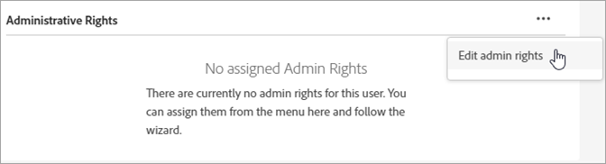

# Verwalten von Experience Cloud-Benutzern und -produkten

Erfahren Sie mehr über die Anmeldung bei der Admin Console, die Verwaltung von Experience Cloud-Benutzerberechtigungen und Produktprofilen sowie die Browserunterstützung.

>[!IMPORTANT]
>
>Die folgenden Informationen gelten speziell für Experience Cloud-Anwendungen. Diese Informationen ergänzen die im [Benutzerhandbuch für Enterprise-Administratoren](https://helpx.adobe.com/de/enterprise/admin-guide.html) enthaltenen allgemeinen Informationen für alle Adobe Cloud-Produkte.

Sie können im Admin-Tool eine sortierbare und filterbare Liste aller Experience Cloud-Benutzer und deren Details anzeigen. Siehe [Anzeigen von Experience Cloud-Benutzern im Admin-Tool](admin-tool-experience-cloud.md).

## Experience Cloud-Benutzerauthentifizierung (geplante Migration){#migration}

Ab Februar 2022 aktualisiert Adobe sein Profilverwaltungssystem, damit Unternehmen ihre Unternehmensberechtigungen für einzelne Profile besser verwalten können. Daher werden alle Benutzer mit einem persönlichen Profil, das einer einzelnen Adobe ID (Typ 1) entspricht, in ein neues Geschäftsprofil migriert. Dieses Profil entspricht einem _Business ID_ (Type2e).

Siehe [Identitätstypen in Adobe Admin Console](https://helpx.adobe.com/de/enterprise/using/identity.html) für Informationen zu Identitätstypen.

### Migrationsprozess

Wenn es für Ihre Migration Zeit ist, erhalten Organisationsadministratoren 30 Tage vor der Migration eine Benachrichtigungs-E-Mail.

* Die Migration wird zwischen 22.00 Uhr geplant. - 6 Uhr, basierend auf der primären Zeitzone der Organisation oder am Wochenende.
* Während der Migration kann der Zugriff auf die Experience Cloud-Anwendung etwa 15 Minuten lang unterbrochen werden und die Admin Console kann bis zu 30 Minuten lang nicht verfügbar sein. Andernfalls ist diese Migration nahtlos.

### Änderungen nach der Migration

Admin Console

* Administratoren mit mehreren Konten sehen möglicherweise eine Profilauswahl, wenn sie sich bei anmelden [!UICONTROL Admin Console].
* Einzelne Adobe ID-Benutzer werden auf die Business ID aktualisiert.
* Das Business ID-Verzeichnis wird hinzugefügt in **[!UICONTROL Einstellungen]** > **[!UICONTROL Identität]** > **[!UICONTROL Verzeichnisse]**.

   

### Anmeldung nach der Migration

Ihr Anmeldeerlebnis ändert sich mit diesem Update nicht:

1. Anmelden bei `experience.adobe.com` dieselben Anmeldeinformationen verwenden.

1. Es wird ein neues Profil erstellt, das mit der Business ID verknüpft ist. Sie werden aufgefordert, **[!UICONTROL Jetzt Mitglied werden]** oder **[!UICONTROL Überspringen]**.

1. Die Verwendung einer der Optionen führt zu einem vorhandenen Landingpage-Erlebnis.

1. Jedem Geschäftsplan ist ein Adobe-Profil zugeordnet, das die Möglichkeit bietet, aus zusätzlichen Adobe Cloud-Angeboten (Creative Cloud und Document Cloud) erstellte Assets zu organisieren.

Weitere Informationen finden Sie unter [Einführung in Adobe-Profile](https://helpx.adobe.com/de/enterprise/kb/introducing-adobe-profiles.html).

## Was ist ein Produktprofil? {#section_AB50558124D541CF80A0D3D76D35A4BF}

_[!UICONTROL Produktprofile]_ sind Gruppen von Produkten und Diensten, die Sie Benutzern zuweisen können. In Experience Cloud basieren die Berechtigungen auf dem Produktprofil und nicht auf dem Benutzer. (Sie können jedoch bestimmten Benutzern Administratorrechte zuweisen.)

In Analytics können Sie beispielsweise eine Sammlung von Reporting-Tools wie Analysis Workspace und Report Builder sowie Report Suites, Metriken und Dimensionen konfigurieren. Sie können einem Produktprofil Berechtigungen erteilen, indem Sie dem Profil Benutzer hinzufügen.

* Siehe [Analytics-Zugriffsberechtigungen einem Produktprofil zuweisen](admin-getting-started.md#task_040673FE3E3E429B9531FBCB8B6A4391) auf dieser Seite.
* Siehe [Delegieren von administrativen Rollen an Benutzer](#delegate-rights) auf dieser Seite.

## Verwalten von Experience Cloud-Produktprofilen {#task_16335111C52D40E9BAC73D0699584DBF}

Sie können ein Produktprofil erstellen und es einer Berechtigungsgruppe zuweisen.

Wenn Sie einen Benutzer zu einer Organisation einladen, können Sie dem Benutzer Zugriff auf Produkte und Produktprofile gewähren. Sie können auch eingeschränkte Administratorberechtigungen an einen Benutzer delegieren. Auf ähnliche Weise können Sie Benutzergruppen erstellen und die Gruppe dann einem Produktprofil hinzufügen, um den Zugriff zu aktivieren.

1. Klicken Sie in der [Admin Console](https://adminconsole.adobe.com/enterprise/) auf **[!UICONTROL Produkte]**.
1. Wählen Sie den Namen Ihres Unternehmens aus.
1. Wählen Sie **[!UICONTROL Neues Profil]** aus.
1. Konfigurieren Sie die Profildetails und klicken Sie dann auf **[!UICONTROL Speichern]**.

Weitere Informationen (und Hilfe zur Produktverwaltung für Creative Cloud und Document Cloud) finden Sie unter [Identität](https://helpx.adobe.com/de/enterprise/admin-guide.html/de/enterprise/using/identity.ug.html) im [Administrations-Benutzerhandbuch](https://helpx.adobe.com/de/enterprise/admin-guide.html/de/enterprise/using/users.ug.html).

**Verwandte Hilfe.**

* [Produkte und Profile verwalten](https://helpx.adobe.com/de/enterprise/admin-guide.html/de/enterprise/using/manage-products.ug.html) im Administrations-Benutzerhandbuch.
* [Enterprise-Benutzerberechtigungen](https://experienceleague.adobe.com/docs/target/using/administer/manage-users/enterprise/property-channel.html?lang=de) in der Hilfe zu Adobe Target.
* Video: [Konfigurieren von Adobe Target-Arbeitsbereichen in der Adobe Admin Console](https://helpx.adobe.com/de/target/kb/how-to-configure-target-workspaces-in-adobe-admin-console0.html)

## Delegieren von administrativen Rollen an Benutzer {#delegate-rights}

In der Admin Console können Sie eingeschränkte Administratorrechte an andere Personen in Ihrem Unternehmen delegieren. Delegierte Rollen ermöglichen es Benutzern, den Softwarezugriff für Endbenutzer zu verwalten, Zugriffsimplementierungsfunktionen bereitzustellen und als Stellvertreter des Supports zu fungieren.

Sie können zum Beispiel:

* Ihren Creative Director Zugriff auf die Creative Cloud gewähren lassen.
* Ihren Marketing Director Zugriff auf die Experience Cloud gewähren lassen.
* Halten Sie diese beiden Rollen getrennt, damit sie die jeweils andere Rolle nicht überschreiten können.

Mithilfe dieser Rollen können Sie die Verwaltung gleichzeitig an andere delegieren, ohne mehr Funktionen bereitzustellen, als benötigt werden.

1. Klicken Sie in der Admin Console auf **[!UICONTROL Benutzer]** und anschließend auf den entsprechenden Benutzernamen.

   

1. Klicken Sie auf **[!UICONTROL Administratorrechte bearbeiten]**.

   

1. Legen Sie die Administratorrechte des Benutzers fest.
1. Wählen Sie **[!UICONTROL Speichern]** aus.

## Analytics-Benutzer und -Produkte verwalten {#section_97DE101F92CD494AB073893680992F1A}

Sie können einem Produktprofil Zugriffsberechtigungen für Analytics-Berichte (Report Suites, Metriken, Dimensionen usw.) zuweisen.

Sie können beispielsweise ein Produktprofil erstellen, das mehrere Analytics-Tools ([!UICONTROL Analysis Workspace], [!UICONTROL Reports &amp; Analytics]und [!UICONTROL Report Builder]). Diese Profile enthalten Berechtigungen für bestimmte Metriken und Dimensionen (einschließlich eVars) sowie Funktionen wie Segmente oder die Erstellung berechneter Metriken.

1. Melden Sie sich bei [der Admin Console](https://adminconsole.adobe.com/enterprise) an und klicken Sie dann auf **[!UICONTROL Produkte]**.
1. Klicken Sie auf der Seite [!UICONTROL Produkte] auf Ihr Produkt und danach auf **[!UICONTROL Berechtigungen]** (nur für Administratoren verfügbar).
1. Konfigurieren Sie die Profilberechtigungen:

| Element | Beschreibung |
|--- |--- |
| Report Suites | Aktivieren Sie Berechtigungen für bestimmte Report Suites. |
| Metriken | Aktivieren Sie Berechtigungen für Traffic, Konversion, benutzerspezifische Ereignisse, Programmereignisse, Inhaltsbewahrung usw. |
| Dimensionen | Passen Sie den Benutzerzugriff auf einer granularen Ebene an, einschließlich eVars, Traffic-Berichte, Programmberichte und Pfadberichte. |
| Report Suite-Tools | Aktivieren Sie Benutzerberechtigungen für Webdienste, Report Suite-Verwaltung, Tools und Berichte sowie Dashboard-Elemente. |
| Analytics-Tools | Gewähren Sie Benutzern Zugriff auf allgemeine Elemente (Abrechnung, Protokolle usw.), Unternehmensverwaltung, Tools, Web-Services, Report Builder und die Data Connectors-Integration. Die Unternehmenseinstellungen aus der Kategorie „Anpassung der Admin Console“ sind nun in den Analytics-Tools zu finden. |

**Migration von Benutzerkonten**

Analytics-Administratoren können Benutzerkonten mithilfe des verfügbaren Analytics-Migrationstools für Benutzer-IDs von der Analytics-Benutzerverwaltung in die [Adobe Admin Console](https://adminconsole.adobe.com/enterprise/) migrieren.

Die Kontomigration erfolgt für Kunden stufenweise. Adobe wird Sie benachrichtigen und unterstützen, wenn Sie an der Reihe sind, Ihre bestehenden Benutzerkonten von **[!UICONTROL Admin Tools]** > **[!UICONTROL Benutzerverwaltung]** in die Admin Console zu migrieren.

Nach der Migration müssen sich Benutzer mithilfe ihrer Adobe ID (oder Enterprise ID) anmelden und sich unter [experience.adobe.com](https://experience.adobe.com) für ihre Experience Cloud-Programme und -Services authentifizieren. Benutzer, die versuchen, sich über die bisherigen Anmeldedaten anzumelden ([!DNL my.omniture.com], [!DNL sc.omniture.com] und [!DNL experiencecloud.adobe.com]), werden an [!DNL experience.adobe.com] weitergeleitet.

**Verwandte Hilfe.**

* [Analytics in der Admin Console](https://experienceleague.adobe.com/docs/analytics/admin/admin-console/home.html?lang=en)
* [Migration der Analytics-Benutzer-ID](https://experienceleague.adobe.com/docs/analytics/admin/user-product-management/migrate-users/c-migration-tool.html?lang=de)

## Verwalten von Adobe Target - Produktprofile im Vergleich zu Arbeitsbereichen {#section_3860AF177C9E4C7E9C390D36A414F353}

In Adobe Target ist ein Arbeitsbereich ein Produktprofil. Er ermöglicht einer Organisation das Zuweisen bestimmter Benutzergruppen zu bestimmten Eigenschaftsgruppen. Arbeitsbereiche ähneln auf vielerlei Weise den Report Suites in Adobe Analytics.

Siehe:

* [Berechtigungen für Unternehmensbenutzer](https://experienceleague.adobe.com/docs/target/using/administer/manage-users/enterprise/property-channel.html?lang=en)
* [Verwalten von Produkten und Profilen](https://helpx.adobe.com/enterprise/admin-guide.html/enterprise/using/manage-products.ug.html)
* Video: [Konfigurieren von Adobe Target-Arbeitsbereichen in der Adobe Admin Console](https://helpx.adobe.com/target/kb/how-to-configure-target-workspaces-in-adobe-admin-console0.html)

## Verwalten von Campaign-Produktprofilen, Mandanten und Sicherheitsgruppen {#section_09CDF75366444CF5810CF321B7C712F3}

Ein *Mandant* wird in Campaign auf der Seite „Produkte der Admin Console“ als *Produkt* angezeigt.

*Sicherheitsgruppe* wird als Produktprofil angezeigt.

Informationen zu Sicherheitsgruppen und zum Zuweisen von Benutzern zu Sicherheitsgruppen finden Sie unter [Verwalten von Gruppen und Benutzern](https://experienceleague.adobe.com/docs/campaign-standard/using/administrating/users-and-security/managing-groups-and-users.html?lang=de).

## Verwalten der Experience Platform-Datenerfassung (Launch) {#section_F2DA6778DD2D48AA8F794041971EE6B1}

Experience Platform [!UICONTROL Datenerfassung] ([!UICONTROL Launch]) wird auf der Seite [!UICONTROL Produkte] in der [!UICONTROL Admin Console] angezeigt. Sie können andere Anwendungen und Dienste in ein Launch-Produktprofil aufnehmen.

Laden Sie Benutzer zu [!UICONTROL Platform Launch] ein und weisen Sie ihnen Benutzerrollen und -rechte zu.

Informationen zu Benutzerberechtigungen in der Admin Console und zum Einrichten Launch-spezifischer Optionen, einschließlich der Zuweisung von Rechten zu Profilen, finden Sie unter [Benutzerverwaltung](https://experienceleague.adobe.com/docs/experience-platform/tags/admin/user-permissions.html?lang=de).

## Experience Manager as a Cloud Service

Adobe Enterprise-Kunden werden in der Adobe [!UICONTROL Admin Console] als Organisationen dargestellt. Experience Manager-Kunden können die Adobe [!UICONTROL Admin Console] verwenden, um ihre Produktberechtigungen und die IMS-Authentifizierung für Experience Manager als [!UICONTROL Cloud Service] zu verwalten.

Siehe [IMS-Unterstützung für Experience Manager as a Cloud Service](https://experienceleague.adobe.com/docs/experience-manager-cloud-service/security/ims-support.html?lang=de).

## Audience Manager {#section_C31E3FA8A1E14463B1B3E07235F1983C}

Erstellen Sie Audience Manager-Benutzer und weisen Sie sie Gruppen zu. Sie können auch Einschränkungen anzeigen (Eigenschaften, Segmente, Ziele und [!DNL AlgoModel]).

Siehe [Administration](https://experienceleague.adobe.com/docs/audience-manager/user-guide/features/administration/administration-overview.html?lang=de) in der Hilfe zu Audience Manager.

## Unterstützte Browser in der Experience Cloud

* [!DNL Microsoft® Edge] (Microsoft® hat für Internet Explorer 8, 9 und 10 den [Support beendet](https://www.microsoft.com/de-de/WindowsForBusiness/End-of-IE-support). Aus diesem Grund werden von Adobe keine Probleme mehr behoben, die in Verbindung mit diesen speziellen Versionen von Internet Explorer gemeldet werden.)
* [!DNL Google Chrome]
* [!DNL Firefox]
* [!DNL Safari]
* [!DNL Opera]

**Hinweis:** Obwohl die Experience Cloud-Oberfläche diese Browser unterstützt, unterstützen einzelne Anwendungen nicht alle Browser. ([Analytics](https://experienceleague.adobe.com/docs/analytics/admin/sys-reqs.html?lang=de) unterstützt beispielsweise nicht [!DNL Opera] und [Adobe Target](https://experienceleague.adobe.com/docs/target/using/implement-target/before-implement/supported-browsers.html?lang=de) unterstützt nicht [!DNL Safari].)

### Anforderungen an Lösungen und Produkte

* [Analytics](https://experienceleague.adobe.com/docs/analytics/admin/sys-reqs.html?lang=en)
* [Report Builder ](https://experienceleague.adobe.com/docs/analytics/analyze/report-builder/report-builder-setup/system-requirements.html?lang=de)
* [Adobe Target](https://experienceleague.adobe.com/docs/target/using/implement-target/before-implement/supported-browsers.html?lang=en)
