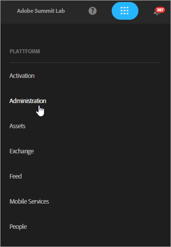
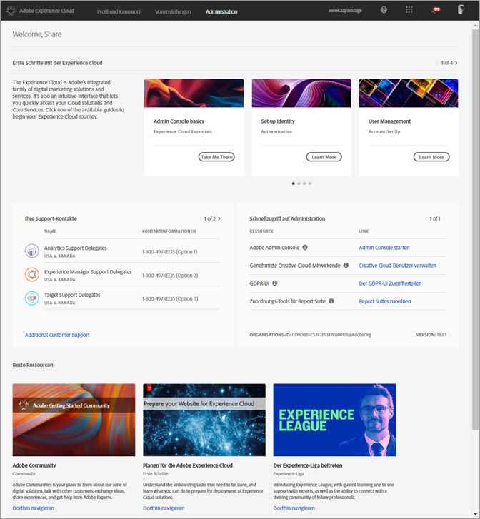
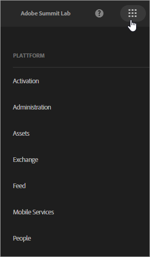
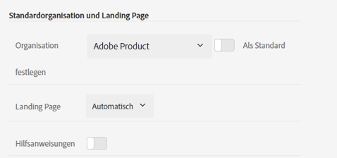
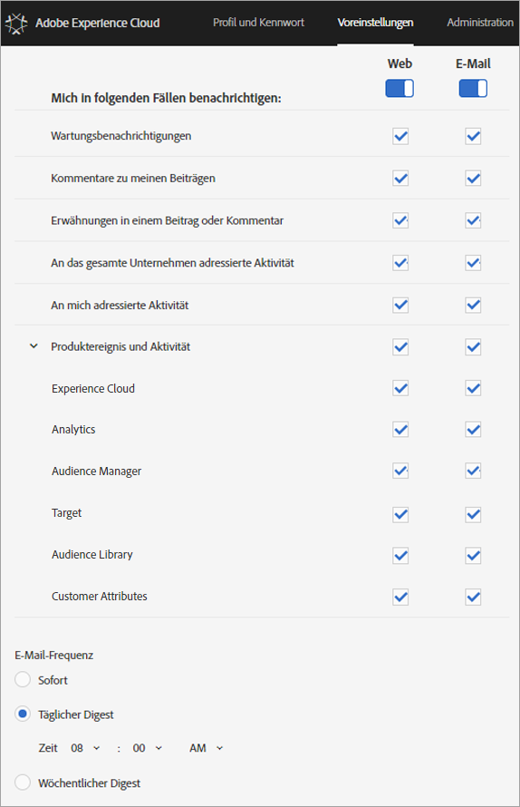

# Anmelden und Verwalten Ihrer Experience Cloud Profil-Einstellungen

Durch die Anmeldung bei der Experience Cloud (anstatt sich bei einer einzigen Lösung anzumelden) wird die einmalige Anmeldung bei allen Lösungen und Diensten, deren Inhaber Sie sind, ermöglicht. In dieser Hilfe wird beschrieben, wie Sie sich bei Experience Cloud anmelden, Kennwörter und Benachrichtigungen verwalten und eine Standard-Landingpage angeben.

>[!IMPORTANT]
>
>Administratoren finden Informationen über Aktualisierungen der Benutzer- und Produktverwaltung im Abschnitt [Administration](../admin-getting-started/admin-getting-started.md#topic_3FCB4099640647E3B2411ADBFCE81909).

## Bei der Experience Cloud anmelden (Administratoren) {#task_034FC955031347F3B02B686A09801A08}

Melden Sie sich an und stellen Sie sicher, dass Sie sich in der richtigen [Organisation](../admin-getting-started/organizations.md#topic_C31CB834F109465A82ED57FF0563B3F1) befinden.

1. Klicken Sie auf das Experience Cloud-Pulldown-Menü () und anschließend auf **[!UICONTROL Administration]**.

   

   Wird die Verknüpfung **[!UICONTROL Administration]** nicht angezeigt, sind Sie kein Experience Cloud-Administrator der angezeigten [Organisation](../admin-getting-started/organizations.md#topic_C31CB834F109465A82ED57FF0563B3F1) (in diesem Beispiel Adobe Corp). Sollten Sie mit der Zuweisung von Administratorrechten Schwierigkeiten haben, wenden Sie sich an die Kundenunterstützung oder einen bereits bestehenden Experience Cloud-Administrator in Ihrem Unternehmen.
1. Klicken Sie auf **[!UICONTROL Administration]**.

   
1. Klicken Sie auf einen der folgenden Links, um fortzufahren:

| Element | Beschreibung |
|--- |--- |
| [Grundlagen der Admin-Konsole](https://helpx.adobe.com/de/marketing-cloud/how-to/first-time-setup.html) | Erfahren Sie mehr über die ersten Schritte, die Sie für die ersten Schritte mit Experience Cloud-Lösungen unternehmen müssen. |
| [Identität einrichten](https://helpx.adobe.com/de/enterprise/using/set-up-identity.html) | Definieren und richten Sie ein Identitätssystem ein, mit dem Ihre Endbenutzer authentifiziert werden. |
| [Benutzerverwaltung](https://helpx.adobe.com/de/enterprise/using/users.html) | Erfahren Sie mehr über die Anmeldung an der Admin Console und die Verwaltung von Benutzerberechtigungen und Produktprofilen für die Experience Cloud. |
| [Admin Console starten](../admin-getting-started/admin-getting-started.md) | Die Admin-Konsole ist der zentrale Speicherort für die Verwaltung Ihrer Adobe-Benutzer und Produktberechtigungen in Ihrer gesamten Organisation. Sie können sich auch über einen [direkten Link](https://adminconsole.adobe.com) bei der Admin Console   anmelden. |
| [Creative Cloud-Benutzer verwalten](../experience-cloud-assets/t-admin-add-cc-user.md) | Mit Experience Cloud Assets können Marketingexperten Ordner mit Designern und anderen kreativen Assets gemeinsam verwenden, synchronisieren und mit ihnen zusammenarbeiten. Sie können die Creative Cloud-Benutzer verwalten, die für die Zusammenarbeit mit Ihrem Unternehmen zugelassen sind. |
| [Report Suites zuordnen](../core-services/core-services.md) | (Nur Analytics) Die Experience Cloud-Hauptdienste sind mit einer Organisation anstelle einer einzelnen Report Suite verknüpft. Um sicherzustellen, dass diese Dienste ordnungsgemäß funktionieren, muss jede Analytics Report Suite einer Organisation zugeordnet werden. (Diese Aufgabe ist Teil eines längeren Arbeitsablaufs, mit dessen Hilfe  [Analytics für Hauptdienste aktiviert wird](../core-services/core-services.md#concept_07ED1D5C64234E77976E6D572E78FB9C).) |
| [Organisations-ID](../admin-getting-started/organizations.md) | Die *Organisations-ID* befindet sich unten auf der Seite &quot;Administration&quot;. Diese ID ist die mit Ihrer bereitgestellten Experience Cloud-Firma verknüpfte ID. Diese ID besteht aus einer 24-stelligen alphanumerischen Zeichenfolge gefolgt von @AdobeOrg (erforderlich). |

## Bei der Experience Cloud anmelden (Benutzer) {#task_1BFE87E20DCB44078CAC82F3CD44B985}

Hilfe für Benutzer, die sich nicht als Administratoren bei der Experience Cloud anmelden.

1. Vergewissern Sie sich bei Ihrem Administrator, dass Ihre [Organisation](../admin-getting-started/getting-started-experience-cloud.md#concept_384D169B0B724B799D573B8ECB5C39BF) in der Experience Cloud bereitgestellt wurde.

1. Navigate to the [Adobe Experience Cloud](https://experiencecloud.adobe.com) ([!DNL experiencecloud.adobe.com]).
1. Klicken Sie auf **[!UICONTROL Mit Adobe ID anmelden]**.

   Ihr Experience Cloud-Administrator kann Ihnen bei der Bestimmung der Kontoart (Adobe ID oder Enterprise ID) behilflich sein.

1. Klicken Sie auf der Landingpage auf das Auswahlsymbol,  um das Pulldown-Menü aufzurufen.

   

   Die in diesem Menü angezeigten Lösungen und Dienste hängen davon ab, welche Anwendungsberechtigungen Ihnen von Ihrem [Administrator](../admin-getting-started/admin-getting-started.md#topic_3FCB4099640647E3B2411ADBFCE81909) zugewiesen wurden.

## Persönliche Standard-Kontoeinstellungen konfigurieren {#task_73CBCAE6C91749D19C95421E5AC311BA}

Sie können persönliche Details bearbeiten und eine standardmäßige [Organisation](../admin-getting-started/admin-getting-started.md#concept_705C626560A54CA2A4215F1C870C42B2) und Landingpage festlegen, die nach der Anmeldung in der Experience Cloud angezeigt werden soll.

1. Melden Sie sich bei der Experience Cloud an und klicken Sie auf Ihr Profilsymbol.

   
1. Klicken Sie auf **[!UICONTROL Profil bearbeiten]**.

   
1. Fahren Sie mit der Konfiguration und Bearbeitung Ihrer persönlichen Informationen fort und klicken Sie auf **[!UICONTROL Änderungen speichern]**.

## Benachrichtigungen aktivieren {#concept_0105453AD71847B8BFCAF4A40915F157}

Sie erhalten eine Benachrichtigung (per E-Mail oder im Produkt) über Systemaktualisierungen, Wartungshinweise, Beiträge, Erwähnungen und freigegebene Assets. Sie können auch die Produkte und Lösungen angeben, für die Sie Benachrichtigungen erhalten möchten, einschließlich des Upload-Status für Kundenattribute.

Um zu Benachrichtigungen zu navigieren, klicken Sie auf das Symbol **[!UICONTROL Benachrichtigungen]** und dann auf das Symbol **[!UICONTROL Einstellungen]**.

Sie können die Anzeige der Benachrichtigungen nach den für Sie wichtigen Benachrichtigungstypen sortieren und nach Benachrichtigungen suchen. Alternativ können Sie auch folgendermaßen vorgehen:

* Sortieren Sie nach den für Sie wichtigen Nachrichtentypen.
* Benachrichtigungen suchen

**So aktivieren Sie Benachrichtigungen**

<!-- 
 <b>Analytics</b> 
 
<ul id="ul_91BF597858124FA5BF338C36F6C5533F"> 
 <li id="li_FAD3E93CDE6242F58F14D55C8A6E23D7">Contribution analysis completed </li> 
 <li id="li_03D33D3228884CECA371B58656B2F3E7">Guided analysis shared </li> 
 <li id="li_DCF710F89317487B8DAA86CC05C694CA">Scheduled report failure </li> 
</ul> 

 <b>Adobe Target</b> 
 

Test started or stopped 
 

 <b>Media Optimizer</b> 
 

Performance alerts 
 

 <b>Dynamic Tag Manager</b> 
 
<ul id="ul_9ACDA418933E40918744D9C32A57DD4B"> 
 <li id="li_4DD0FFD3D9F84A428703611EF767D4D0">New web property created </li> 
 <li id="li_C6B923012E9D40BA91F4CBF7D2D72986">New user added </li> 
 <li id="li_EB0B9D1CFDE24E6987935CCCBFC7892A">Approvals - publishing and approval status for new rules, data elements, and tools </li> 
 <li id="li_17B0B176FF85435FB7EDD4317BC18201">Property has been published </li> 
</ul> -->

## Profile und Kennwörter verwalten  {#task_7B89F4F38E5A4C4EB0FF842953856382}

Sie können Ihr Experience Cloud-Profil bearbeiten, eine Standardorganisation und -Landingpage festlegen und vieles mehr.

1. [In Experience Cloud anmelden](../admin-getting-started/getting-started-experience-cloud.md#task_1BFE87E20DCB44078CAC82F3CD44B985).

1. Klicken Sie im Experience Cloud-Menü auf Ihr Profilbild.

   
1. Klicken Sie auf **[!UICONTROL Profil bearbeiten]**.

   Füllen Sie auf der Seite &quot;Profil und Passwörter&quot;die Felder und Optionen unter &quot;Persönliche Details&quot;aus.

## Kennwort zurücksetzen  {#task_46541A2806164CB1A4AE8239604E4EB1}

1. Navigieren Sie zur Anmeldeseite Ihrer Lösung.
1. Klicken Sie auf **[!UICONTROL Kennwort vergessen]**.

   Durch das Zurücksetzen des Lösungskennworts sollten sich Probleme bei der Verknüpfung des Kennworts im Zuge der Experience Cloud-Kontenverknüpfung lösen lassen.

   For Adobe Analytics users, navigate to [https://sc2.omniture.com/password_recovery.html](https://sc2.omniture.com/password_recovery.html).

## Lösungsanmeldung über einen direkten Link konfigurieren {#concept_8BE493A08786469B88B210E13F78FF2F}

Optional können Sie sich mit der über die Experience Cloud-Oberfläche bereitgestellten Authentifizierung bei einer bestimmten Seite in einer Lösung anmelden.

### URL-Vorlage

`https://<tenantId>.experiencecloud.adobe.com/<solutionname>?destURL=<fullURL>`

Beispiel-URL:

`https://aem62tenant.experiencecloud.adobe.com/analytics?destURL=https%3A%2F%2Fsc.omniture.com%2Freports%2F11562.html`

>[!NOTE]
>
>Sie müssen alle URLs vor Weitergabe an den Parameter `destURL` verschlüsseln. (Encoder sites like [URL Decoder / Encoder](https://meyerweb.com/eric/tools/dencoder/) are available.)

| Parameter | Beschreibung | Beispiel | Erforderlich/Optional |
|--- |--- |--- |--- |
| tenantId | Name des Mandanten, bei dem sich der Benutzer anmelden soll. | aem62tenant | Optional |
| destURL | Die vollständige URL zu dem Ort, an den der Benutzer geleitet werden soll. | https://sc.omniture.com/x/1_7xxzf | Optional |
| solutionname | Name der MAC-Lösung, die Inhaber des Parameters destURL ist. Dieser Name wird verwendet, um zu bestätigen, dass der Benutzer Zugriff auf die Lösung hat, zu der die URL gehört.  Es liegt in der Verantwortung der Lösungen sicherzustellen, dass der „solutionname“ mit dem Parameter „destURL“ übereinstimmt.  Beispiel: Wenn die URL Lösungsnamen als Social und die destURL als Analytics-URL enthält, wird der Benutzer zur URL umgeleitet, selbst wenn er keinen Zugriff auf Analytics hat. MAC überprüft NICHT, ob der Eigentümer der destURL mit dem Lösungsnamen synchronisiert ist. | analytics | Erforderlich, wenn destURL-Parameter verwendet werden. |
