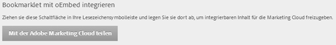

# Inhalte einbetten

Sie können Inhalte von einer Webseite in die Experience Cloud einbetten.

Ziehen Sie in [!UICONTROL Administration] die Schaltfläche **[!UICONTROL Mit Adobe Experience Cloud teilen]** in die Symbolleiste „Lesezeichen“ Ihres Browsers.

Wenn Sie sich auf einer Webseite befinden, die eingebetteten Inhalt unterstützt (zum Beispiel Hilfethemen), klicken Sie in der Symbolleiste auf **[!UICONTROL Mit Adobe Experience Cloud teilen]**.
