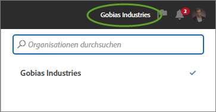
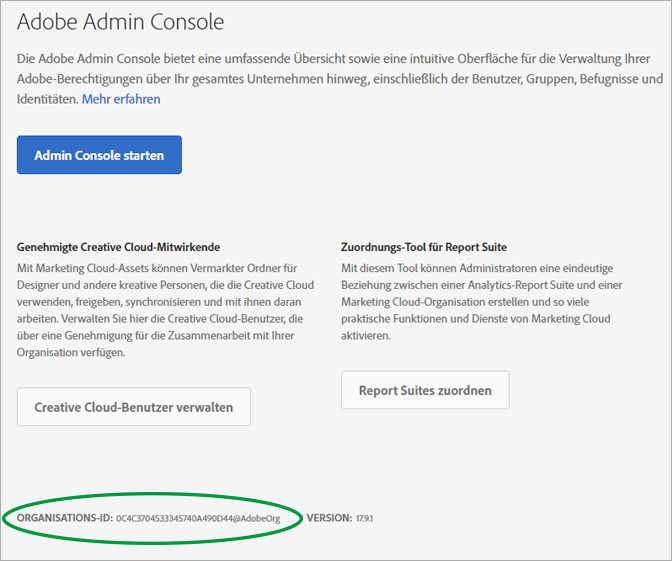

# Organisationen und Kontoverknüpfung

Erfahren Sie mehr über die Verwaltung von Organisationen und das Verknüpfen von Lösungskonten mit der Experience Cloud.

## Organisation identifizieren {#concept_384D169B0B724B799D573B8ECB5C39BF}

Eine -*Organisation* ist die Einheit, die es einem Administrator ermöglicht, Gruppen und Benutzer zu konfigurieren und das Single-Sign-on in der Experience Cloud zu steuern. Die Organisation agiert als zentrale Anmeldestelle, die sämtliche Experience Cloud-Produkte und -Lösungen umfasst. Normalerweise besitzt eine Organisation den Namen Ihres Unternehmens. Ein Unternehmen kann jedoch über mehrere Organisationen verfügen.

Möglicherweise müssen Sie auch Ihre Organisations-ID zu Supportzwecken suchen. Mit dem Menü **[!UICONTROL Organisation]** können Sie prüfen, ob Sie sich in der richtigen Organisation befinden, und Organisationen wechseln.

## Organisations-ID ermitteln {#concept_EA8AEE5B02CF46ACBDAD6A8508646255}

Die **Organisations-ID** ist die ID, die Ihrem freigeschalteten Experience Cloud-Unternehmen zugeordnet ist. Diese ID besteht aus einer 24-stelligen alphanumerischen Zeichenfolge gefolgt von @AdobeOrg (erforderlich).

Um Ihre Organisations-ID anzuzeigen, navigieren Sie zur Experience Cloud-Landingpage oder klicken Sie auf () und anschließend auf **[!UICONTROL Administration]**. Sie finden die Organisations-ID am unteren Rand der Seite [!UICONTROL Erste Schritte mit der Experience Cloud] oder auf der Seite [!UICONTROL Administration].

## Lösungskonten mit einer Adobe ID verknüpfen {#task_FD389E78640848919E247AC5E95B8369}

In der Regel gewähren Experience Cloud-Administratoren Zugriff auf Lösungen und Dienste. In seltenen Fällen müssen Sie eventuell die Anmeldeinformationen der Lösung mit einer Adobe ID verknüpfen.

1. Befolgen Sie die Anweisungen in Ihrer E-Mail-Einladung zur Experience Cloud.
1. Melden Sie sich mit Ihrer Adobe ID oder Enterprise ID an.
1. Klicken Sie auf die Lösungsauswahl. ( ).

   

   Die Lösungen, auf die Sie Zugriff haben, sind farbig dargestellt.
1. Klicken Sie auf die gewünschte Option.

   

   Diese Art Nachricht wird angezeigt, wenn Sie der entsprechenden Gruppe angehören (und über Zugriff auf die Lösung verfügen), Ihre Kontodaten jedoch noch nicht mit Ihrer Adobe ID verknüpft haben.
1. Klicken Sie auf **[!UICONTROL Konto verknüpfen]** und geben Sie Ihre Anmeldeinformationen ein.

## Standardorganisation und -Landingpage festlegen {#concept_6A191B42A9874A9780882903BA18F071}

Sie können bei der Anmeldung eine Standardorganisation und eine Landingpage angeben.

Klicken Sie in Ihrem Profil auf **[!UICONTROL Profil bearbeiten]**.

Unter „Standardorganisation und Landingpage“ können Sie Ihren Anmeldevorgang anpassen.

## Problembehebung für Kontoverknüpfungen {#concept_DFCB29A3B4834FC59AA29E0BBA301584}

Hilfe zu Problemen, die sich aus der Kontoverknüpfung ergeben.

In der Regel schlägt die Kontoverknüpfung fehl, da die Adobe ID mit einem vorherigen Benutzer verknüpft ist. Wenn die Kontoverknüpfung fehlschlägt, können Sie Folgendes tun:

* [Wenden Sie sich an den Adobe Support](https://helpx.adobe.com/de/marketing-cloud/contact-support.html).
* Greifen Sie über die Standardanmeldung auf die Lösung zu, solange das Problem nicht behoben ist.
