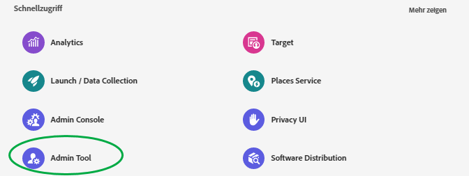
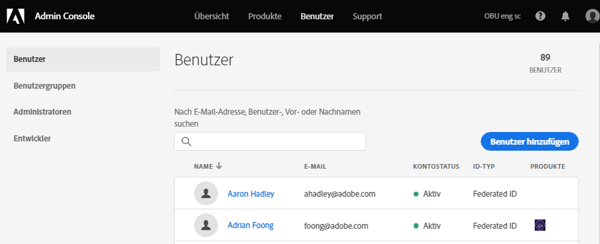
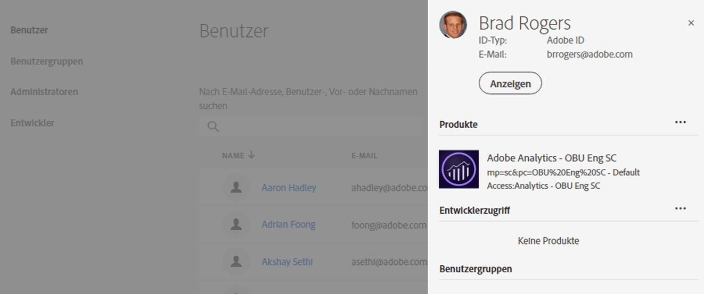
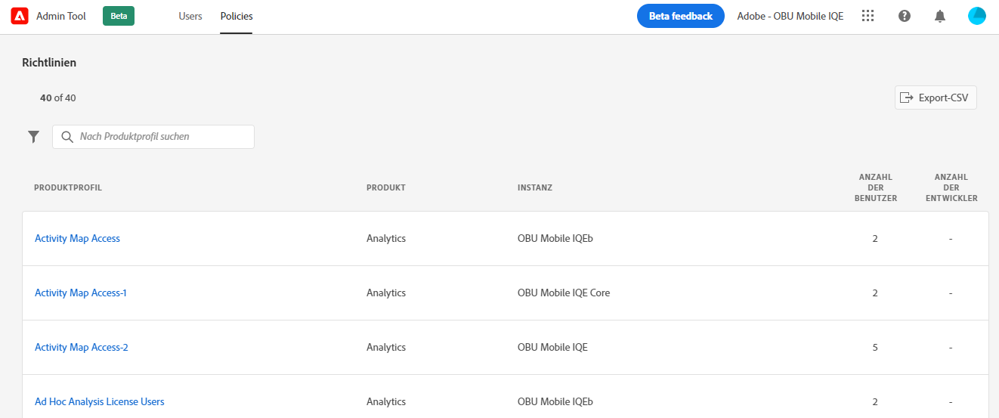
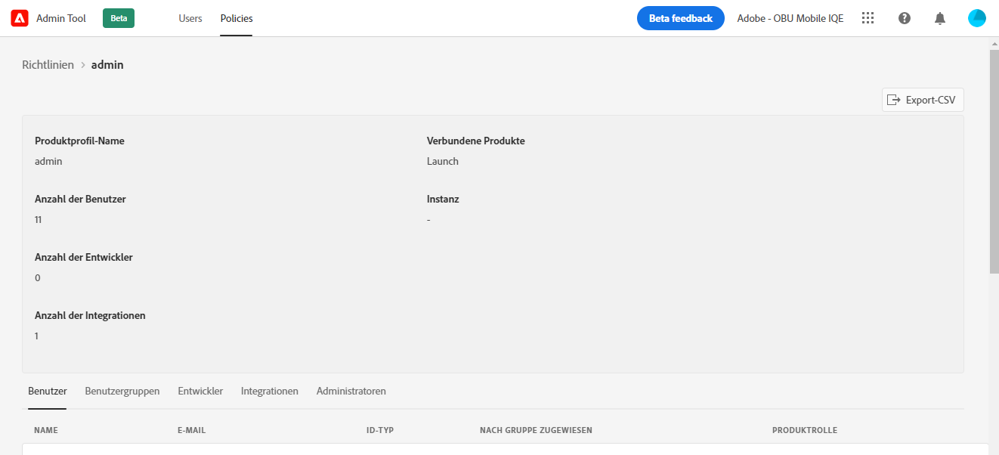

# CX Enterprise [!UICONTROL Admin-Tool]

Administratoren können eine sortierbare und filterbare Liste aller CX Enterprise-Benutzer und -Richtlinien mit Details im [!UICONTROL Admin-Tool] anzeigen. Zu den Benutzerdetails zählen der Produktzugriff und die Rollen der Benutzer sowie die zuletzt aufgerufenen Informationen. Zu den Richtliniendetails gehören die Benutzenden-, Gruppen-, Entwickler-, Integrations- und Administratorliste einer Richtlinie (Produktprofil) sowie detaillierte Berechtigungen und Ressourceninformationen für die Richtlinie.

1. Melden Sie sich bei `https://experience.adobe.com/.` an.

   

1. Klicken [!UICONTROL  unter &quot;]&quot; auf **[!UICONTROL Admin-Tool]**.

   (Alternativ können Sie in der Startseiten-URL _home_ durch _admin_ ersetzen.)

   Die Seite [!UICONTROL Benutzer] wird angezeigt.

## Seite „Benutzer“

Auf dieser Seite wird eine vollständige Liste der Benutzer angezeigt, die Zugriff auf CX Enterprise in Ihrem Unternehmen haben. Es enthält Informationen zu Programmberechtigungen und zur letzten Anmeldung. Sie können nach benutzerdefinierten Ansichten der Benutzerliste suchen, sortieren und filtern.

| Element | Beschreibung |
| --- | ---|
| [!UICONTROL Name] | Der Vor- und Nachname des Benutzers. Sie können diese Spalte von A bis Z und von Z bis A sortieren. Klicken Sie auf den Namen eines Benutzers, um weitere Details zum Benutzer anzuzeigen. |
| [!UICONTROL E-Mail] | Die mit dem Benutzer verknüpfte E-Mail-Adresse. Die Spalte kann von A bis Z und von Z bis A sortiert werden. |
| [!UICONTROL ID-Typ] | Der Identitätstyp für das Konto des Benutzers. Es können Filter angewendet werden, um spezielle ID-Typen anzuzeigen. Weitere Informationen finden Sie unter [Verwalten von Identitätstypen](https://helpx.adobe.com/de/enterprise/using/identity.html). |
| [!UICONTROL Lösungen] | Zusammenfassung der CX Enterprise-Anwendungen, auf die der Benutzer zugreifen kann. Sie können Filter anwenden, um die Liste auf Benutzer mit Zugriff auf bestimmte Programme einzuschränken. |
| [!UICONTROL Letzte Anmeldung] | Uhrzeit und Datum der letzten Benutzeranmeldung bei CX Enterprise. Diese Spalte kann nach auf- oder absteigenden Datumsangaben sortiert werden.   **Wichtig:** Ab dem 13. Januar 2020 werden die letzten Anmeldedaten eines Benutzers 365 Tage lang aufbewahrt. Diese Informationen sollen die aktuelle Anmeldeaktivität in CX Enterprise anzeigen und nicht eine Empfehlung sein, vor dem 13. Januar 2020 Maßnahmen für inaktive Konten zu ergreifen. |

## Anpassen der Benutzerlistenansicht

Sie können die Spalten suchen, sortieren oder filtern, um die Benutzerliste anzupassen.

* Suchen Sie Benutzer nach Name oder E-Mail-Adresse. Die Suchvorgänge entsprechen der von Ihnen eingegebenen Textzeichenfolge.
* Sortieren Sie die Spalte nach auf- oder absteigenden Werten. Dies Sortierung gilt für die Spalten [!UICONTROL Name] [!UICONTROL E-Mail] und [!UICONTROL Letzte Anmeldung].
* Um mehrere Filter anzuwenden und Benutzer mit bestimmten Kriterien aufzulisten, klicken Sie auf **[!UICONTROL Filtern nach]**. Wenn mehrere Filterkategorien angewendet werden, enthalten Suchvorgänge die E-Mail-Domäne `AND` ID-Typ `AND` Lösung.

| Element | Beschreibung |
| ---------| ----------|
| [!UICONTROL E-Mail-Domain] Filter | Suchen Sie in der Spalte „E-Mail“ nach Zeichenfolgen, um die Ergebnisse auf eine oder mehrere Domänen zu beschränken. Hinzufügen mehrerer Filter durch Drücken der Eingabetaste nach jedem Suchbegriff. |
| [!UICONTROL ID-Typ] Filter | Wählen Sie aus den verfügbaren ID-Typen aus. Als Filter können mehrere ID-Typen verwendet werden. |
| [!UICONTROL Lösung] Filter | Wählen Sie aus den verfügbaren Programmen. Mehrfache Programmfilter suchen nach Ergebnissen, die Lösung 1 `OR` Lösung 2 enthalten. |

## Anzeigen der Benutzerdetails

Klicken Sie auf [!UICONTROL  Seite ]Benutzer“ auf die E-Mail-Adresse eines Benutzers, um dessen Details anzuzeigen.

Eine detaillierte Ansicht der einzelnen Benutzer enthält wichtige Informationen zum Programmzugriff, zu den Admin- und Produktrollen sowie zu den zuletzt aufgerufenen Informationen des Benutzers.

## Abschnitt „Info“

In diesem Abschnitt wird eine Zusammenfassung des Benutzerkontos angezeigt, einschließlich Folgendem:

* Benutzeravatar und Systemadmin-Zeichen (falls zutreffend)
* Name
* E-Mail
* Benutzername (bei Konten mit Federated ID können Benutzernamen von der E-Mail-Adresse abweichen)
* [ID-Typ](https://helpx.adobe.com/de/enterprise/using/identity.html)
* Land
* Letzte Anmeldung

## Lösungszusammenfassung

In diesem Abschnitt wird eine Zusammenfassung der CX Enterprise-Anwendungen angezeigt, auf die der Benutzer zugreifen kann. Umfasst die Rolle der Produktverwaltung, sofern anwendbar.

## Detaillierte Liste des Produktzugriffs

In diesem Abschnitt wird eine vollständige Liste aller Produktprofilzugehörigkeiten für den Benutzer angezeigt.

| Element | Beschreibung |
| ---------| ----------|
| [!UICONTROL Produkt] | Name des Produkts, das mit dem Profil verknüpft ist. |
| [!UICONTROL instance] | Name der Instanz (z. B. Unternehmensanmeldung oder Mandant), die mit dem Produkt und Produktprofil verknüpft ist. |
| [!UICONTROL Produktprofil] | Eindeutiger Name des Produktprofils. |
| [!UICONTROL Nach Gruppe zugewiesen] | Name der Benutzergruppe, die den Benutzer mit einem Produktprofil verknüpft. Leere Ergebnisse geben an, dass der Benutzer dem Produktprofil direkt und nicht über eine Gruppe zugewiesen wurde. |
| [!UICONTROL Produktrollen] | Rollenzuweisung des Benutzers im Produktprofil. Diese Informationen gelten derzeit nur für Adobe Target-Produktprofile. |

## Seite „Richtlinien“

Auf dieser Seite wird eine vollständige Liste der CX Enterprise-Richtlinien in Ihrer Organisation angezeigt. Sie enthält Informationen zu Produkten, Instanzen, Benutzern und Entwicklern. Sie können nach benutzerdefinierten Ansichten der Richtlinienliste suchen, sortieren und filtern.

| Element | Beschreibung |
| ---| ---|
| [!UICONTROL Produktprofil] | Der Name des Produktprofils. Die Spalte kann A->Z oder Z->A sortiert werden. Um weitere Details zur Richtlinie anzuzeigen, wählen Sie den Namen eines Produktprofils aus. |
| [!UICONTROL Produkt] | Das Produkt, das mit dem Produktprofil verknüpft ist. Die Spalte kann von A bis Z und von Z bis A sortiert werden. |
| [!UICONTROL instance] | Die Instanz (z. B. Mandant oder angemeldetes Unternehmen), die mit dem Produktprofil verknüpft ist. Produkte ohne eindeutige Instanzen oder Mandanten haben als Wert „-“. Die Spalte kann von A bis Z und von Z bis A sortiert werden. |
| [!UICONTROL Anzahl der Benutzer] | Eindeutige Anzahl der mit dem Produktprofil verknüpften Benutzer, einschließlich direkter Zuweisung und Gruppenzuweisung. Die Spalte kann vom Kleinsten bis zum Größten oder vom Größten bis zum Kleinsten sortiert werden. |
| [!UICONTROL Anzahl der Entwickler] | Anzahl der mit dem Produktprofil verbundenen Entwicklerrollen. Die Spalte kann vom Kleinsten bis zum Größten oder vom Größten bis zum Kleinsten sortiert werden. |

## Anpassen der Richtlinienlistenansicht

Sie können die Spalten suchen, sortieren oder filtern, um die Richtlinienliste anzupassen.

* Suchen Sie nach Produktprofilen mit dem Namen. Die Suchvorgänge entsprechen der von Ihnen eingegebenen Textzeichenfolge.
* Sortieren Sie die Spalte nach auf- oder absteigenden Werten. Dies Sortierung gilt für die Spalten [!UICONTROL Produktprofil] [!UICONTROL Produkt] [!UICONTROL Instanz,] [!UICONTROL Anzahl der Benutzer,] und [!UICONTROL Anzahl der Entwickler,].
* Klicken Sie auf **[!UICONTROL Symbol]** Filtern nach“, um mehrere Filter anzuwenden und Produktprofile mit bestimmten Kriterien aufzulisten. Wenn mehrere Filterkategorien angewendet werden, enthalten Suchvorgänge Gruppen, die mit der `AND` Instanzlösung `AND` verknüpft sind.

| Element | Beschreibung |
| ---------| ----------|
| [!UICONTROL Instanz] Filter | Suchen Sie in der Spalte „Instanz“ nach Zeichenfolgen, um die Ergebnisse auf eine oder mehrere Instanzen zu beschränken. Sie können mehrerer Filter durch Drücken der Eingabetaste nach jedem Suchbegriff hinzufügen. |
| [!UICONTROL Lösung] Filter | Wählen Sie aus den verfügbaren Programmen. Mehrfache Programmfilter suchen nach Ergebnissen, die Lösung 1 `OR` Lösung 2 enthalten. |

## Ansicht der Richtliniendetails

Wählen Sie auf [!UICONTROL  Seite ] den Produktprofilnamen aus, um die Details einer Richtlinie anzuzeigen.

Eine detaillierte Ansicht der einzelnen Produktprofile enthält wichtige Details zu den Themen des Produktprofils (Benutzer, Gruppen usw.). Außerdem werden Zugriffsberechtigungen und Ressourcen angezeigt, die vom Produktprofil aktiviert wurden.

Details des Produktprofils können in CSV-Dateien exportiert werden. Die Option [!UICONTROL CSV exportieren] erzeugt zwei CSV-Dateien:

* Personendetails (Benutzer, Benutzergruppen, Entwickler, Integrationen, Administratoren)
* Informationen zu Berechtigungen und Ressourcen

## Zusammenfassung

In diesem Abschnitt wird eine Zusammenfassung des Produktprofils angezeigt, einschließlich Folgendem:

* Name des Produktprofils
* Anzahl der Benutzer
* Anzahl der Entwickler
* Anzahl der Integrationen
* Zugehörige Produkte
* Instanz

## Detaillierte Personenliste

Dieser Abschnitt enthält eine vollständige Liste aller Benutzer, Benutzergruppen, Entwickler, Integrationen und Administratoren, die dem Profil zugewiesen sind.

| Tab | Beschreibung |
| ---------| ----------|
| [!UICONTROL Benutzer] | Die Liste der im Produktprofil enthaltenen Benutzer. Die Benutzergruppenzuordnung wird in der Spalte [!UICONTROL Nach Gruppe zugewiesen] angezeigt. |
| [!UICONTROL Benutzergruppen] | Die Liste der mit dem Produktprofil verknüpften Benutzergruppen. |
| [!UICONTROL Entwickelnde] | Die Liste der mit dem Produktprofil verbundenen Entwickler. |
| [!UICONTROL Integrationen] | Die Liste der mit dem Produktprofil verbundenen Integrationen. |
| [!UICONTROL Admins] | Die Liste der mit dem Produktprofil verknüpften Administratoren. |

## Detaillierte Listen zu Berechtigungen und Ressourcen

Dieser Abschnitt enthält eine vollständige Liste der Berechtigungen und Ressourcen, die für das Produktprofil verfügbar sind. Berechtigungen und Ressourcen, die im Produktprofil enthalten sind, wurden mit einem &quot;✔&quot; gekennzeichnet. Die Listen der Berechtigungen und Ressourcen wurden zur einfacheren Anzeige in Registerkarten und Spalten geordnet. Registerkarten und Spalten zeigen die Liste der Abschnitte an, die für das aktuelle Produkt gelten.

## Verwandte Informationen

* [Benutzer verwalten](https://helpx.adobe.com/de/enterprise/using/users.html) im [!DNL Admin Console]
