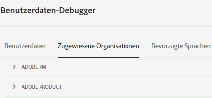
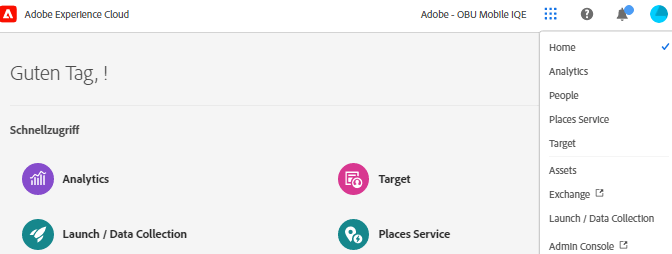
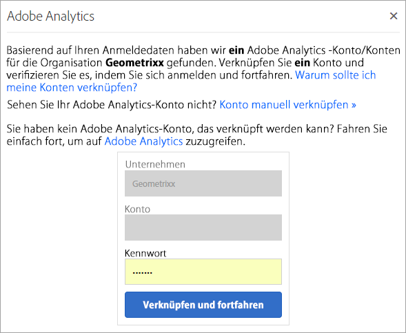

# Organisationen und Kontoverknüpfung

Eine *Organisation* (Organisations-ID) ist die Entität, die es einem Administrator ermöglicht, Gruppen und Benutzende zu konfigurieren und Single Sign-on in Experience Cloud zu steuern.

Die Organisation funktioniert wie ein Unternehmen mit Anmeldung, das alle Experience Cloud-Produkte und -Programme umfasst. Normalerweise besitzt eine Organisation den Namen Ihres Unternehmens. Ein Unternehmen kann jedoch über mehrere Organisationen verfügen.

Um sicherzustellen, dass Sie sich bei Ihrer richtigen Organisation angemeldet haben, klicken Sie auf **[!UICONTROL Profile]** , um den Standardorganisationsnamen anzuzeigen. Wenn Sie Zugriff auf mehr als eine Organisation haben, können Sie in der Kopfzeilenleiste auch eine andere Organisation anzeigen und zu dieser wechseln.

>[!NOTE]
>
>Durch den Wechsel zwischen Organisationen können Sie auf die Admin Console für diese bestimmte Organisation zugreifen. Wenn die gewünschte Organisation nicht aufgeführt ist, müssen Sie möglicherweise den Zugriff von einem Administrator in dieser Organisation anfordern. (Wenn Sie mehrere Admin Consoles zusammenführen müssen, wenden Sie sich an den Kunden-Support von Adobe.)

## Federated IDs

Wenn Ihr Unternehmen Federated IDs verwendet, können Sie sich durch ein Single Sign-on Ihres Unternehmens bei Experience Cloud anmelden, ohne Ihre E-Mail-Adresse und Ihr Passwort eingeben zu müssen. Fügen Sie `#/sso:@domain` zur Experience Cloud-URL (`https://experience.adobe.com`) hinzu, um diese Aufgabe zu erfüllen.

Setzen Sie beispielsweise für eine Organisation mit Federated IDs und der Domain `example.com` Ihren URL-Link auf `https://experience.adobe.com/#/sso:@example.com`. Sie können auch direkt zu einem bestimmten Programm gehen, indem Sie diese URL, an die der Programmpfad angehängt ist, als Lesezeichen speichern. (Beispiel für Adobe Analytics: `https://experience.adobe.com/#/sso:@example.com/analytics`.)

## Organisations-ID anzeigen

Sie können die zugewiesene Organisations-ID zu Support-Zwecken finden. Mit der **[!UICONTROL Organization]** in der Kopfzeile können Sie überprüfen, ob Sie sich in der richtigen Organisation befinden, und Organisationen wechseln.

Die Organisations-ID ist die ID, die Ihrem freigeschalteten Experience Cloud-Unternehmen zugeordnet ist. Diese ID besteht aus einer 24-stelligen alphanumerischen Zeichenfolge gefolgt von `@AdobeOrg` (zwingend erforderlich).

Sie können Ihre Organisations-ID zusammen mit anderen Kontoinformationen mithilfe des Tastaturbefehls **Strg+I** von jeder Seite aus auf `https://experience.adobe.com` einsehen.

**Anzeigen der Organisations-ID**

1. Drücken Sie in [Experience Cloud](https://experience.adobe.com) **Strg+I** auf der Tastatur.

   

1. Suchen Sie unter **[!UICONTROL User Information]** nach **[!UICONTROL Current Org ID]** und Sie können die Organisations-ID finden.

   Alternativ können sich Administratoren auch bei der Admin Console anmelden (navigieren Sie zu [https://adminconsole.adobe.com](https://adminconsole.adobe.com)) und Ihre Organisations-ID in der URL sehen.

   Beispielsweise in der folgenden URL:

   `https://adminconsole.adobe.com/C538193582390300A495CC9@AdobeOrg/overview`

   Hier lautet die ID:

   `C538193582390300A495CC9@AdobeOrg`

## Verknüpfen eines Programmkontos mit einer Adobe ID

In der Regel gewähren Experience Cloud-Administratoren Zugriff auf Programme und Services. In seltenen Fällen können Sie die Anmeldeinformationen eines Programms mit einer Adobe ID verknüpfen.

1. Führen Sie die Schritte in Ihrer E-Mail-Einladung zu Experience Cloud aus.

1. Melden Sie sich mit Ihrer Adobe ID oder Enterprise ID an.

1. Klicken Sie auf die **[!UICONTROL Application selector]**. ( ).

   

   Die Programme, auf die Sie Zugriff haben, sind farbig dargestellt.

1. Klicken Sie auf das gewünschte Programm.

   

   Diese Art Nachricht wird angezeigt, wenn Sie der entsprechenden Gruppe angehören (und über Zugriff auf das Programm verfügen), Ihre Kontoanmeldedaten jedoch noch nicht mit Ihrer Adobe ID verknüpft haben.

1. Klicken Sie auf **[!UICONTROL Link Account]** und geben Sie Ihre Anmeldeinformationen ein.

## Standardorganisation angeben

Sie können bei der Anmeldung eine Standardorganisation angeben.

1. Klicken Sie in der Kopfzeile auf **[!UICONTROL Profile]** und dann auf Voreinstellungen.

1. Wählen Sie unter [!UICONTROL General] eine Standardorganisation aus.

## Problembehebung für Kontoverknüpfungen

Hilfe zu Problemen, die sich aus der Kontoverknüpfung ergeben.

In der Regel schlägt die Kontoverknüpfung fehl, da die Adobe ID mit einem vorherigen Benutzer verknüpft ist. Wenn die Kontoverknüpfung fehlschlägt, können Sie Folgendes tun:

* [Wenden Sie sich an den Adobe Support](https://experienceleague.adobe.com/?support-solution=General&lang=de#support).
* Greifen Sie über die Standardanmeldung auf Ihre Anwendung zu, während das Problem behoben wird.

