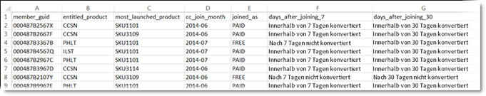

# Kundenattribute

To locate [!UICONTROL customer attributes] navigate to **[!DNL Experience Platform]** > **[!UICONTROL People]** > **[!UICONTROL Customer Attributes]**

Wenn Sie Daten von Unternehmenskunden in einer CRM-Datenbank (Customer Relationship Management) erfassen, können Sie diese Daten in eine Datenquelle für Kundenattribute in die Experience Cloud hochladen. Nach dem Hochladen können die Daten mit [!DNL Adobe Analytics] und [!DNL Adobe Target] verarbeitet werden.

## Voraussetzungen für das Hochladen von Kundenattributen {#section_BD38693AFBF34926BA28E964963B4EA0}

* **Aktivierung der Lösung:** [Aktivieren Sie Ihre Lösungen für Hauptdienste](../core-services/core-services.md#concept_07ED1D5C64234E77976E6D572E78FB9C).

* **Gruppenmitgliedschaft:** Um Kundenattributdaten hochzuladen, müssen Benutzer Mitglieder der folgenden Gruppe sein:  [„Kundenattribute“](../admin-getting-started/admin-getting-started.md#task_3295A85536BF48899A1AB40D207E77E9). Sie müssen auch einer Adobe Analytics-Gruppe oder einer Adobe-Zielpopulation angehören.

   Um herauszufinden, ob Ihr Unternehmen Zugang zu Kundenattributen hat, muss sich Ihr [!DNL Experience Cloud]-Administrator bei der [!DNL Experience Cloud] anmelden. Navigate to **[!UICONTROL Administration]** > **[!UICONTROL Launch Admin Console]** > **[!UICONTROL Groups]**. Falls *Kundenattribute* als eine der Gruppen angezeigt wird, können Sie beginnen.

   Benutzer, die der Gruppe „Kundenattribute“ hinzugefügt wurden, sehen auf der linken Seite der Experience Cloud-Benutzeroberfläche das Menüelement [!UICONTROL Kundenattribute].

* **Adobe-Zielgruppe** [!DNL at.js] (beliebige Version) oder [!DNL mbox.js] Version 58 oder höher ist für Kundenattribute erforderlich.

   Siehe [Bereitstellung der &quot;at.js&quot;](https://docs.adobe.com/content/help/en/target/using/implement-target/client-side/deploy-at-js/how-to-deployatjs.html) - oder &quot; [Mbox.js&quot;-Implementierung](https://docs.adobe.com/content/help/en/target/using/implement-target/client-side/mbox-implement/mbox-download.html).

## What is enterprise customer data? {#section_6F34C29F11414842AA57D2B1248FA3C6}

Unternehmensdaten befinden sich in anderen Systemen. Es kann komplex sein und verschiedene Dinge für verschiedene Menschen bedeuten. Diese Daten können Informationen wie Mitgliedschaften, Treuestufe, Alter, Geschlecht, eigene Produkte, Interessen und Lebenszeitwert beinhalten.

Die folgende Abbildung zeigt ein Beispiel für eine Datendatei mit Abonnentendaten zu Produkten wie Mitglieds-IDs, Produkten mit Berechtigung, den am häufigsten gestarteten Produkten usw.

After you create the data file, you can upload it to the customer attribute source that you create in **[!UICONTROL Experience Cloud]** > **[!UICONTROL Customer Attributes]**.

Weitere Informationen zu diesem Arbeitsablauf finden Sie unter [Hochladen von Kundenattributdaten](../attributes/t-crs-usecase.md#task_BCC327B2A0EF4A1BBB2934013AB92B78).

## Anwendungsfälle für Lösungen {#section_4E77650F6CEE4C4ABCD0B3221A5AE5D9}

Nachdem sich die Daten in der Experience Cloud befinden, können Sie sie anpassen und für Berichte, Segmentierung, Aktivitäten und Kampagnen freigeben.

Beispiel:

| Lösung | Vorteile und Anwendungsfälle |
|--- |--- |
| Adobe Analytics | Marketingexperten und Analysten können Folgendes verstehen:<ul><li>Die Online-Kampagnen, die bei Ihren Gold-Kunden am effektivsten sind.</li><li>Die Produkte, nach denen Gold-Kunden suchen, im Vergleich zu Produkten, nach denen Platin-Kunden suchen.</li><li>ob Ihre Site-Neugestaltung positive Auswirkungen auf die Konversionsraten älterer Kunden hat.</li><li>Welche Produkte Kunden mit einem niedrigen Lebenszeitwert nutzen, neigen dazu, auf meiner Site zu recherchieren.</li></ul> |
| Adobe Target | Mithilfe von Attributdaten können Benutzer von Adobe Zielgruppe:<ul><li>Zeigen Sie den treuen Clubmitgliedern besondere Rabatte und Angebote.</li><li>Empfehlen Sie Ihren Luxuskunden teurere Produkte.</li><li>Für Kunden, die bereits E-Mails erhalten, zeigen Sie ein Upsell-Angebot an, das normalerweise für E-Mail-Anmeldungen reserviert ist</li></ul> |
