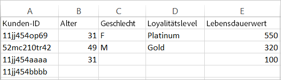
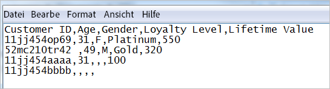

# Informationen zur Datendatei und den Datenquellen für Kundenattribute

Datendateianforderungen und mehrere Datenquellen für das Hochladen von Kundenattributen in der Experience Cloud.

Sie benötigen Zugriff auf CRM-Daten oder ähnliche Daten aus Ihrem Unternehmen. Die in die Experience Cloud hochzuladenden Daten müssen im `.csv`-Format vorliegen. Wenn das Upload über FTP oder sFTP erfolgt, wird auch eine `.fin`-Datei hochgeladen.

Kundenattribute sind für die Verarbeitung einiger Dateien pro Tag ausgelegt. Um das Problem einer großen Anzahl kleiner Dateien zu reduzieren, die die Verarbeitung verzögern, werden Dateien, die innerhalb von 30 Minuten nach einem vorherigen Batch von derselben Organisation gesendet werden, in eine Warteschlange mit niedrigerer Priorität weitergeleitet.

## Zulässige Dateitypen und Namensanforderungen {#section_6F64FA02ACCC4215B0862CB6A1821FBF}

<table id="table_C27955F6B52A45B28BEEAAF14FFC86D8"> 
 <thead> 
  <tr> 
   <th colname="col1" class="entry"> Dateityp </th> 
   <th colname="col2" class="entry"> Beschreibung </th> 
  </tr> 
 </thead>
 <tbody> 
  <tr> 
   <td colname="col1"> <p> <span class="filepath">.csv </span> </p> </td> 
   <td colname="col2"> <p>Eine Datei mit kommagetrennten Werten (z. B. eine in Excel erstellte Datei). Dies ist die Datei, die die Kundenattributdaten enthält. </p> <p> <b>Namensanforderungen:</b> Stellen Sie sicher, dass Dateinamenerweiterungen keine Leerzeichen enthalten. </p> </td> 
  </tr> 
  <tr> 
   <td colname="col1"> <p> <span class="filepath">.fin </span> </p> </td> 
   <td colname="col2"> <p>(Erforderlich) Die <span class="filepath">.fin</span>-Datei teilt dem System mit, dass das Upload der Daten abgeschlossen ist. <span class="filepath">.fin</span>- und <span class="filepath">.csv</span>-Datei müssen den gleichen Namen haben. </p> <p>Adobe empfiehlt die Erstellung einer leeren Textdatei mit der Erweiterung <span class="filepath">.fin</span>. Eine leere Datei spart Speicherplatz und Übertragungszeit. </p> <p> <p>Hinweis: Nach dem Upload darf die <span class="filepath">.fin</span>-Datei nicht mehr umbenannt werden. Die <span class="filepath">.fin</span>-Datei muss gesondert hochgeladen werden, und es darf sich nicht um eine schon einmal hochgeladene Datei handeln, die einfach umbenannt wurde. </p> </p> <p>Nach dem Hochladen der <span class="filepath">.fin</span>-Datei auf die FTP-Site mit den Kundenattributen ruft das System die Daten unverzüglich ab (innerhalb einer Minute). Dies unterscheidet sich von anderen FTP-Systemen von Adobe, die die Daten weniger häufig sammeln (etwa einmal pro Stunde). </p> <p>Beim Upload mittels Drag &amp; Drop ist keine <span class="filepath">.fin</span>-Datei erforderlich. </p> </td> 
  </tr> 
  <tr> 
   <td colname="col1"> <p> <span class="filepath"> .gz</span> oder <span class="filepath">.zip </span> </p> </td> 
   <td colname="col2"> <p> <span class="filepath"> .gz</span> (gzip) oder <span class="filepath">.zip</span> – bei komprimierten Dateien. Eine <span class="filepath">.zip</span>-Datei darf nur eine Datei enthalten. </p> <p> <b>Namensanforderungen:</b> Die <span class="filepath">.zip</span>- bzw. <span class="filepath">.gz</span>-Datei und die <span class="filepath">.csv</span>-Datei sollten den gleichen Namen haben. Beispiel: Wenn der Name der <span class="filepath">.csv</span>-Datei <span class="filepath">crm_klein.csv</span> lautet, sollte der Name der <span class="filepath">.zip</span>-Datei <span class="filepath">crm_klein.csv.zip</span> lauten. </p> <p>Der Name der .fin-Datei muss mit dem Namen der .csv-Datei übereinstimmen. </p> </td> 
  </tr> 
 </tbody> 
</table>

## Voraussetzungen für Attributdatendateien {#section_169FBF5B7BBA47CE825B7A330CF3FE98}

**Beispiel-CSV**

Die CSV-Datei muss das folgende Format aufweisen:



Anzeige derselben Datei in einem Texteditor:



**Leitlinien**

<table id="table_A9849CC9AA784763921DE057F0F61515"> 
 <thead> 
  <tr> 
   <th colname="col1" class="entry"> Element </th> 
   <th colname="col2" class="entry"> Beschreibung </th> 
  </tr> 
 </thead>
 <tbody> 
  <tr> 
   <td colname="col1"> <p>Drag &amp; Drop </p> </td> 
   <td colname="col2"> <p>Die Drag &amp; Drop-Datei sollte kleiner als 100 Megabyte sein. </p> <p>Beim Upload mittels Drag &amp; Drop ist keine <span class="filepath">.fin</span>-Datei erforderlich. </p> </td> 
  </tr> 
  <tr> 
   <td colname="col1"> <p>Spalte mit Kunden-ID </p> </td> 
   <td colname="col2"> <p> Die erste Spalte muss eine Unique-Customer-ID sein. Die verwendete ID muss der ID entsprechen, die an den Experience Cloud ID-Dienst übergeben wird. </p> <p>Bei Analytics wird die ID in einer prop oder eVar gespeichert. </p> <p>setCustomerID-Wert für Target: (Siehe <a href="../core-services/core-services.md#section_AD473A6A21C1446498E700363F9A8437" format="dita" scope="local">Analytics und Adobe Target – Synchronisieren der Kunden-ID</a>) </p> <p> Diese Kunden-ID ist die eindeutige Kennung, die Ihr CRM-System für jede Person in Ihrer Datenbank verwendet. Die übrigen Spalten sind Attribute, die von Ihrem CRM-System stammen. Sie legen fest, wie viele Attribute hochgeladen werden sollen. </p> <p>Für Spaltenüberschriften werden benutzerfreundliche, lesbare Namen empfohlen. Sie sind jedoch nicht erforderlich. Wenn Sie das Schema nach dem Hochladen validieren, können Sie den hochgeladenen Zeilen und Spalten benutzerfreundliche Namen zuordnen. </p> <p> <b>Informationen zu Kunden-IDs</b> </p> <p>In der Regel verwendet ein Unternehmen eine Kunden-ID aus einem CRM-System. Diese ID wird mithilfe des Aufrufs <span class="codeph">setCustomerIDs</span> festgelegt, wenn sich eine Person anmeldet. Diese ID wird auch als Schlüssel in der CRM-Datei verwendet, die in die Experience Cloud hochgeladen wird. Eine <a href="../attributes/t-crs-usecase.md#task_09DAC0F2B76141E491721C1E679AABC8" format="dita" scope="local">Alias-ID</a> ist ein benutzerfreundlicher Name für einen Datenspeicher in Audience Manager, in dem die Aliasdaten gespeichert werden. Das System sendet Aliase an diesen Datenspeicher (über setCustomerIDs). Die CRM-Datei wird auf die Daten in diesem Datenspeicher angewendet. </p> <p>Informationen zu <span class="codeph">setCustomerIDs</span> finden Sie unter <a href="https://docs.adobe.com/content/help/en/id-service/using/reference/authenticated-state.html" format="https" scope="external">Kunden-IDs und Authentifizierungszustände</a>. </p> </td> 
  </tr> 
  <tr> 
   <td colname="col1"> <p>Nachfolgende Überschriften und Spalten </p> </td> 
   <td colname="col2"> <p>Die nachfolgenden Überschriften sollten den Namen der einzelnen Attribute widerspiegeln. </p> <p> Diese Spalten sollten Kundenattribute enthalten, die aus dem CRM-System stammen. </p> </td> 
  </tr> 
  <tr> 
   <td colname="col1"> <p>Attributbeschränkungen </p> </td> 
   <td colname="col2"> <p>Sie können Hunderte von <span class="filepath">CSV</span>-Spalten für den Kundenattributdienst in die Experience Cloud hochladen. Bei der Konfiguration von Abonnements und der Auswahl von Attributen gelten jedoch in Abhängigkeit von den Lösungen, die Sie besitzen, die folgenden Einschränkungen: </p> <p> 
     <ul id="ul_2BB85067918D4BB3B59394F3E3E37A6D"> 
      <li id="li_93703988B9934384B4B94A839D028380"> <b>Analytics Standard</b>: 3 insgesamt </li> 
      <li id="li_D1E5E7BD24C54591B14D15DE97447835"> <b>Analytics Premium</b>: 200 pro Report Suite </li> 
      <li id="li_8C891FE3D1EF49FA9F81E2E32CD0B9CA"> <b>Adobe Target Standard:</b> 5 </li> 
      <li id="li_2B66D43023F34EA685CE2C38A9250CEA"> <b>Adobe Target Premium:</b> 200 </li> 
     </ul> </p> </td> 
  </tr> 
  <tr> 
   <td colname="col1"> <p>Zeilenbeschränkungen </p> </td> 
   <td colname="col2"> <p>Für die Anzahl Zeilen ist keine Einschränkung bekannt. </p> </td> 
  </tr> 
  <tr> 
   <td colname="col1"> <p>Spaltenbeschränkungen </p> </td> 
   <td colname="col2"> <p>Die Anzahl Spalten sollte aus praktischen Gründen auf etwa 200 begrenzt werden. </p> </td> 
  </tr> 
  <tr> 
   <td colname="col1"> <p>Zeichenbeschränkungen </p> </td> 
   <td colname="col2"> <p>Beim Erstellen eines Analytics-Abonnements werden die Feldlängen für die hochgeladenen Dateien auf 255 gekürzt. </p> </td> 
  </tr> 
  <tr> 
   <td colname="col1"> <p>FTP-Richtlinien und Größenbeschränkungen </p> </td> 
   <td colname="col2"> <p> 
     <ul id="ul_E157EE6F98914EADA0C103D1D1E705D3"> 
      <li id="li_84FBD455DD164A28AC16F4A5AB19E4B3">Die maximale Dateigröße für die Übertragung mittels FTP ist 4 GB pro Upload. </li> 
      <li>Die minimale Dateigröße für jeden Upload-Vorgang ist 10 MB. </li>
      <li>Sie können jede halbe Stunde eine Datei hochladen. </li>
      <li id="li_B69A20C51D824727AA99C1F6F78537A4"> Sie sollten Ihre <span class="filepath">.csv</span>-Datei (und auch die <span class="filepath">.fin</span>-Datei) im Stammordner der FTP-Site ablegen. </li> 
     </ul> </p> <p> <p>Wichtig: Der zulässige Gesamtspeicherplatz für das FTP-Konto beträgt 40 GB. Es liegt in Ihrer Verantwortung, verarbeitete Dateien zu löschen. </p> </p> </td> 
  </tr> 
  <tr> 
   <td colname="col1"> <p>Dateianforderungen </p> </td> 
   <td colname="col2"> <p> Jede Attributquelle sollte dieselbe Anzahl kommagetrennter Felder enthalten. </p> <p> Felder mit Zeilenumbruch, doppelte Anführungszeichen oder Kommas müssen in Anführungszeichen gesetzt werden. </p> <p> Doppelte Anführungszeichen in einem Feld müssen mit einem umgekehrten Schrägstrich (\) geschützt werden. </p> <p> Leere Spalten werden als <span class="term">null</span>. </p> </td> 
  </tr> 
  <tr> 
   <td colname="col1"> <p>Mehrere Dateien </p> </td> 
   <td colname="col2"> <p>Wenn Sie Kundenattributdaten in mehrere Dateien in schneller Folge hochladen möchten und die Dateien groß sind, stellen Sie sicher, dass die vorherige Datei verarbeitet wurde, bevor Sie die nächste Datei hochladen. Sie können dies überwachen, indem Sie überprüfen, wann die vorherige Datei in den Ordner mit verarbeiteten oder fehlgeschlagenen Vorgängen innerhalb Ihres FTP-Kontos für Kundenattribute verschoben wurde. </p> <p> Die Aufspaltung einer großen Datei in kleinere Dateien und deren schnelle Übermittlung kann die Verarbeitung verlangsamen, es sei denn, Sie können sicherstellen, dass jede Datei vollständig verarbeitet wird, bevor Sie die nächste versenden. </p> </td> 
  </tr> 
  <tr> 
   <td colname="col1"> <p>Zeichenkodierung </p> </td> 
   <td colname="col2"> <p>Für Japan ist UTF-8 obligatorisch. </p> </td> 
  </tr> 
   <tr> 
   <td colname="col1"> <p>Historische Daten </p> </td> 
   <td colname="col2"> <p> Kundenattribute sind an das zugrunde liegende Besucherprofil in Analytics gebunden. Kundenattribute werden daher während der gesamten Lebensdauer des Besucherprofils in Analytics mit dem Besucher verknüpft. Dies umfasst das Verhalten, das vor der erstmaligen Anmeldung des Kunden aufgetreten ist. </p> <p> Wenn Sie die Data Warehouse-Methode zum Aufstocken verwenden, sind die Daten an einen post_visid_high/low-Wert gebunden, der auf der Analytics-ID (AID) basiert. Wenn Sie den Experience Cloud ID-Dienst verwenden, sind die Daten an einen post_visid_high/low-Wert gebunden, der auf Experience Cloud ID (MID) basiert. </p> </td> 
  </tr> 
  <tr> 
   <td colname="col1"> <p>Datenfeeds </p> </td> 
   <td colname="col2"> <p>Kundenattribute sind in Datenfeeds nicht verfügbar. </p> </td> 
  </tr> 
 </tbody> 
</table>

## Nutzen mehrerer Datenquellen {#section_76DEB6001C614F4DB8BCC3E5D05088CB}

Beim Erstellen, Ändern oder Löschen von Kundenattributquellen dauert es ca. eine Stunde, bis die IDs mit der neuen Datenquelle synchronisiert werden.

Die Alias-ID für jede Kundenattributquelle muss eindeutig sein. Wenn Sie über mehrere Datenquellen verfügen, die dieselbe ID verwenden, sollten diese wie folgt eingerichtet werden:

**In VisitorAPI.js oder dem Experience Cloud ID-Tool im dynamischen Tag-Management:**

Legen Sie zwei Kunden-IDs fest, die mit den entsprechenden Datenquellen übereinstimmen:

```
Visitor.setCustomerIDs({ 
     "ds_id1”:"123456", 
     "ds_id2":"123456" 
});
```

(Weitere Informationen finden Sie unter [Kunden-IDs und Authentifizierungszustände)](https://docs.adobe.com/content/help/de-DE/id-service/using/reference/authenticated-state.html).

In der **[!UICONTROL Experience Cloud]** > **[!UICONTROL Personen]** > **[!UICONTROL Kundenattribute]**:

Erstellen Sie zwei Kundenattributquellen mit eindeutigen Alias-IDs, die den Kunden-IDs oben entsprechen. Mithilfe dieser Methode kann dieselbe Referenz-ID an mehrere Kundenattributquellen gesendet werden.
