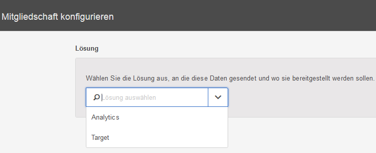

# Konfigurieren von Abonnements in Experience Cloud

Erfahren Sie mehr über Lösungsdatenquellen und das Konfigurieren von Abonnements. Abonnements ermöglichen den Datenfluss von Kundenattributen zwischen Experience Cloud und Lösungen (Analytics und [!DNL Target]).

Ein Adobe Analytics-Abonnement ermöglicht beispielsweise Attributdaten in Berichten. Wenn Sie Adobe Target verwenden, können Sie Kundenattribute für Targeting und Segmentierung hochladen.

**[!UICONTROL Kunden-Attributquelle]** > **[!UICONTROL Neue Kunden-Attributquelle erstellen]** > **[!UICONTROL Neu]**

| Element | Beschreibung |
|--- |--- |
| Lösung | **Adobe Analytics:**  Wählen Sie Analytics und die Report Suites aus, die Attributdaten erhalten sollen, sowie die einzuschließenden Attribute. **Adobe Target:**  Sie können Kundenattribute für Targeting und die Segmentierung hochladen. Diese Funktion ist nützlich, wenn Sie einen Test auf der Grundlage von Attributdaten durchführen möchten oder die Daten für die Segmentierung in Analytics zur Verfügung stellen möchten. Hochgeladene Kundenattributdaten für einen Besucher sind bei der Anmeldung in **[!DNL Target]** > **Zielgruppen** verfügbar. Es werden mehrere Datenquellen unterstützt. Wenn Sie [Kunden-IDs](../core-services/core-services.md) auf Ihrer Website festlegen, stellen Sie sicher, dass mindestens ein Alias über ein [!DNL Target]-Abonnement verfügt. |
| Report Suite (Analytics) | Die Report Suites von Analytics. Innerhalb einer Attributquelle können Sie dem Analytics-Abonnement maximal zehn Report Suites hinzufügen. Berücksichtigen Sie bei der Auswahl der einzuschließenden Report Suites die folgenden Vorschläge:<ul><li>Wählen Sie Report Suites mit einem gemeinsamen Satz authentifizierter Kunden aus. Wenn sich die authentifizierten Kunden in einer Report Suite nicht mit den authentifizierten Kunden in einer anderen Report Suite überschneiden, teilen Sie diese Report Suites in verschiedene Attributquellen auf.</li><li>Wenn möglich, sollten die Report Suites, die in einer Attributquelle enthalten sind, ein ähnliches Traffic-Volumen aufweisen.</li></ul> Falls Sie mehr als zehn Report Suites mit dem gleichen Satz authentifizierter Kunden haben, konfigurieren Sie weitere Kundenattributquellen mit jeweils bis zu zehn Report Suites. |
| Einzuschließende Attribute (Analytics und [!DNL Target]) | Die Attribute, die Sie an die Lösung senden möchten.  Bei der Konfiguration von Abonnements und der Auswahl von Attributen gelten – abhängig von den Lösungen, die Sie besitzen – die folgenden Einschränkungen _pro Report Suite_:<ul><li>Foundation: 0</li><li>Select: 3</li><li>Prime: 15</li><li>Ultimate: 200</li><li>Standard: 3 insgesamt</li><li>Premium: 200 pro Report Suite</li><li>[!DNL Target] Standard: 5</li><li>[!DNL Target] Premium: 200</li></ul> **Hinweis:** Bei einem Upgrade auf Analytics Premium dauert es 24 Stunden, bis weitere Attribute verfügbar sind. Während dieser Wartezeit wird Ihnen möglicherweise eine Fehlermeldung über einen erreichten Attributabonnement-Maximalwert angezeigt. |
