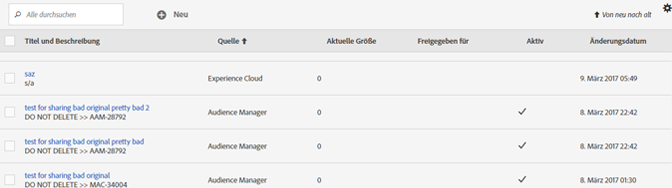
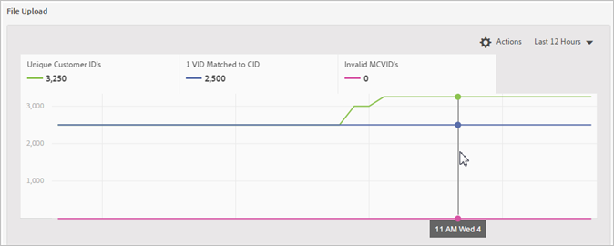
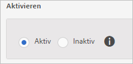
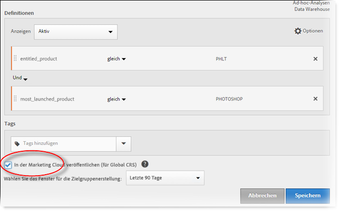
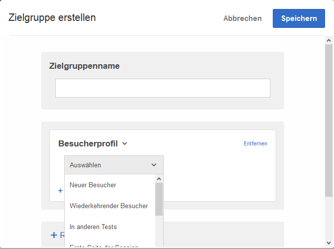

# Erstellen einer Kundenattributquelle und Hochladen der Datendatei

Erstellen Sie die Kundenattributquelle (CSV- und FIN-Dateien) und laden Sie die Daten hoch. Sobald Sie dazu bereit sind, aktivieren Sie die Datenquelle. Geben Sie die Attributdaten nach Aktivierung der Datenquelle an Analytics und Target weiter.

## Arbeitsablauf für Kundenattribute {#concept_BF0AF88E9EF841219ED4D10754CD7154}


1. [Erstellen einer Datendatei](../attributes/t-crs-usecase.md#task_B5FB8C0649374C7A94C45DCF2878EA1A)
1. [Erstellen Sie die Attributquelle und laden Sie die Datendatei hoch.](../attributes/t-crs-usecase.md#task_09DAC0F2B76141E491721C1E679AABC8)
1. [Prüfen des Schemas](../attributes/t-crs-usecase.md#task_09DAC0F2B76141E491721C1E679AABC8)
1. [Konfigurieren von Abonnements und Aktivieren der Attributquelle](../attributes/t-crs-usecase.md#task_1ACA21198F0E46A897A320C244DFF6EA)


Sobald die Datenquelle aktiv ist, können Sie folgende Aufgaben ausführen:

* [Verwenden von Kundenattributen in Adobe Analytics](../attributes/t-crs-usecase.md#task_7EB0680540CE4B65911B2C779210915D)
* [Verwenden von Kundenattributen in Adobe Target](../attributes/t-crs-usecase.md#task_FC5F9D9059114027B62DB9B1C7D9E257)


>[!IMPORTANT]
>
>Um auf diese Funktion zugreifen zu können, müssen Benutzer dem Produktprofil „Kundenattribute“ zugewiesen sein (Kundenattribute – Standardzugriff). ( **[!UICONTROL Administration]** &gt; **[!UICONTROL Admin Console]** &gt; **[!UICONTROL Benutzer]** &gt; ). Benutzer, die der Gruppe „Kundenattribute“ hinzugefügt wurden, sehen auf der linken Seite der Experience Cloud-Benutzeroberfläche unter [!UICONTROL Zielgruppen] das Menüelement [!UICONTROL Kundenattribute.]
>
>Die Mitgliedschaft in der Lösungsgruppe ist ebenfalls erforderlich.

Um die Funktion „Kundenattribute“ verwenden zu können, müssen Benutzer der Adobe-Gruppe „Kundenattribute“ in der Benutzerverwaltung sowie Gruppen auf Lösungsebene (Analytics oder Target) angehören.

Informationen hierzu finden Sie unter [Benutzer und Gruppen](../admin-getting-started/admin-getting-started.md#task_3295A85536BF48899A1AB40D207E77E9).

## Erstellen Sie eine Datendatei.{#task_B5FB8C0649374C7A94C45DCF2878EA1A}

Bei diesen Daten handelt es sich um Unternehmensdaten aus Ihrem CRM-System. Die Daten können zum Beispiel Produktabonnementdaten einschließlich Mitglieds-IDs, Produktberechtigungen, der am häufigsten gestarteten Produkte und dergleichen mehr enthalten.


1. Erstellen Sie eine `.csv`.


   >[!NOTE]
   >
   >Später werden Sie diese `.csv`-Datei per Drag-and-Drop hochladen. Wenn Sie jedoch [per FTP hochladen](../attributes/t-upload-attributes-ftp.md#task_591C3B6733424718A62453D2F8ADF73B), benötigen Sie auch eine `.fin`-Datei mit dem gleichen Namen wie die `.csv`.


   Beispiel für die Kundendatendatei eines Unternehmens:

   

1. Überprüfen Sie vor dem Hochladen der Datei die wichtigen Informationen in den [Datendateivoraussetzungen](../attributes/crs-data-file.md#concept_DE908F362DF24172BFEF48E1797DAF19).
1. [Erstellen Sie eine Kundenattributquelle und laden Sie wie nachfolgend beschrieben die Daten hoch](../attributes/t-crs-usecase.md#task_BCC327B2A0EF4A1BBB2934013AB92B78).

## Erstellen Sie die Attributquelle und laden Sie die Datendatei hoch.{#task_09DAC0F2B76141E491721C1E679AABC8}

Führen Sie diese Schritte auf der Seite „Neue Kunden-Attributquelle erstellen“ der Experience Cloud aus.


>[!IMPORTANT]
>
>Beim Erstellen, Ändern oder Löschen von Kundenattributquellen dauert es bis zu einer Stunde, bis die IDs mit der neuen Datenquelle synchronisiert werden. Sie müssen über Administratorrechte in Audience Manager verfügen, um Kundenattributquellen zu erstellen oder zu ändern. Wenden Sie sich an die Audience Manager-Kundenunterstützung oder -Beratung, um Administratorrechte zu erhalten.


1. Klicken Sie in [!DNL Experience Cloud] im Menü auf das -Symbol.
1. Klicken Sie unter **[!DNL Experience Platform]****[!UICONTROL "Personen]** " &gt; **[!UICONTROL " Kundenattribute]**«.

   Auf der Seite [!UICONTROL Kundenattribute] können Sie vorhandene Datenattributquellen verwalten und bearbeiten.

   
1. Klicken Sie auf **[!UICONTROL Neu]**.

   
1. Konfigurieren Sie auf der Seite [!UICONTROL Kunden-Attributquelle bearbeiten] die folgenden Felder:


   * **[!UICONTROL Name:]** Ein Anzeigename für die Datenattributquelle. Bei [!DNL Adobe Target] dürfen Attributnamen keine Leerzeichen enthalten. Wenn ein Attribut mit Leerzeichen übergeben wird, wird es von [!DNL Target] ignoriert. Weitere nicht unterstützte Zeichen: `< , >, ', "`.

   * **[!UICONTROL Beschreibung:]** (Optional) Eine Beschreibung der Quelle des Datenattributs.

   * **[!UICONTROL Alias-ID:]** Gibt die Quelle der Kundenattributdaten an, beispielsweise ein CRM-System. Eine eindeutige ID, die im Code Ihrer Kundenattributquelle verwendet wird. Die ID muss eindeutig sein und darf nur Kleinbuchstaben, aber keine Leerzeichen enthalten. Der in der Experience Cloud-Oberfläche im Feld „Alias-ID“ eingegebene Wert für eine Kundenattributquelle sollte mit den Werten übereinstimmen, die (über das Dynamic Tag Management oder JavaScript des Mobile-SDK) aus der Implementierung übergeben werden.

      Die Alias-ID entspricht bestimmten Bereichen, für die Sie zusätzliche Kunden-ID-Werte eingerichtet haben. Beispiel:

      * **Dynamisches Tag-Management:** Die Alias-ID entspricht dem *Integrationscode* -Wert unter [!UICONTROL "Kundeneinstellungen]«im Tool [" Experience Cloud ID-Dienst](https://marketing.adobe.com/resources/help/en_US/dtm/?f=macid) " .

      * **Besucher-API:** Die Alias-ID entspricht den zusätzlichen [Kunden-IDs](https://marketing.adobe.com/resources/help/en_US/mcvid/?f=mcvid_customer_ids), die den Besuchern zugeordnet werden können.

         Beispiel: *„crm_ id“* in:


         ```
         "crm_id":"67312378756723456"
         ```


      * **Ios:** Die Alias-ID entspricht *"idtype"* in [visitorsyncidentifiers: Bezeichner.](https://marketing.adobe.com/resources/help/en_US/mobile/ios/?f=methods)

         Beispiel:

         `[ADBMobile visitorSyncIdentifiers:@{@<`**`"idType"`**`:@"idValue"}];`


      * **Android:** Die Alias-ID entspricht dem *" Idtype "* in [syncidentifiers](https://marketing.adobe.com/resources/help/en_US/mobile/android/?f=methods).

         Beispiel:

         `identifiers.put(`**`"idType"`**`, "idValue");`

         Zusätzliche Informationen zur Datenverarbeitung des Alias-ID-Feldes und von Kunden-IDs finden Sie unter [Nutzen mehrerer Data Sources](../attributes/crs-data-file.md#section_76DEB6001C614F4DB8BCC3E5D05088CB).
   * **[!UICONTROL Hochladen einer Datei:]** Die `.csv`-Datendatei kann per Drag-and-Drop oder per FTP hochgeladen werden. (Beim Upload via FTP ist zusätzlich eine `.fin`-Datei erforderlich.) Siehe [Hochladen der Daten via FTP](../attributes/t-upload-attributes-ftp.md#task_591C3B6733424718A62453D2F8ADF73B).


      >[!IMPORTANT]
      >
      >Für die Datendatei bestehen bestimmte Voraussetzungen. Weitere Informationen finden Sie unter [Datendateivoraussetzungen](../attributes/crs-data-file.md#concept_DE908F362DF24172BFEF48E1797DAF19).


      Nach dem Hochladen der Datei werden die Daten auf dieser Seite unter der Überschrift „[!UICONTROL Datei-Upload]“ in tabellarischer Form angezeigt. Sie können das Schema prüfen, Abonnements konfigurieren oder die Übertragung via FTP einrichten.


      **Grafik zum Datei-Upload**

      

   * **[!UICONTROL Unique Customer-ID:]** Zeigt an, wie viele eindeutige IDs Sie in diese Attributquelle hochgeladen haben.

   * **[!UICONTROL Vom Kunden bereitgestellte IDs für Experience Cloud Besucher-IDs:]** Zeigt an, wie viele IDs für Experience Cloud Besucher-IDs bereitgestellt wurden.

   * **[!UICONTROL Vom Kunden bereitgestellte IDs mit hoher Alias-Anzahl:]** Zeigt die Anzahl der vom Kunden bereitgestellten IDs mit 500 oder mehr bereitgestellten Experience Cloud Besucher-IDs an. In der Regel kennzeichnen diese vom Kunden bereitgestellten IDs keine Einzelpersonen, sondern eine Art freigegebene Anmeldung. Das System verteilt die diesen IDs zugewiesenen Attribute auf die 500 zuletzt als Alias zugewiesenen Experience Cloud-Besucher-IDs, und zwar so lange, bis 10.000 Aliasse erreicht sind. Bei Erreichen dieser Anzahl erklärt das System die vom Kunden bereitgestellte ID als ungültig und verteilt nicht länger zugewiesene Attribute.


## Prüfen des Schemas {#task_404AAC411B0D4E129AB3AC8B7BE85859}

Der Prüfungsprozess ermöglicht die Zuordnung von Anzeigenamen und Beschreibungen zu den hochgeladenen Attributen (Zeichenfolgen, Ganzzahlen, Zahlen usw.). Sie können Attribute auch löschen, indem Sie das Schema aktualisieren.

Siehe [Prüfen des Schemas](../attributes/validate-schema.md#concept_B3A01A15D04E4F998118E09B3A9B5043).

Informationen zum Löschen von Attributen finden Sie unter [Schema aktualisieren (Attribute löschen)](../attributes/t-crs-usecase.md#task_6568898BB7C44A42ABFB86532B89063C).

## (Optional) Schema aktualisieren (Attribute löschen) {#task_6568898BB7C44A42ABFB86532B89063C}

So löschen Sie Attribute und ersetzen Attribute im Schema.


1. Entfernen Sie auf der Seite [!UICONTROL Kunden-Attributquelle bearbeiten] das **[!UICONTROL Target]-** oder **[!UICONTROL Analytics]**-Abonnement (unter [!UICONTROL Abonnements konfigurieren]).
1. [Laden Sie eine neue Datendatei mit aktualisierten Feldern hoch](../attributes/t-crs-usecase.md#task_09DAC0F2B76141E491721C1E679AABC8).

## Konfigurieren Sie Abonnements und aktivieren Sie die Attributquelle.{#task_1ACA21198F0E46A897A320C244DFF6EA}

Der Datenfluss zwischen der Experience Cloud und Lösungen wird durch die Konfiguration eines Abonnements eingerichtet. Durch die Aktivierung der Attributquelle können die Daten an die abonnierten Lösungen übertragen werden. Die von Ihnen hochgeladenen Kundendatensätze werden mit den von Ihrer Website oder Anwendung eingehenden ID-Signalen abgeglichen.

Siehe [Konfigurieren von Abonnements](../attributes/subscription.md#concept_ECA3C44FA6D540C89CC04BA3C49E63BF).

**So aktivieren Sie eine Attributquelle**

Suchen Sie auf der Seite [!UICONTROL Neue Kunden-Attributquelle erstellen oder [bearbeiten] die Überschrift [!UICONTROL Aktivieren] und klicken Sie dann auf **[!UICONTROL Aktiv]**.



## Kundenattribute in Adobe Analytics verwenden {#task_7EB0680540CE4B65911B2C779210915D}

Mit den Daten, die jetzt in Lösungen verfügbar sind, wie z. B. in
<keyword>
Adobe Analytics
</keyword>können Sie Berichte zu den Daten erstellen, sie analysieren und die entsprechende Aktion in Ihren Marketing-Kampagnen durchführen.

Folgendes Beispiel zeigt ein [!DNL Analytics]-Segment, das auf den hochgeladenen Attributen basiert. Dieses Segment zeigt Photoshop Lightroom-Abonnenten, deren am häufigsten geladenes Produkt Photoshop ist.



Wenn Sie ein Segment in der Experience Cloud veröffentlichen, wird es in den Experience Cloud-Zielgruppen und in Audience Manager verfügbar.

Weitere Informationen hierzu finden Sie in der Analytics-Hilfe unter [Bericht „Kundenattribute“](https://marketing.adobe.com/resources/help/en_US/reference/?f=reports_customer_attributes).

## Kundenattribute in Adobe Target verwenden {#task_FC5F9D9059114027B62DB9B1C7D9E257}

In Target können Sie beim Erstellen einer Zielgruppe Kundenattribute im Abschnitt „Besucherprofil“ auswählen. Alle Kundenattribute enthalten in der Liste das Präfix [!DNL crs.]. Sie können die Attribute beim Aufbau von Zielgruppen beliebig mit anderen Datenattributen kombinieren.



Weitere Informationen finden Sie unter [Erstellen einer neuen Zielgruppe](https://marketing.adobe.com/resources/help/en_US/target/target/?f=t_creating_a_new_audience) in der Target-Hilfe.
