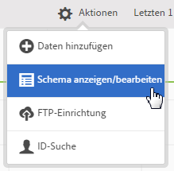
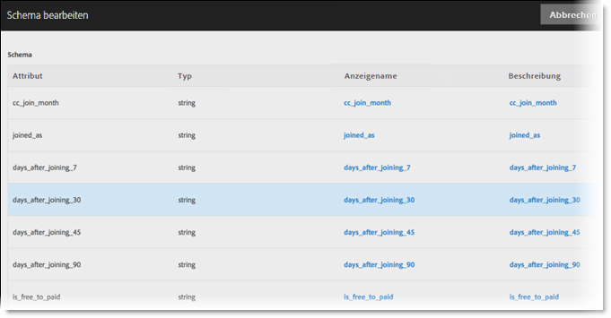

# Prüfen des Schemas

Der Prüfungsprozess ermöglicht die Zuordnung von Anzeigenamen und Beschreibungen zu den hochgeladenen Attributen (Zeichenfolgen, Ganzzahlen, Zahlen usw.). Aus diesen Einstellungen wird ein Schema erstellt, das zur Prüfung aller in Zukunft in diese Datenquelle hochgeladenen Daten verwendet wird. Die ursprünglichen Daten bleiben durch diese Zuordnung unverändert.

>[!NOTE]
>
>Durch die Aktualisierung des Schemas nach der Validierung werden Kundenattribute gelöscht. Siehe [Schema aktualisieren (auch Attribute löschen)](../attributes/t-crs-usecase.md#task_6568898BB7C44A42ABFB86532B89063C).

**[!UICONTROL Kunden-Attributquelle]** &gt; **[!UICONTROL Neue Kunden-Attributquelle erstellen]** &gt; **[!UICONTROL Schema anzeigen/bearbeiten]**

Auf der Seite „[!UICONTROL Schema überprüfen]“ stellt jede Schemazeile eine Spalte der hochgeladenen CSV-Datei dar.

* **[!UICONTROL Daten hinzufügen:]** Lädt in diese Datenquelle neue Attributdaten hoch.

* **[!UICONTROL Schema anzeigen/bearbeiten:]** Ordnet den Attributdaten wie im nächsten Schritt beschrieben Anzeigenamen zu.

* **[!UICONTROL FTP-Einrichtung:]** [Daten per FTP hochladen](../attributes/t-upload-attributes-ftp.md#task_591C3B6733424718A62453D2F8ADF73B).

* **[!UICONTROL ID-Suche:]** Geben Sie eine Kunden-ID (CID) aus Ihrer `.csv` ein, um Experience Cloud-Informationen für diese ID zu suchen. Diese Funktion eignet sich zum Beispiel für die Fehlerbehebung, wenn Sie herausfinden möchten, weshalb die Attributdaten eines bestimmten Besuchers nicht angezeigt werden:

   * **[!UICONTROL MCID (Experience Cloud ID):]** Zeigt an, ob Sie die neueste Version des Experience Cloud ID-Dienstes verwenden. Wenn Sie den MCID-Dienst verwenden, hier aber keine IDs angezeigt werden, hat die Experience Cloud keinen Alias für diese CID erhalten. Der Besucher hat sich also entweder nicht angemeldet, oder Ihre Implementierung lässt diese ID nicht durch.

   * **[!UICONTROL CID (Customer ID):]** Die mit dieser CID verbundenen Attribute. Wenn Sie eine prop oder eVar zum Hochladen von CIDs (AVID) verwenden und Attribute angezeigt werden, aber keine AVID, hat sich der Besucher vermutlich nicht bei Ihrer Site angemeldet.

   * **[!UICONTROL AVID (Analytics-Besucher-ID):]** Zeigt an, ob Sie eine „prop“ oder „eVar“ zum Hochladen von CIDs verwenden. Wenn diese IDs an die Experience Cloud weitergeleitet werden, werden hier alle mit der angegebenen CID verbundenen-Besucher-IDs angezeigt.

Wenn Sie in der Experience Cloud eine Kundenattributquelle und ein FTP-Konto erstellt haben, können Sie die Daten auch via FTP hochladen. Pro Attributquelle müssen Sie ein FTP-Konto erstellen. Die hochgeladenen Dateien werden im Stammordner dieses Kontos gespeichert. Die Daten müssen im .csv-Format übertragen werden, wobei eine zusätzliche .fin-Datei am Ende angibt, dass das Upload abgeschlossen ist.

Die Namen, die Sie den Zeichenfolgen, Ganzzahlen und Nummern geben, werden zur Erstellung der [!DNL Analytics]-Metriken verwendet. See [Customer Attributes Report](https://docs.adobe.com/help/en/analytics/components/variables/dimensions-reports/reports-customer-attributes.html) in [!DNL Analytics] help for more information.

* **[!UICONTROL Attribut:]** Die aus der hochgeladenen `.csv`-Datei gelesenen Attributdaten.

* **[!UICONTROL Typ:]** Datentyp, z. B.:

   * **Zeichenfolge:** eine Folge von Zeichen

   * **Ganzzahl:** ganze Zahlen

   * **Zahl:** Zahl mit bis zu zwei Nachkommastellen

* **[!UICONTROL Anzeigename:]** Ein benutzerfreundlicher Anzeigename für das Attribut. Beispielsweise können Sie das Attribut *Kundenalter* in *Kunde seit* ändern.

* **[!UICONTROL Beschreibung:]** Eine benutzerfreundliche Beschreibung des Attributs.
