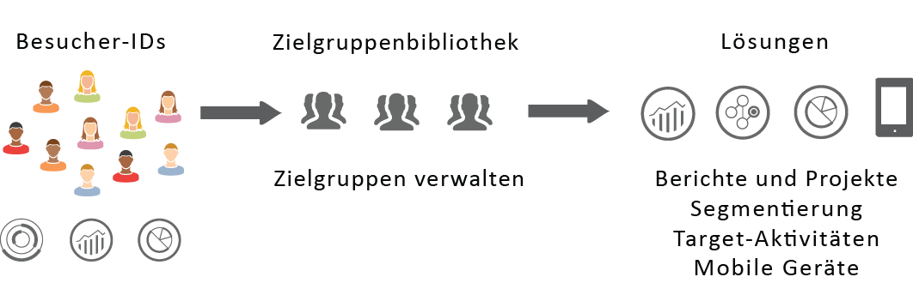
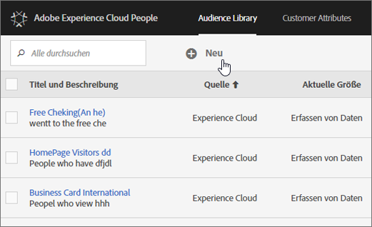

# Experience Cloud-Zielgruppen {#topic_679810123CAA4E0CA4FA3417FB0100C7}

Zielgruppen sind Sammlungen von Besuchern (eine Liste von Besucher-IDs). Über die Zielgruppenbibliothek von Adobe können Sie die Übersetzung von Besucherdaten in die Zielgruppensegmentierung verwalten. Das Erstellen und Verwalten von Audiences ist daher ähnlich wie das Erstellen und Verwenden von Segmenten. Sie können in [!DNL Experience Cloud] das Zielgruppensegment auch für Produkte und Services freigeben.

Zielgruppen können aus verschiedenen Quellen erstellt bzw. abgeleitet werden:

* In der [!DNL Experience Cloud] neu erstellt
* [!DNL Analytics]-Segmente, die in [!DNL Experience Cloud] veröffentlicht werden
* [!DNL Audience Manager]

**Echtzeit- und historische Zielgruppen**

Alle Zielgruppen stehen unabhängig von ihrer Quelle für Echtzeit-Targeting zur Verfügung. Zielgruppen, die in Analytics für Audience Manager freigegeben wurden, sind jedoch für Echtzeit-Targeting nicht verfügbar. Das System bewertet Zielgruppen auf zweierlei Weise:

* Historische Zielgruppen aus Analytics werden alle 4 Stunden ausgewertet. Die Gesamtdauer für die Verarbeitung und Freigabe kann bis zu 8 Stunden dauern. Historische Zielgruppen beinhalten immer wiederkehrende Besucher.
* Echtzeit-Zielgruppen werden in den Experience Cloud Audiences ermittelt und in Echtzeit ausgewertet.

## So werden Zielgruppen in Lösungen verwendet {#concept_01EB9345C5344597BC94A864EDD38EE1}

Die folgende Tabelle beschreibt, wie Zielgruppen in Experience Cloud-Lösungen verwendet werden:

| Lösung | Beschreibung |
|--- |--- |
| Experience Cloud-Zielgruppen | Erstellen, verwalten und teilen Sie Zielgruppen systemintern mithilfe der Benutzeroberfläche der [Zielgruppenbibliothek](../audience-library/audience-library.md). Sie haben folgende Möglichkeiten:<ul><li>Verwenden von Echtzeit-Zielgruppen mithilfe von Attributen für Rohanalysen</li><li>Kombinieren von Zielgruppen zur Erstellung von Composite-Daten, indem Sie Echtzeit- und historische Daten kombinieren</li><li>Siehe Grafische Ansichten der geschätzten Zielgruppengröße</li></ul> Vorschläge zum Typ der Zielgruppe, die Sie erstellen möchten, finden Sie unter: [Experience Cloud-Zielgruppen](https://helpx.adobe.com/de/marketing-cloud-core/kb/People/Audience-Creation-Options.html). |
| Analytics | Bei der Segmentierung können Sie ein Segment erstellen, es mit einer Report Suite verknüpfen und das Segment dann in Experience Cloud veröffentlichen. Beim Veröffentlichen des Segments wird es auf der Seite [!UICONTROL Zielgruppenbibliothek] in Experience Cloud angezeigt. (Weitere Informationen finden Sie unter [Segmente in Experience Cloud veröffentlichen](https://docs.adobe.com/content/help/de-DE/analytics/components/segmentation/segmentation-workflow/seg-publish.html) in der Analytics-Hilfe.) Die Zielgruppe steht auch als eine für ein Kampagnenerlebnis anvisierte Zielgruppe in Adobe Target und in Audience Manager bereit. Nachdem eine Zielgruppe in Adobe Analytics freigegeben und zur Verwendung in einer aktiven Kampagne ausgewählt wurde, werden alle Besucherprofile, die in den letzten 90 Tagen den Segmentdefinitionskriterien entsprochen haben, an die Experience Cloud-Plattform für [!UICONTROL Zielgruppendienste] gesendet. Die Beschränkung für freigegebene Zielgruppen wurde auf 75 erhöht. Zielgruppen, die von der Experience Cloud und Analytics gemeinsam verwendet werden, dürfen nicht mehr als 20 Millionen eindeutige Mitglieder umfassen. Aufgrund der Caching-Funktion wird zudem die Löschung von Report Suites in Analytics erst nach 12 Stunden durch Experience Cloud übernommen. |
| Mobile Services | Analysieren Sie den mobilen Traffic mithilfe der Sunburst-Visualisierung im Bericht [!UICONTROL Gerätetypen]. |
| [!DNL Target] | Mit dem [ID-Dienst](https://docs.adobe.com/content/help/de-DE/id-service/using/home.html) werden Besucher-IDs und Daten zu einem einsatzfähigen Profil zusammenfasst, welches dann lösungsübergreifend verwendet werden kann. Wenn das Kontrollkästchen [In der Experience Cloud veröffentlichen](../audience-library/audience-library.md) während der Segmenterstellung in Adobe Analytics aktiviert wird, ist das Segment in der benutzerdefinierten Zielgruppenbibliothek von Adobe Target verfügbar. Ein in Analytics oder Audience Manager erstelltes Segment kann für Aktivitäten in [!DNL Target] verwendet werden. Sie können zum Beispiel Kampagnenaktivitäten basierend auf [!DNL Analytics]-Konversionsmetriken und in [!DNL Analytics] erstellten Zielgruppensegmenten erstellen. |
| Audience Manager | Freigegebene Zielgruppen sind in der Segmentierung von Audience Manager verfügbar. Alle Experience Cloud-Zielgruppen stehen systemintern in Audience Manager zur Verfügung. Dieser bietet Folgendes:<ul><li>Integrierte Automatisierung hinsichtlich der Freigabe und Verwendung in Lösungs-Workflows</li><li>Offsite-Ziele</li><li>Look-Alike-Modellierung</li></ul> |
| Campaign | <ul><li>Importieren freigegebener Zielgruppen von verschiedenen Adobe Experience Cloud-Lösungen in Adobe Campaign.</li><li>Exportieren Sie Empfängerlisten in Form von freigegebenen Zielgruppen. Diese freigegebenen Zielgruppen können dann in den anderen von Ihnen verwendeten Adobe Experience Cloud-Lösungen genutzt werden.</li></ul> |
| Media Optimizer | Verwenden Sie die Zielgruppe als Ziele. |

>[!IMPORTANT]
>
>Wenn ein Besucher in die in Analytics freigegebene Zielgruppe aufgenommen wird, ist diese Information erst mit einer Verzögerung von 4 bis 8 Stunden in [!DNL Target], Ad Cloud und Campaign Standard verfügbar.

## Weitere Hilfestellung – Fragen, Hinweise und Anwendungsbeispiele {#section_C7F151644D8A45F7B6FC54F58845635D}

| Hilfe mit | Ressource |
|--- |--- |
| Es können keine Ressourcen gefunden werden? | Stellen Sie sicher, dass Sie bereitgestellt wurden. Siehe [Erste Schritte – Aktivieren Ihrer Lösungen für zentrale Dienste](../core-services/core-services.md). Klicken Sie [hier](https://www.adobe.com/go/audiences), um Zugriff auf Profiles &amp; Audiences anzufordern (Integrations-Bereitstellungsformular). |
| Anwendungsbeispiele | Weitere Anleitungen zu der zu verwendenden Lösung finden Sie in der Knowledgebase unter [Optionen zur Zielgruppenerstellung](https://helpx.adobe.com/de/marketing-cloud-core/kb/People/Audience-Creation-Options.html). |
| Forum | Das [Zielgruppenforum](https://forums.adobe.com/community/experience-cloud/platform/core-services/people-service/audiences) ist eine zusätzliche Ressource, die Hilfe bei Zielgruppen bietet. |

## Schnittstellenelemente der Zielgruppenbibliothek {#section_D04ACEF61CEF4B189AE6BA9F40D0DBF4}

Die [!DNL Experience Cloud] verfügt über eine Bibliothek für die Erstellung und Verwaltung von Zielgruppen mit einer systemeigenen Zielgruppenidentifizierung in Echtzeit.

**[!UICONTROL Experience Cloud]** > **[!UICONTROL Experience Platform]** > **[!UICONTROL Personen]** > **[!UICONTROL Zielgruppenbibliothek]**

| Element | Beschreibung |
|--- |--- |
| Neu | [Erstellen einer Zielgruppe](../audience-library/audience-library.md). |
| Titel und Beschreibung | Eine Spaltenüberschrift, die die Zielgruppe identifiziert und beschreibt. |
| Autor | Die Person, die das Zielgruppensegment erstellt hat. |
| Quelle | Gibt an, wo die Zielgruppe erstellt wurde.<ul><li>**Analytics:** Ein Segment, das in Adobe Analytics erstellt und dann in [Experience Cloud veröffentlicht wurde](../audience-library/audience-library.md).</li><li>**Experience Cloud:** Eine neue Zielgruppe, [die in Experience Cloud Audiences erstellt wird](../audience-library/audience-library.md).</li><li>**Audience Manager:** In Audience Manager erstellte Zielgruppen werden automatisch in Experience Cloud-Zielgruppen angezeigt.</li></ul> |
| Aktuelle Größe | Die aktuelle Zielgruppengröße. |
| Aktiv | Der aktive Status des Segments. |
