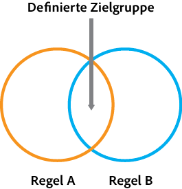
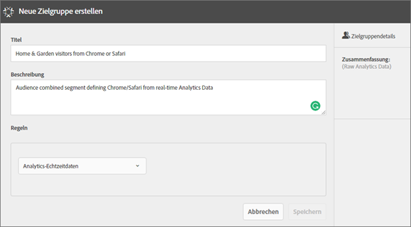
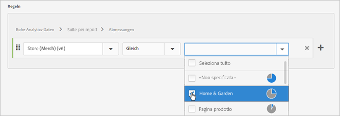
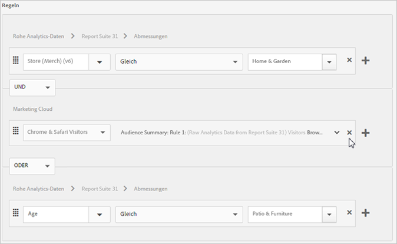
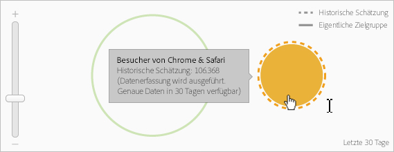

# Erstellen einer Zielgruppe

Erfahren Sie, wie Sie mit Attributregeln eine Zielgruppe erstellen und eine gemischte Zielgruppe in der Experience Cloud definieren.

In diesem Artikel erfahren Sie, wie:

* Erstellen einer Zielgruppe
* eine Regel erstellen
* Verwenden von Regeln zum Definieren einer zusammengesetzten Audience

Die folgende Grafik stellt zwei Regeln in einer zusammengesetzten Audience dar.

Jeder Kreis stellt eine Regel dar, die die Mitgliedschaft in einer Audience definiert. Besucher, die sich in beiden Audiencen als Mitglieder qualifizieren, überschneiden sich, um zur zusammengesetzten, definierten Audience zu werden.

>[!NOTE]
>
>Die Zielgruppe ist erst nach Ablauf des für die Datenerfassung angegebenen Zeitraums vollständig definiert.
Das folgende Beispiel zeigt, wie die Regeln für eine zusammengesetzte Audience erstellt werden. Diese Audience umfasst:

* &quot;Home &amp; Garden&quot;-Abschnitt, der aus Seitendaten oder Rohanalysedaten abgeleitet wurde.
* Chrome- und Safari-Benutzer, die einem [!DNL Adobe Analytics]-Segment entnommen wurden, das in der [!DNL Experience Cloud] [veröffentlicht](../audience-library/audience-library.md#task_32FEEFE0B32E4E388CD4D892D727282A) wurde.

   

1. In the [!DNL Experience Cloud], under [!DNL Experience Platform], click **[!UICONTROL People]** > **[!UICONTROL Audience Library].**
1. Klicken Sie auf der Seite [!UICONTROL „Zielgruppen“] auf **[!UICONTROL Neu]**. 

   

1. Geben Sie auf der Seite [!UICONTROL Neue Zielgruppe erstellen] einen Titel und eine Beschreibung an.
1. Wählen Sie unter [!UICONTROL Regeln] eine Attributquelle aus:

   * **[!UICONTROL Analytics-Echtzeitdaten (oder Rohdaten):]** Hierbei handelt es sich um Attributdaten, die aus Echtzeit-Bildanfragen an Analytics gewonnen werden und Daten wie eVars und Ereignisse enthalten. Sie müssen bei Verwendung dieser Attributquelle eine Report Suite auswählen und die einzuschließende Dimension oder das einzuschließende Ereignis definieren. Diese Report Suite-Auswahl stellt die von der Report Suite verwendete Variablenstruktur bereit.
   >[!NOTE]
   >
   >Aufgrund der Caching-Funktion wird die Löschung von Report Suites in Analytics erst nach 12 Stunden durch Experience Cloud übernommen.

   * **[!UICONTROL Experience Cloud:]** Aus [!DNL Experience Cloud]-Quellen abgeleitete Attributdaten. Hierbei kann es sich z. B. um Daten aus Zielgruppensegmenten handeln, die Sie in [!DNL Analytics] erstellen, oder Daten aus [!DNL Audience Manager].

1. Definieren Sie Audiencen und klicken Sie dann auf **[!UICONTROL Speichern].**

>[!NOTE]
>
>Für die Erstellung von Zielgruppenregeln sollten Sie Ihre Implementierungsvariablen unbedingt kennen.

Definieren Sie unter [!UICONTROL Regeln] die *`Home & Garden`*-Attributauswahl:

* **[!UICONTROL Attributquelle:]** Analytics-Rohdaten
* **[!UICONTROL Report Suite:]** Report Suite 31
* Dimension = **[!UICONTROL Store (Merch) (v6)]** > **[!UICONTROL Equals]** > **[!UICONTROL Home &amp; Garden]**

Die *Besucher von Chrome und Safari* sind ein in Analytics freigegebenes Zielgruppensegment:

* **[!UICONTROL Attributquelle:]** Experience Cloud
* **[!UICONTROL Dimension:]** Besucher von Chrome &amp; Safari

Zum Vergleich können Sie eine *OR*-Regel hinzufügen, um alle Besucher eines Site-Bereichs wie „Patio &amp; Furniture“ anzuzeigen.

Die resultierende Regel ist eine definierte Audience mit Chrome &amp; Safari-Benutzern, die Home &amp; Garden besucht haben. Das Segment &quot;Patio &amp; Furniture&quot;bietet zusätzliche Einblicke in alle Besucher, die diesen Site-Abschnitt besuchen.

* **Historische Schätzdaten:** (Gepunkteter Kreis) Stellt Regeln dar, die basierend auf [!DNL Analytics]-Daten erstellt wurden.
* **Tatsächliche Audience:** (Durchgehender Kreis) Jede erstellte Regel, die 30 Tage lang Daten aus Audience Manager enthält. Wenn die Audience Manager-Daten 30 Tage erreichen, wird die Zeile durchgehend gefüllt und stellt die tatsächlichen Zahlen dar.

Nachdem die Datenerfassung für den angegebenen Zeitraum abgeschlossen wurde, werden die Kreise zu einer definierten Audience kombiniert.

Nach dem Speichern der Audience ist sie für andere Lösungen verfügbar. Sie können beispielsweise eine freigegebene Audience in eine Adobe-Zielgruppe-Aktivität aufnehmen.
