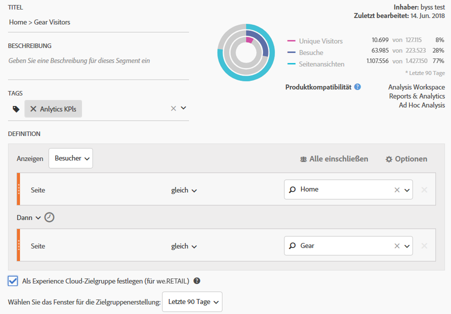

# Veröffentlichen eines Analytics-Zielgruppensegments

Für Ihre Zielgruppen-Marketingaktivitäten müssen Sie ein Analytics-Zielgruppensegment in der Experience Cloud und in Adobe Target veröffentlichen.

1. [Erstellen eines Segments](https://marketing.adobe.com/resources/help/de_DE/analytics/segment/?f=seg_build) in Analytics.
1. Aktivieren Sie im Segment Builder die Option **[!UICONTROL Als Experience Cloud-Zielgruppe festlegen]**.

   

   | Element | Beschreibung |
   |--- |---|
   | Als Experience Cloud-Zielgruppe festlegen (für &lt;report suite name&gt;) | Veröffentlicht dieses Segment in Experience Cloud. Die Zielgruppe können Sie für Marketingaktivitäten in Adobe Target und für die Segmentierung in Audience Manager verwenden. Die Felder „Titel“ und „Beschreibung“ sind für die Veröffentlichung des Segments erforderlich. Wenn diese Option deaktiviert ist, werden zwar Titel und Definition des Zielgruppensegments freigegeben, die eigentlichen Daten jedoch nicht. Wenn die Zielgruppe einer Aktivität in Target zugewiesen wird, beginnt Analytics damit, IDs für Besucher zu senden, die sich für diese Experience Cloud- und Target-Zielgruppe qualifizieren. Ab diesem Zeitpunkt werden der Zielgruppenname und die zugehörigen Daten auf der Experience Cloud Audiences-Seite angezeigt. Zielgruppen, die von der Experience Cloud und Analytics gemeinsam verwendet werden, dürfen nicht mehr als 20 Millionen Zielgruppen-Mitglieder umfassen. Aufgrund der Caching-Funktion wird die Löschung von Report Suites in Analytics erst nach 12 Stunden durch Experience Cloud übernommen. In Analytics können Sie ein veröffentlichtes Segment bearbeiten oder löschen. Wird das Segment aktuell verwendet, wird ein Warnhinweis eingeblendet, wenn Sie das Segment bearbeiten. Ein veröffentlichtes Segment, das aktuell in Adobe Target verwendet wird, kann nicht gelöscht werden. Wenn ein Besucher in die in Analytics freigegebene Zielgruppe aufgenommen wird, ist diese Information erst mit einer Verzögerung von 24 bis 48 Stunden in Target, Advertising Cloud und Campaign verfügbar. **Datenschutz** Zielgruppen werden nicht nach dem Authentifizierungsstatus der Besucher gefiltert. Wenn Besucher Ihre Site sowohl authentifiziert als auch nicht authentifiziert anzeigen können, kann eine Aktion, die ein nicht authentifizierter Benutzer durchführt, dennoch dazu führen, dass der Besucher in die Zielgruppe aufgenommen wird. Lesen Sie den [Überblick über den Datenschutz in Analytics](https://marketing.adobe.com/resources/help/de_DE/reference/?f=c_Privacy_Overview), um die alle Auswirkungen auf den Datenschutz durch die Zielgruppenfreigabe zu verstehen. |
   | Fenster für Zielgruppenerstellung auswählen | Beachten Sie, dass es sich um ein **rollierendes** Zeitfenster und kein festgelegtes Zeitfenster handelt. |

1. Klicken Sie auf **[!UICONTROL Speichern]**.
1. Rufen Sie [!DNL Adobe Target] auf, klicken Sie auf [!UICONTROL Zielgruppen].
1. Suchen Sie auf der Seite [!UICONTROL Zielgruppen] die aus der Experience Cloud stammende Zielgruppe.

   Diese Zielgruppen sind für Aktivitäten verfügbar.
