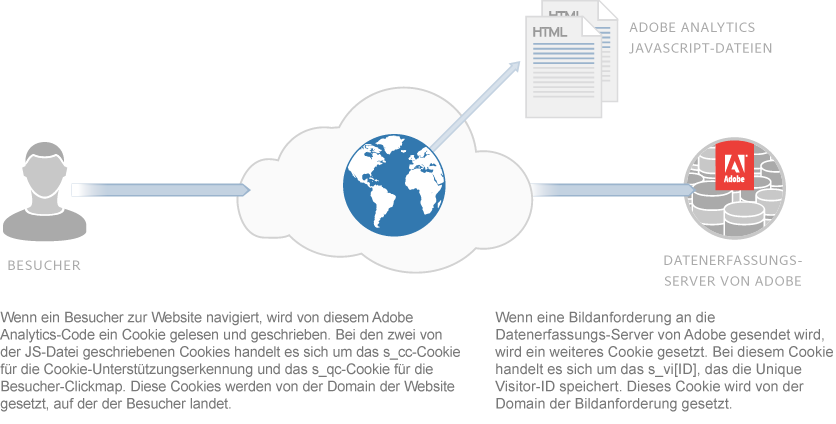
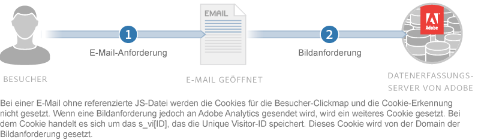

# Informationen über Cookies und Datenschutz{#about-cookies-and-privacy}

Die Wahrung der Privatsphäre und die Datensicherheit der Kunden hat bei Adobe oberste Priorität. Adobe nimmt an mehreren Datenschutzorganisationen teil und arbeitet mit Datenschutzbehörden und Selbstregulierungsgrundsätzen zusammen. Diese Zusammenarbeit umfasst das Programm Digital Advertising Alliance AdChoices , mit dem Kunden Informationen über die Verwendung ihrer Informationen und die Auswahl ihrer Verwendung erhalten.

Die meisten von Experience Cloud-Produkten gesetzten Cookies enthalten keine personenbezogenen Informationen. Diese Cookies und zugehörige Daten sind sicher und werden nur für die Berichte in Ihrem Unternehmen sowie zur Bereitstellung relevanter Inhalte und Werbeanzeigen genutzt. Die Daten werden nicht an Drittanbieter oder andere Kunden von Adobe weitergegeben, es sei denn in aggregierter Form für Branchenberichte. Beispielsweise werden im [!DNL Digital Marketing Insight Report] aggregierte und anonyme Daten mehrerer Einzelhändler analysiert.

Adobe führt unternehmensübergreifend keine Informationen auf Browserebene zusammen. Zum Schutz der Privatsphäre und der Sicherheit von Kundendaten ermöglichen einige Dienste innerhalb des Experience Cloud-Angebots den Unternehmen die Verwendung eines separaten Satzes mit Cookies für jede verfolgte Site. Einige der Suite-Angebote bieten Kunden außerdem die Möglichkeit, ihren eigenen Domänennamen als Inhaber des Cookies zu verwenden. Dadurch entsteht eine zusätzliche Datenschutz- und Sicherheitsstufe, da die Experience Cloud-Cookies *Erstanbieter-Cookies* sind, die dauerhaft zur Website des Unternehmens gehören.

Cookies können nur die Informationen speichern und bereitstellen, die zuvor in ihnen abgelegt wurden. Sie sind nicht in der Lage, Code auszuführen oder andere auf dem Computer gespeicherte Informationen abzurufen. Außerdem schränken Webbrowser den Zugriff auf Cookie-Daten ein. Browser erzwingen eine Cookie-Sicherheitsrichtlinie, die alle Cookie-Daten nur der Website zur Verfügung stellt, die die Informationen ursprünglich eingestellt hat.

Beispielsweise können Daten, die in Cookies enthalten sind, die von der Adobe.com-Website eingestellt werden, auf keiner anderen Website als Adobe.com angezeigt werden.

Die folgende Abbildung zeigt die Verwendung von Cookies für eine Standard-Bildanforderung:

Die folgende Abbildung zeigt die Verwendung von Cookies für eine direkte Bildanforderung (in Szenarien, in denen keine JS-Datei geladen wird):

