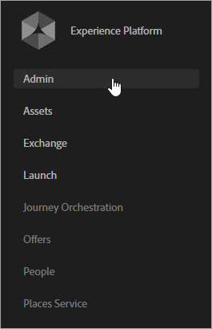

# Implementierung für Experience Cloud Services aktivieren

Wenn Sie kürzlich Experience Cloud mit Experience Platform Launch implementiert haben, sind Sie bereits für Kundenattribute und Experience Cloud-Audiences eingerichtet. Sie können auch Benutzer und Produkte in der Admin Console verwalten.

Bestehende Kunden können ihre Lösungsimplementierungen modernisieren und Experience Cloud implementieren. Auf diese Weise können Sie Kundenattribute und Zielgruppenfunktionen in Adobe Analytics, Audience Manager und Adobe Target verwenden. Für eine erfolgreiche Implementierung werden Sie:

1. [Experience Cloud beitreten und Administrator werden](#section_2423F0BD3DF642658103310EE5EA6154)
1. [Implementieren von Experience Cloud ID Service](#section_3C9F6DF37C654D939625BB4D485E4354)
1. [Report Suites einer Experience Cloud-Organisation zuweisen](#section_7B08516B01BA421681DF03D0E86CE3BA)
1. [Den Analytics-AppMeasurement-Code aktualisieren](#section_1798D9D0F05C47E29816AC4EEB9A0913)
1. [Die Implementierung der Adobe Target aktualisieren](#section_C2F4493C7A36406DAE2266B429A4BD24)
1. [Überprüfen der Implementierung](#section_E641782A0F4F44AF8C9C91216BE330D5)
1. [Benutzer und Produkte verwalten](#section_B6E95F4E0E12483CB9DA99CBC0C5A4AF)
1. [Freigabe von Attributen und Zielgruppendaten beginnen](#section_960C06093623462E8EA247B3E97274A1)

## Experience Cloud beitreten und Administrator werden {#section_2423F0BD3DF642658103310EE5EA6154}

Was Sie tun müssen, um Experience Cloud-Mitglied zu werden:

1. Stellen Sie sicher, dass Sie über gültige SKUs für Adobe Analytics oder Adobe Target verfügen.

   * **Adobe Analytics:** Standard oder Premium (nicht die ältere [!DNL SiteCatalyst]-SKU).
   * **Adobe Target:** Standard oder Premium.

   >[!NOTE]
   >
   >Migrieren Sie für [!DNL Target] beispielsweise von [!DNL mbox.js] zu „at.js“. Siehe [Aktualisieren von at.js 1.x auf at.js 2.x](https://experienceleague.adobe.com/docs/target/using/implement-target/client-side/at-js-implementation/upgrading-from-atjs-1x-to-atjs-20.html?lang=en).

1. Modernisieren Sie Ihre Implementierung und lassen Sie sich einen Administrator bereitstellen.

   * Führen Sie die Schritte unter [Implementieren des [!UICONTROL Experience Cloud ID-Dienstes]](core-services.md#section_3C9F6DF37C654D939625BB4D485E4354) aus.
   * Wenden Sie sich an Ihren Kundenbetreuer und starten Sie den Bereitstellungsprozess für die Experience Cloud.

1. Verwalten Sie Benutzer und Produkte in der [!UICONTROL Admin Console].

### Administratoranmeldung

Sobald Sie Administrator sind, können Sie sich unter [experience.adobe.com](https://experience.adobe.com) anmelden.

Der Link **[!UICONTROL Admin Console]** ist in der Menünavigation im Experience Cloud verfügbar.

Weitere Informationen finden Sie unter [Experience Cloud – Benutzer und Produkte verwalten](admin-getting-started.md#topic_3FCB4099640647E3B2411ADBFCE81909).

### Benutzeranmeldung

Für die Anmeldung bei der Experience Cloud müssen Ihre Benutzer:

* Eine Adobe ID (oder Enterprise ID für Ihr Unternehmen) haben.
* Sich bei [experience.adobe.com](https://experience.adobe.com) anmelden.
* Zu einer Lösungsgruppe gehören, die einer Unternehmensgruppe zugeordnet ist.
* Verknüpfen Sie ggf. die Lösungskonten mit ihrer Adobe ID (Beschreibung unten).

### Optional: Verknüpfen Sie vorhandene Benutzerkonten.

Wahrscheinlich haben Sie Benutzer, die bereits Mitglied von Lösungsgruppen sind, z. B. eine Analytics-Gruppe, die Sie zuvor unter [!UICONTROL Analytics] > [!UICONTROL Admin Tools] verwaltet haben.

Wenn Sie diese Gruppen Experience Cloud-Unternehmensgruppen zuordnen, müssen diese Benutzer ihre Anmeldeinformationen für das Lösungskonto manuell mit ihrer Adobe ID verknüpfen.

Siehe [Verknüpfen von Konten in der Experience Cloud](organizations.md#topic_C31CB834F109465A82ED57FF0563B3F1)

>[!NOTE]
>
>Nach dem Mapping von Unternehmens- und Lösungsgruppen werden neue Benutzer automatisch verknüpft. (Lösungsanmeldeinformationen werden automatisch erstellt und mit ihrer Adobe ID verknüpft.)

In den folgenden Abschnitte wird die Modernisierung Ihrer Implementierung beschrieben. Durch die Modernisierung Ihrer Implementierung werden die zentralen Dienste in der Experience Cloud aktiviert.

## Implementieren von [!UICONTROL Experience Cloud ID Service] {#section_3C9F6DF37C654D939625BB4D485E4354}

Der [!UICONTROL Experience Cloud ID-Dienst] stellt eine allgemeine ID für lösungsübergreifende Integrationen bereit. Er bietet eine domänenübergreifende Besucheridentifikation und einen Pfad für geräte-/browserübergreifendes Targeting und die Personalisierung basierend auf CRM-Daten, die über [!UICONTROL Kundenattribute] hochgeladen wurden.

Die einfachste Methode zur Aktivierung der zentralen Experience Cloud-Dienste besteht darin, diese für Analytics und Adobe Target automatisch über die [Experience Cloud ID Service-Erweiterung](https://experienceleague.adobe.com/docs/experience-platform/tags/extensions/adobe/id-service/overview.html?lang=en) in [!UICONTROL Experience Platform Launch] zu aktivieren.

Die vollständige Hilfe zum Experience Cloud ID-Dienst (früher Besucher-ID) finden Sie [hier](https://experienceleague.adobe.com/docs/id-service/using/intro/overview.html?lang=de#intro).

**Sie verwenden nicht [!UICONTROL Experience Platform Launch] oder [!UICONTROL Dynamic Tag Management]?**

Wenn Sie [!UICONTROL Experience Platform Launch] oder das [!UICONTROL Dynamic Tag Management] nicht verwenden, implementieren Sie den ID-Dienst über die JavaScript-Implementierung ([!DNL VisitorAPI.js]) wie folgt:

| Aufgabe | Beschreibung |
| -----------| ---------- |  
| [Implementieren des Experience Cloud ID-Dienstes für Analytics](https://experienceleague.adobe.com/docs/id-service/using/implementation/setup-analytics.html?lang=en) | Adobe empfiehlt auch, zusätzliche [Kunden-IDs](https://experienceleague.adobe.com/docs/id-service/using/reference/authenticated-state.html?lang=en) festzulegen. Diese IDs werden den einzelnen Besuchern zugeordnet und dienen der Aktivierung der aktuellen und zukünftigen Funktionen in Experience Cloud. |
| Aktualisieren Sie Ihre vorhandene [!DNL s_code] auf die Version H.27.3 oder höher, oder Ihre vorhandene [!DNL AppMeasurement.js] auf Version 1.4 oder höher. | Diese Dateien können im [Code-Manager](https://experienceleague.adobe.com/docs/analytics/admin/admin-tools/code-manager-admin.html?lang=en) in den Analytics Admin Tools heruntergeladen werden. (Das Handbuch für die [JavaScript-Implementierung](https://experienceleague.adobe.com/docs/analytics/implementation/js/overview.html?lang=en#js) ist verfügbar, wenn Sie weitere Informationen zu [!DNL AppMeasurement.js] benötigen.) |
| Synchronisieren der Kunden-ID für Analytics | Siehe [Analytics – Synchronisieren der Kunden-ID](core-services.md#section_AD473A6A21C1446498E700363F9A8437) (unten). |

{style=&quot;table-layout:auto&quot;}

### Analytics und Adobe Target – Synchronisieren der Kunden-ID {#section_AD473A6A21C1446498E700363F9A8437}

Adobe empfiehlt im Zuge der Einrichtung des Experience Cloud ID-Dienstes für Analytics und [!DNL Target] die Synchronisierung Ihrer [Kunden-IDs](https://experienceleague.adobe.com/docs/id-service/using/reference/authenticated-state.html?lang=en) mit der Experience Cloud.

In Adobe Target muss `mbox3rdpartyid` die Kunden-ID abrufen und an [!DNL Target] senden. (Siehe [Arbeiten mit Kundenattributen](https://experienceleague.adobe.com/docs/target/using/audiences/visitor-profiles/working-with-customer-attributes.html?lang=en) in [!DNL Target].)

Wenn sich ein Besucher auf Ihrer Website authentifiziert oder sich auf andere Weise identifiziert, muss Ihre Implementierung die CRM-Kunden-ID dieser Person für die Seite oder App verfügbar machen. Anschließend können Sie den entsprechenden Funktionsaufruf verwenden, um Ihre Kunden-ID mit der Experience Cloud zu synchronisieren. Durch diese Synchronisierung wird die CRM-Kunden-ID des Besuchers in der Experience Cloud gespeichert und die Attribute dieses Kunden werden für die Verwendung in der Experience Cloud aktiviert.

Beispiel: Bob hat in Ihrem CRM-System die Kunden-ID `52mc210tr42`. Wenn sich Bob bei Ihrer Site authentifiziert, müssen Sie diese ID auf der Seite bereitstellen und die ID zur Synchronisierung auf eine der beiden folgenden Arten verwenden:

* Aufruf von `visitor.setCustomerIDs({"crm_id":"52mc210tr42"})` über den Besucher-ID-Dienst Oder
* Füllen Sie die *`Customer ID (52mc210tr42)`* in einer prop oder eVar.

Die Kunden-ID muss in jedem Aufruf an den [!DNL Analytics]-Server angegeben sein, auf dem die Kunden-ID bekannt ist.

### Mobile SDKs

Syntaxbeispiele zum Festlegen zusätzlicher Kunden-IDs in [Android™](https://experienceleague.adobe.com/docs/mobile-services/android/overview.html?lang=de)- und [iOS](https://experienceleague.adobe.com/docs/mobile-services/ios/overview.html?lang=de)-Apps finden Sie im Abschnitt *Experience Cloud-ID-Dienst* .

### Aktivierung der Attribute historischer Daten

Kundenattributdaten werden nach der Anmeldung durch die Besucher bereitgestellt. Wenn Sie den ID-Dienst noch nicht implementiert haben und Kunden-IDs in einer Prop oder einer eVar historisch verfolgt haben, können Sie einen Prozess anfordern, der historische Anmeldungen an Experience Cloud sendet. Auf diese Weise können Sie sofort mit der Verwendung von Kundenattributen beginnen.

Wenden Sie sich an die Kundenunterstützung, um historische Daten zu aktivieren.

## Zuweisen von Report Suites zu einer Experience Cloud-Organisation {#section_7B08516B01BA421681DF03D0E86CE3BA}

>[!NOTE]
>
>Die Funktion für die Report Suite-Zuweisung wurde im November 2020 eingestellt. Wenden Sie sich bei Fragen an den Support.

Experience Cloud-Dienste (z. B. der Experience Cloud ID-Dienst und [!UICONTROL People-Dienst]) sind einer Experience Cloud-Organisation und keiner einzelnen Analytics Report Suite zugeordnet. Um sicherzustellen, dass diese Dienste ordnungsgemäß funktionieren, muss jede Analytics Report Suite einer Experience Cloud-Organisation zugeordnet werden.

## Den Analytics-AppMeasurement-Code aktualisieren {#section_1798D9D0F05C47E29816AC4EEB9A0913}

Wenn Sie Analytics verwenden, stellen Sie sicher, dass Sie die regionale Datenerfassung (Regional Data Collection, RDC) verwenden. Wenn Ihre Datenerfassungsdomäne `omtrdc.net` lautet, oder wenn Ihr CNAME `omtrdc.net` zugeordnet ist, befinden Sie sich auf RDC. Weitere Informationen finden Sie unter [Übergang zu RDC](https://experienceleague.adobe.com/docs/analytics/technotes/rdc/regional-data-collection.html?lang=de). Wenn Sie Erstanbieter-Cookies verwenden, finden Sie unter [CNAME und Experience Cloud ID-Dienst](https://experienceleague.adobe.com/docs/id-service/using/reference/analytics-reference/cname.html?lang=en) Informationen zu CNAMES für die Datenerfassung und zur domänenübergreifenden Verfolgung.

Adobe empfiehlt eine Modernisierung Ihrer Analytics-Implementierung durch Aktualisierung Ihrer JavaScript-Bibliotheken einschließlich der Besucher-API. Die einfache Möglichkeit, dies zu erreichen, besteht darin, eine [Adobe Analytics-Erweiterung](https://experienceleague.adobe.com/docs/experience-platform/tags/extensions/adobe/analytics/overview.html?lang=en) in der Experience Platform Data Collection (Launch) hinzuzufügen.

## Die Implementierung der Adobe Target aktualisieren {#section_C2F4493C7A36406DAE2266B429A4BD24}

* Es wird empfohlen, eine [Adobe Target-Erweiterung](https://experienceleague.adobe.com/docs/experience-platform/tags/extensions/adobe/target-v2/overview.html?lang=en) in [!UICONTROL Experience Platform Launch] hinzuzufügen, damit der Bibliotheksabruf automatisch erfolgt. Sie können auch die [Experience Cloud ID-Diensterweiterung](https://experienceleague.adobe.com/docs/experience-platform/tags/extensions/adobe/id-service/overview.html?lang=en) für Adobe Target (und andere Lösungen) mithilfe von [!UICONTROL Experience Platform Launch] einrichten. Die Aktualisierung des [!UICONTROL Experience Cloud ID-Dienstes] **ist erforderlich**, damit Adobe Target die zentralen Dienste verwenden kann.
* Wenn Sie [!UICONTROL Experience Platform Launch] nicht verwenden, aktualisieren Sie [Ihre Mbox-Bibliothek](https://experienceleague.adobe.com/docs/target/using/implement-target/client-side/implement-target-for-client-side-web.html?lang=en) manuell.
* Fordern Sie Zugriff auf Adobe Analytics als Berichtsquelle für [!DNL Adobe Target] an. [!DNL Target]- und [!DNL Analytics]-Daten werden bei der Verarbeitung bei demselben Server-Aufruf zusammengeführt, damit Besucher lösungsübergreifend verknüpft werden. Siehe [Analytics für die Target-Implementierung](https://experienceleague.adobe.com/docs/target/using/integrate/a4t/a4t.html?lang=de).

   >[!IMPORTANT]
   >
   >Alle Analytics-Kunden sind bereits für zentrale Dienste wie Kundenattribute freigeschaltet. Wenn Sie kein Analytics-Kunde sind, wenden Sie sich an die Kundenunterstützung, um eine Freischaltung anzufordern.

## Überprüfen der Implementierung {#section_E641782A0F4F44AF8C9C91216BE330D5}

Führen Sie die folgenden Schritte aus, um sicherzustellen, dass der Experience Cloud-ID-Dienst auf Ihrer Site korrekt implementiert ist.

1. Löschen Sie die Cookies für Ihre Site, damit Sie die Anforderung an den Experience Cloud-ID-Dienst sehen können (die Anforderung erfolgt beim ersten Besuch und danach einmal pro Besucher und Woche).
1. Suchen Sie mit einem Paket-Sniffer oder dem Netzwerkbereich eines Webbrowser-Debuggers nach einer Anfrage für [!DNL dpm.demdex.net].
1. Überprüfen Sie, ob die Antwort `d_mid` und einen Wert enthält, z. B.: `_setMarketingCloudFields({"d_mid":"4235...`
1. Stellen Sie sicher, dass die Analytics-Anforderung den `mid`-Parameter enthält (die Experience Cloud ID). Während der Übergangsphase (sofern aktiviert) sollte auch ein `aid`-Parameter angezeigt werden (die Analytics-Besucher-ID).

Erwartete Antwort mit der Experience Cloud ID:

Analytics-Bildanforderung mit der Experience Cloud ID (auch bekannt als `mid` oder _Besucher-ID_):

Experience Cloud ID in der mbox-Anfrage:

### Was ist die Übergangsphase?

Nach der Bereitstellung des Experience Cloud ID-Dienstes erhalten neue Besucher vom Datenerfassungsserver keine Analytics Experience Cloud ID mehr. Wenn der ID-Dienst für manche Bereiche der Site noch nicht implementiert wurde und Besucher diese Bereiche aufrufen, wird die Experience Cloud ID nicht erkannt und den Besuchern wird eine alte Analytics-Besucher-ID zugewiesen. Dies kann zu potenziellen Problemen führen, einschließlich doppelten Besuchen und falscher Zuordnung.

Wenn beispielsweise der Supportbereich Ihrer Site in einem separaten CMS verwaltet wird, haben Sie möglicherweise eine andere Analytics-JavaScript-Datei für diesen Bereich. Wenn Sie die Experience Cloud-ID auf Ihrer Haupt-Site bereitstellen, bevor Sie den ID-Dienst auf der Support-Site bereitstellen, erhalten neue Besucher beim Besuch des Supportbereichs eine Legacy-Analytics-ID. Besuche, die sich über beide Sitebereiche erstrecken, werden als unterschiedliche Besuche gemeldet.

Wird der Experience Cloud-ID-Dienst auf Sites bereitgestellt, die mehrere JavaScript-Dateien oder andere Technologien (z. B. Flash) verwenden, kann dies Koordinierungsprobleme verursachen. Diese Probleme treten auf, da Sie den Experience Cloud-ID-Dienst für alle Sitebereiche gleichzeitig aktivieren müssen. Durch die Konfiguration einer Übergangsphase wird neuen Besuchern vom ID-Dienst weiterhin eine Analytics-Besucher-ID zugewiesen. Besucher können in Sitebereichen konsistent identifiziert werden, die noch nicht auf den Besucher-ID-Dienst aktualisiert wurden.

## Benutzer und Produkte verwalten {#section_B6E95F4E0E12483CB9DA99CBC0C5A4AF}

Navigieren Sie nach der erfolgreichen Einrichtung zur [Admin Console](https://adminconsole.adobe.com/), wo Sie Benutzer und Produktprofile verwalten können.

Siehe [Verwalten von Experience Cloud-Benutzern und -produkten](admin-getting-started.md#topic_3FCB4099640647E3B2411ADBFCE81909).

### Kundenattribute

Benutzer, die der Gruppe [!UICONTROL Kundenattribute] hinzugefügt wurden, können das Menüelement [!UICONTROL Kundenattribute] auf der linken Seite des Experience Cloud sehen.

## Freigabe von Attributen und Zielgruppendaten beginnen {#section_960C06093623462E8EA247B3E97274A1}

Nutzen Sie die Vorteile folgender Funktionen.

### [!UICONTROL Personen] > [!UICONTROL Kundenattribute]

Wenn Sie Daten von Unternehmenskunden in einer CRM-Datenbank (Customer Relationship Management) erfassen, können Sie die Daten in eine Kundenattribut-Datenquelle im Experience Cloud hochladen. Verwenden Sie nach dem Hochladen die Daten in [!DNL Adobe Analytics] und [!DNL Adobe Target].

Weitere Informationen finden Sie unter [Kundenattribute](attributes.md#concept_ACFEE7C8B8E94875BA0825CDF4913AF1)

### [!UICONTROL Personen] > [!UICONTROL Zielgruppenbibliothek]

In Experience Cloud-[!UICONTROL Zielgruppen] können Sie Zielgruppen erstellen, bereits vorhandene Zielgruppen zu einer gemeinsamen Zielgruppe zusammenfassen und alle freigegebenen Zielgruppen anzeigen.

Weitere Informationen finden Sie unter [Zielgruppen](audience-library.md#topic_679810123CAA4E0CA4FA3417FB0100C7)

## Datenspeicherung und Datenschutz

Wenn Sie Echtzeit-Zielgruppenprofile und andere Hauptdienste innerhalb der Adobe [!DNL Experience Cloud] verwenden, kann die Verwendung dieser Dienste beeinflussen, in welchem Rechenzentrum (und Land) sich Ihre Daten befinden. Da [!DNL Experience Cloud] Audience Manager verwendet, müssen sich im [!UICONTROL People]-Dienst verwendete Daten auf den Audience Manager-Servern in den USA befinden.

Bei der Verwendung von Diensten, die über den Dienst [!UICONTROL People] verfügbar gemacht werden, lauten die Datentypen, die von anderen Adobe-Produkten an das Zielgruppen-Management gesendet werden:

* Schlüssel-/Werte-Paare aus [!DNL Analytics] (Eigenschaften, eVars, Listenvariablen usw.). Standardmäßig enthalten die Protokollzeilen die IP-Adresse, inklusive des letzten Oktetts der IP (vorausgesetzt, die IP-Adresse wurde nicht durch Einstellungen zur IP-Verschleierung innerhalb von Adobe [!DNL Analytics] verändert).
* Eigenschaften und Segmente, für die sich Besucher auf der Grundlage der in Audience Manager festgelegten Regeln qualifizieren.
* (Optional) Eine oder mehrere Ihrer IDs. Je nach Implementierung des ID-Dienstes senden Sie möglicherweise auch eine oder mehrere Ihrer IDs, z. B. CRM-IDs oder Hash-E-Mail-Adressen. Werden diese Daten an Adobe [!DNL Analytics] gesendet, werden sie an das Adobe Zielgruppen-Management übergeben. Adobe empfiehlt, keine personenbezogenen Daten in Adobe [!DNL Analytics] bereitzustellen. Verwenden Sie stattdessen einen unidirektionalen Hash, um die Daten zu maskieren, bevor sie an Adobe gesendet werden.
* Segmente aus [!DNL Analytics] über die Back-End-Funktion zur Segmentfreigabe.
* Wenn Cookies von Drittanbietern nicht blockiert werden, wird das Cookie demdex.net gesetzt. Bei Verwendung des Experience Cloud ID-Dienstes wird das Erstanbieter-Cookie `AMCV_###@AdobeOrg` immer gesetzt.

Alle diese Datenelemente werden in Form von Protokolldateien an Adobe Audience Manager gesendet. Audience Manager verarbeitet und speichert diese Daten in den USA. Audience Manager bietet keine Option zum Speichern oder Verarbeiten dieser Daten außerhalb der USA.

### Cookies und Opt-Outs

Bei der Profilerstellung für Zielgruppen in Echtzeit wird neben den Cookies für [!DNL Analytics] und [!DNL Target] das Audience Manager-Cookie verwendet.

Wenn Sie eine geeignete Funktion zum Deaktivieren von Cookies bereitstellen möchten, müssen Besucher Ihrer Site diese Funktion aus Audience Manager zum vorhandenen Opt-out-Vorgang hinzufügen.

Anweisungen finden Sie unter [Adobe Experience Cloud – Implementieren von Adobe Opt-Outs](https://experienceleague.adobe.com/docs/analytics/implementation/js/opt-out.html).

Informationen zum Aktivieren der domänenübergreifenden Verfolgung finden Sie unter [CNAMEs für die Datenerfassung und domänenübergreifende Verfolgung](https://experienceleague.adobe.com/docs/id-service/using/reference/analytics-reference/cname.html?lang=en).
