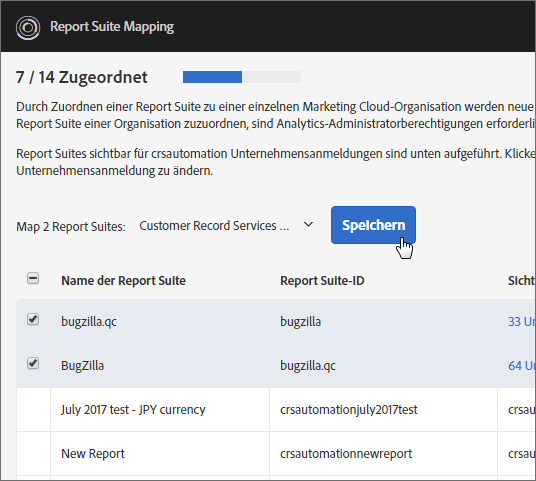

# Report Suites einer Organisation zuweisen {#topic_7C4740559EAC4E0FA5F8DEF886B580DA}

>[!NOTE]
>
>Die Funktion für die Report Suite-Zuordnung wurde im November 2020 eingestellt. Wenden Sie sich bei Fragen an den Kundensupport.

Experience Cloud-Dienste (z. B. der Experience Cloud ID-Dienst und [!UICONTROL People]) sind einer Organisation und keiner einzelnen Report Suite zugeordnet. Um sicherzustellen, dass diese Dienste ordnungsgemäß funktionieren, muss jede Analytics Report Suite einer Organisation zugeordnet werden. Der Zuordnungsprozess:

* Legt eine Experience Cloud-Organisation als primäre Organisation für die Report Suite fest.
* Hat keinen Einfluss darauf, wer auf die Report Suite zugreifen kann (der Zugriff wird nach wie vor über das Adobe Analytics-Anmeldekonto eines jeden Benutzers bestimmt)

## Anforderungen

Sie müssen Analytics-Administrator einer Unternehmensanmeldung sein, die Zugriff auf die Report Suite hat, die Sie zuordnen möchten. Außerdem muss dieses Konto [mit einer Experience Cloud-Organisation verknüpft](../admin-getting-started/organizations.md#topic_C31CB834F109465A82ED57FF0563B3F1) sein, damit Report Suites dieser Organisation zugeordnet werden können.

Organisationen werden ausgegraut, wenn Sie in Analytics keine Administratorrechte für eine Unternehmensanmeldung einer Organisation haben, die über Zugriff auf die entsprechende Report Suite verfügt.

## Report Suite einer Organisation zuweisen {#task_23993FE78DF6455FA8D7BE60686EA16C}

1. Navigieren Sie zu Report Suites für Data Governance unter [!DNL Analytics] > **[!UICONTROL Admin]** > **[!UICONTROL Data Governance]** (siehe [Einstellungen für die Data Governance in der Report Suite zeigen/verwalten](https://docs.adobe.com/help/de-DE/analytics/admin/data-governance/gdpr-view-settings.html)).

1. Wenn Sie anzeigen möchten, welche Unternehmensanmeldungen Zugriff auf welche Report Suite haben, klicken Sie auf **[!UICONTROL Sichtbar für Unternehmensanmeldung]**.

   Mithilfe dieser Ansicht können Sie Entscheidungen über die Zuweisung einfacher treffen.

1. Klicken Sie auf das Dropdown-Menü in der Spalte **[!UICONTROL Zugeordnete Organisation]** neben einer Report Suite und wählen Sie die Organisation aus, der Sie die Suite zuweisen möchten.

   Tipps zum Auswählen einer Experience Cloud-Organisation finden Sie im nächsten Abschnitt.

## Mehrere Report Suites einer Organisation zuweisen {#task_94955B0D8ABA4CB1A38746ECF8E32711}

1. Klicken Sie auf **[!UICONTROL Experience Cloud]** > **[!UICONTROL Administration]** > **[!UICONTROL Report Suite-Zuweisung]**.

1. Wählen Sie die Report Suites aus, die Sie zuweisen möchten.

   

1. Wählen Sie die Organisation aus (hier Outdoors Inc) und klicken Sie auf **[!UICONTROL Auswählen]**.

   Tipps zum Auswählen einer Experience Cloud-Organisation finden Sie im nächsten Abschnitt.

1. Klicken Sie auf **[!UICONTROL Zuordnung speichern]**.

## Tipps für die Auswahl einer Experience Cloud-Organisation {#mapping-tips}

Dieser Abschnitt enthält Tipps zur Auswahl der Experience Cloud-Organisation, der Sie eine Report Suite zuordnen sollten.

### Welche Organisation sollte ich wählen?

Wird der Experience Cloud ID-Dienst derzeit auf der Report Suite bereitgestellt, stellen Sie sicher, dass Sie im Zuordnungs-Tool für Report Suites dieselbe Organisation auswählen, die auch in der Datei [!DNL visitorAPI.js] auf Ihrer Site angegeben ist. Sie können die im Abschnitt zum [Testen und Verifizieren des Experience Cloud ID-Dienstes](https://docs.adobe.com/content/help/en/id-service/using/implementation-guides/test-verify.html) beschriebenen Anweisungen verwenden, um die Organisations-ID zu ermitteln, die vom Besucher-ID-Dienst genutzt wird.

Wird der Besucher-ID-Dienst bisher noch nicht auf Sites eingesetzt, auf denen die Report Suite Daten erfasst, muss die Implementierung der in der Report Suite-Zuweisung ausgewählten Organisation entsprechen, wenn der Experience Cloud-Besucher-ID-Dienst zu einem späteren Zeitpunkt verwendet wird.

### Warum sind einige Organisationen ausgegraut?

Dies deutet darauf hin, dass Sie nicht über ausreichende Berechtigungen verfügen, um die ausgegraute Report Suite zuzuordnen. Siehe folgendes Beispiel:

In dieser Darstellung zeigt der blaue Schlüssel an, dass der Benutzer über Administratorrechte verfügt. Die grauen Linien geben die Sichtbarkeit an.

Dieser Benutzer hat Zugriff auf zwei Experience Cloud-Organisationen. Er hat die folgenden Aktionen ausgeführt:

* Er hat sein Admin-Konto der Analytics-Unternehmensanmeldung [!UICONTROL chapek] mit seinem [!UICONTROL Chapek] Corp Experience Cloud-Organisationskonto verknüpft.
* Er hat sein Nicht-Admin-Konto der Analytics-Unternehmensanmeldung [!UICONTROL doohan] mit seinem [!UICONTROL Chapek] Corp Experience Cloud-Organisationskonto verknüpft.
* Er hat sein Nicht-Admin-Konto der Analytics-Unternehmensanmeldung nigel mit seinem Nigel Inc Experience Cloud-Organisationskonto verknüpft.

Unter den folgenden Punkten werden die Zuordnungsaktionen aufgelistet, die dieser Benutzer in Bezug auf diese Report Suites ausführen kann und nicht ausführen kann:

* Die Report Suite [!UICONTROL Chapek-prod] kann der [!UICONTROL Chapek] Corp-Organisation zugeordnet werden, da dieser Benutzer Administrator einer verknüpften Analytics-Unternehmensanmeldung ([!UICONTROL chapek]) ist und sein Konto mit dieser Organisation verknüpft ist.
* Die Report Suite [!UICONTROL Nigel-prod] kann von diesem Benutzer nicht verknüpft werden, da er kein Administrator einer Unternehmensanmeldung ist, für die diese Report Suite sichtbar ist.
* Die Report Suite [!UICONTROL Doohan-prod] kann [!UICONTROL Chapek Corp] zugeordnet werden, da dieser Benutzer Administrator einer Unternehmensanmeldung ([!UICONTROL chapek]) ist, die mit der Experience Cloud-Organisation verknüpft ist (beachten Sie, dass er kein Administrator der Analytics-Unternehmensanmeldung ist). Beachten Sie, dass die Report Suite [!UICONTROL doohan-prod] auch dann für die Zuordnung zur Nigel Inc Experience Cloud-Organisation berechtigt ist, wenn dieser Benutzer diese Zuordnung nicht durchführen kann. In diesem Fall werden beide Experience Cloud-Organisationen in der Liste angezeigt, [!UICONTROL Nigel Inc] ist jedoch ausgegraut. Vor der Zuordnung sollte sich der Benutzer mit einem Administrator der nigel-Unternehmensanmeldung beraten, um zu ermitteln, welche Organisation für die Zuordnung am besten geeignet ist. Auf der Benutzeroberfläche wird eine Warnung zu möglichen Konflikten angezeigt, wenn Sie eine Organisation auswählen, die sich von der Organisation unterscheidet, unter der die Report Suite ursprünglich erstellt wurde.

## Häufig gestellte Fragen {#section_099E485805994C929FF9C9F75219BEE1}

### Warum werden nicht alle meine Report Suites angezeigt?

Einige Ihrer Report Suites werden möglicherweise unter einer anderen Unternehmensanmeldung angezeigt. Sie können die aktuelle Unternehmensanmeldung über die Dropdown-Liste am oberen Bildschirmrand ändern.

### Was geschieht, wenn ich einige der in der Dropdown-Liste für eine meiner Report Suites aufgelisteten Organisationen nicht kenne?

In der Liste sind alle *möglichen* Organisationen aufgeführt, denen die Report Suite zugewiesen werden kann, selbst wenn Sie nicht über die nötigen Berechtigungen für die Zuweisung zu all diesen Report Suites verfügen. Wenn Sie nicht sicher sind, ob die Report Suite einer der ausgegrauten Report Suites in der Liste zugeordnet werden soll, wenden Sie sich an einen Experience Cloud-Administrator in Ihrer Organisation, um die beste Auswahl zu bestimmen.

### Was geschieht, wenn ich einige der aufgelisteten Unternehmensanmeldungen für eine Report Suite in der Spalte „Sichtbare Firmen bei der Anmeldung“ nicht erkenne?

Irgendwann wurde diese Report Suite für ein anderes Unternehmen freigegeben, die möglicherweise Teil einer anderen Experience Cloud-Organisation ist.

### Was bedeutet die Fehlermeldung über einen möglichen Konflikt bei einer Report Suite, die von einer anderen Organisation generiert wurde? Warum ist das wichtig?

Dies ist eine Benachrichtigung, die Sie bei einer fundierten Entscheidung bezüglich der Zuordnung Ihrer Report Suite unterstützt. Wir möchten Sie darauf hinweisen, dass die Report Suite ursprünglich unter einer anderen Organisation erstellt wurde, falls diese Organisation für diese Report Suite besser geeignet sein sollte.

### Woher weiß ich, ob eine Report Suite zugeordnet ist?

Zugeordnete Report Suites werden in einem nicht bearbeitbaren Format angezeigt. Wenn Sie eine Zuordnung ändern müssen, wenden Sie sich an die Kundenunterstützung.

### Was geschieht, wenn ich nur die Organisations-ID für meine Experience Cloud-Organisation kenne? Wo kann ich den Namen meiner Organisations-ID nachschlagen?

Sie finden Ihren Organisationsnamen unter [Organisationen und Kontoeinstellungen](https://docs.adobe.com/content/help/de-DE/core-services/interface/manage-users-and-products/organizations.html).

### In der Spalte „Datum der Zuordnung“ ist ein Datum eingetragen. Wer hat diese Zuordnung vorgenommen?

Sie können das Report Suite-Änderungsprotokoll auf der Benutzeroberfläche von Analytics verwenden, um die Benutzer-ID zu überprüfen, die die Änderung vorgenommen hat. Suchen Sie nach dem Ereignis „Suite in Verbindung mit IMS-Organisation“.
