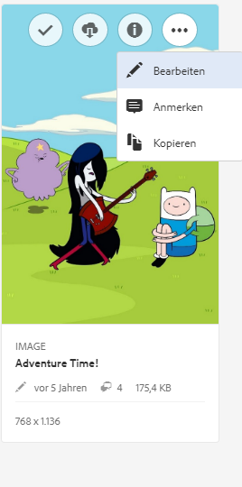
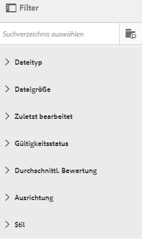
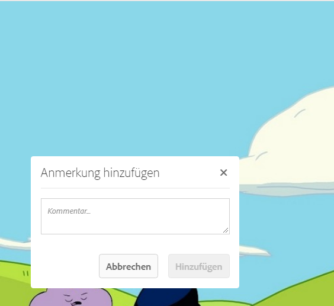
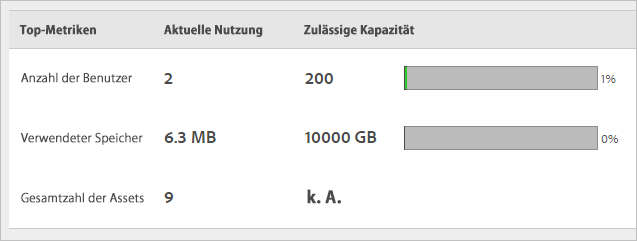

# Übersicht über Experience Cloud-Assets

>[!NOTE]
>
>Assets ist ein veralteter Coreservice, der jetzt überarbeitet wird.

Experience Cloud Assets bietet ein zentrales Repository marketingfähiger Assets, die Sie in all Ihren Lösungen nutzen können. Ein Asset ist ein digitales Dokument, Bild oder Video oder eine digitale Audiodatei (oder ein Teil davon), das bzw. die mehrere Darstellungen aufweisen und über untergeordnete Assets verfügen kann (z. B. Ebenen in einer [!DNL Photoshop]-Datei, Folien in einer [!DNL PowerPoint]-Datei, Seiten in einer PDF-Datei, Dateien in einer ZIP-Datei).

Die Asset-Dienste sind:

* Asset-Speicherung, Verwaltungsfunktionen, eingebettete Auswahlfunktionen (Zugriff erfolgt über Lösungen).
* Integrationen in die Creative Cloud-, Experience Cloud-Zusammenarbeit und in Experience Cloud-Lösungen.

Die Verwendung von Assets verbessert die Konsistenz und Markenkonformität und beschleunigt die Markteinführung. Sie können Workflows in Lösungen optimieren:

* **[!DNL Social]**: Veröffentlichen Sie in Social Media, auf Facebook, in Twitter, LinkedIn und Google+.
* **[!DNL Target]**: Erstellen Sie Erfahrungen für A/B- und multivariate Tests.
* **[!DNL Media Optimizer]**: Entwickeln Sie Werbeeinheiten für verschiedene Kanäle und Kampagnen
* **[!DNL Campaign]**: Fügen Sie Assets in E-Mail-Newslettern und Kampagnen ein.

In [!UICONTROL Experience Cloud Assets] können Sie:

* [Zu Experience Cloud Assets navigieren](experience-cloud-assets.md#section_3657039DD3524F2AA88753BFF4781125)
* [Auf die Symbolleiste zugreifen](experience-cloud-assets.md#section_EC2E401D225148818F3753248556BE6B)
* [Asset bearbeiten](experience-cloud-assets.md#section_CD3C55A9D4574455B94D0955391C8FEC)
* [Nach Assets suchen](experience-cloud-assets.md#section_50FE049010B446FC9640AA6A30E5A730)
* [Anmerkungen zu Assets vornehmen](experience-cloud-assets.md#section_67FE1DFAAB744DA5B1CD3AD3CCEABF7A)
* [Assets im Vollbildmodus anzeigen und zoomen](experience-cloud-assets.md#section_A9F50D7D6BE341A2AB8244A4E42A4EF7)
* [Asset-Eigenschaften anzeigen](experience-cloud-assets.md#section_FED28711DAB14E1BBEEA7CA890EE9573)
* [Gebrauchsberichte ausführen](experience-cloud-assets.md#section_15D782FFB8D74CF4A735116CC03AD902)
* [Assets mit Experience Manager freigeben](experience-cloud-assets.md#section_45C1B72F4D274F54BC6CCB64D2580AC5)

## Zu Experience Cloud Assets navigieren {#section_3657039DD3524F2AA88753BFF4781125}

## Auf die Symbolleiste zugreifen {#section_EC2E401D225148818F3753248556BE6B}

Navigieren Sie zu einem Asset (oder Asset-Verzeichnis) und wählen Sie **[!UICONTROL Auswählen]** aus.

Die Symbolleiste bietet schnellen Zugriff auf Funktionen, einschließlich Suche, Timeline, Darstellungen, Bearbeiten, Anmerkungen und Herunterladen.

## Asset bearbeiten {#section_CD3C55A9D4574455B94D0955391C8FEC}

Die Bearbeitung eines Assets ermöglicht Funktionen wie:

* Beschneiden
* Drehen
* Spiegeln

## Nach Assets suchen {#section_50FE049010B446FC9640AA6A30E5A730}

Sie können nach Keyword, Dateityp, Größe, Änderungsdatum, Veröffentlichungsstatus, Ausrichtung und Stil suchen.

## Anmerkungen zu Assets vornehmen {#section_67FE1DFAAB744DA5B1CD3AD3CCEABF7A}

Wählen Sie **[!UICONTROL Anmerken]** aus, indem Sie Kreise oder Pfeile auf ein Bild zeichnen, und kommentieren Sie das Asset zur Überprüfung durch Mitarbeiter.

## Assets im Vollbildmodus anzeigen und Zoomen {#section_A9F50D7D6BE341A2AB8244A4E42A4EF7}

Wählen Sie **[!UICONTROL Ansichten]** > **[!UICONTROL Bild]** aus, um das vollständige Asset-Bild anzuzeigen und das Zoomen zu aktivieren.

## Asset-Eigenschaften anzeigen {#section_FED28711DAB14E1BBEEA7CA890EE9573}

Treffen Sie eine Auswahl zwischen der Kartenansicht mit Eigenschaften, der Listenansicht und der Spaltenansicht, um Ihr Asset möglichst schnell zu finden.

Wählen Sie **[!UICONTROL Ansichten]** > **[!UICONTROL Eigenschaften]** aus, um die Eigenschaften eines Assets anzuzeigen:

## Gebrauchsberichte ausführen {#section_15D782FFB8D74CF4A735116CC03AD902}

Anzahl der Benutzer, belegten Speicherplatz und Gesamtzahl der Assets anzeigen.

Wählen Sie **[!UICONTROL Tools]** > **[!UICONTROL Berichte]** > **[!UICONTROL Gebrauchsbericht]**

