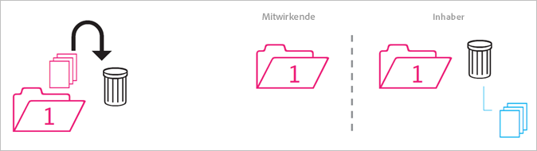
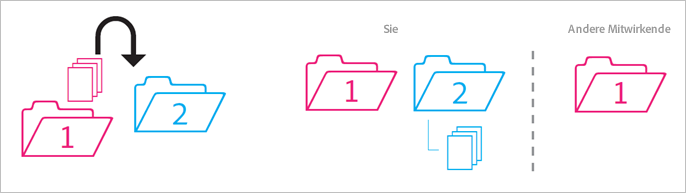
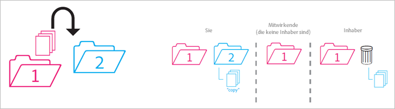
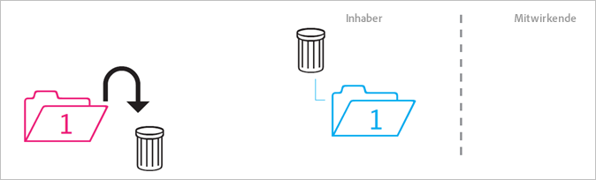
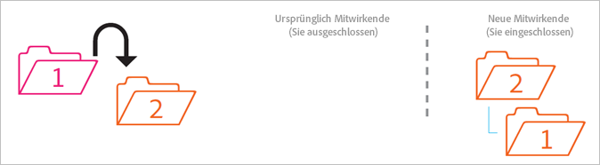
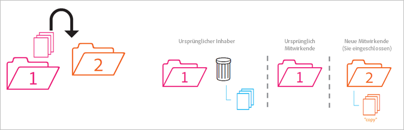
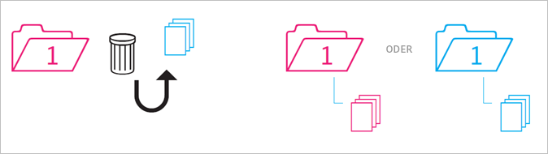

# Verhalten freigegebener Ordner

Richtlinien zum Verhalten freigegebener Ordner beim Verschieben, Löschen und Wiederherstellen.

>[!NOTE]
>
>Freigegebene Experience Cloud-Ordner und -Assets werden 1:1 auf dem Creative Cloud-Desktop gespiegelt. Wenn ein User von Experience Cloud einen Ordner ändert (löscht, hinzufügt oder die Freigabe entfernt), wird die Aktion im Creative Cloud-Desktop und im Web widergespiegelt. Wenn die Freigabe eines Ordners aufgehoben wird, werden daher der Ordner und die Assets vom lokalen Computer gelöscht. Nachdem die Freigabe aufgehoben wurde, werden der Ordner und sein Inhalt in den Papierkorb auf den lokalen Computer verschoben, von wo Sie sie manuell auf Ihrem Computer wiederherstellen können.

## Nicht freigegebener Ordner in freigegebenen Ordner {#section_A9BAC1A244A246A984AC62660E61E0C0}

Sie verschieben einen nicht freigegebenen Ordner in einen freigegebenen Ordner:

**Ergebnis**: Beide Ordner werden freigegeben.

## Freigegebener Ordner in nicht freigegebenen Ordner {#section_8BA83001DCEC4CF084B980C4A660F59A}

Sie verschieben einen freigegebenen Ordner in einen nicht freigegebenen Ordner.

**Ergebnis**: Der nicht freigegebene Ordner bleibt nicht freigegeben. Der freigegebene Ordner bleibt freigegeben.

## Inhalt eines nicht freigegebenen Ordners in freigegebenen Ordner {#section_2941ED0DC52E4573AC1AB4C22313DD8E}

Sie verschieben Inhalt aus einem nicht freigegebenen Ordner in einen freigegebenen Ordner.

**Ergebnis:** Der Inhalt wird jetzt freigegeben, und alle Mitwirkenden können ihn sehen. Der Platz für die Datenspeicherung erhöht sich um die Inhaltsgröße.

## Archivierter und gelöschter freigegebener Inhalt {#section_5210D5F4943A44D0BA675D8EB4EAE20F}

Sie archivieren oder löschen Inhalte, die sich in einem freigegebenen Ordner befinden.

**Ergebnis:** Der Inhalt wird für den Eigentümer des Ordners archiviert. Mitwirkende, die nicht Eigentümer des Inhalts sind, können nicht mehr darauf zugreifen.

## Eigener freigegebener Inhalt in nicht freigegebenen Ordner {#section_3810A364B67E4B8C9CA244BC52BF91BB}

Sie verschieben Inhalt aus einem freigegebenen Ordner, dessen Eigentümer Sie sind, in einen nicht freigegebenen Ordner.

**Ergebnis:** Die Inhalte werden jetzt nicht mehr freigegeben. Die am freigegebenen Ordner Mitwirkenden haben auf den Inhalt keinen Zugriff mehr.

## Inhalt eines anderen Benutzers in nicht freigegebenen Ordner {#section_310766EBF0DC4C0BB4AB3E8A4DAEBE07}

Sie verschieben Inhalte aus freigegebenen Ordnern, die Eigentum einer anderen Person sind, in einen nicht freigegebenen Ordner.

**Ergebnis:** Der Inhalt wird im nicht freigegebenen Ordner angezeigt und aus dem freigegebenen Ordner entfernt. Die am freigegebenen Ordner Mitwirkenden haben auf den Inhalt keinen Zugriff mehr. Der Inhalt wird für den Eigentümer des freigegebenen Ordners archiviert.

Eigentümer und Editoren können Inhalte verschieben, die ihnen nicht gehören, aber Betrachter können dies nicht. Wenn Eigentümer und Editoren Inhalte verschieben, stehen diese keinem User in einem freigegebenen Ordner zur Verfügung.

## Archivierter oder gelöschter eigener Inhalt {#section_B314B13512A5409C87C49DFDB7602E14}

Sie archivieren (über das Web) oder löschen (über einen Desktop) einen freigegebenen Ordner, dessen Eigentümer Sie sind.

**Ergebnis:** Der Ordner wird nicht freigegeben; anschließend wird er archiviert. Die Mitarbeiter haben keinen Zugriff mehr auf den Ordner.

## Freigegebener Ordner in anderen freigegebenen Ordner {#section_0A3F203D048D4D1586E9850DC92C51E9}

Sie verschieben einen freigegebenen Ordner, dessen Eigentümer Sie sind, in einen anderen freigegebenen Ordner, egal ob Sie dessen Eigentümer sind oder nicht.

**Ergebnis:** Wenn der Ordner in Ordner 2 verschoben wird, wird er für die neuen Mitwirkenden freigegeben.

## Freigegebener Inhalt in anderen freigegebenen Ordner {#section_69F6C312792A4CD2831BD14A340F850E}

Sie verschieben Inhalte aus einem freigegebenen Ordner in einen anderen freigegebenen Ordner.

**Ergebnis:** Der Inhalt wird in Ordner 2 angezeigt und jetzt für neue Mitwirkende freigegeben. Der Inhalt wird aus dem Ordner 1 entfernt, und der Eigentümer sieht ihn als archiviert, während die anderen Mitwirkenden keinen Zugriff mehr darauf haben.

## Aus Archiv wiederhergestellter Inhalt {#section_DEA990B3581741F89FBB81D18C2AB449}

Sie stellen Inhalte aus einem Archiv wieder her, das zu einem freigegebenen Ordner gehörte. Sie waren zum Zeitpunkt der Archivierung Eigentümer des Inhalts.

**Ergebnis:** Der Inhalt wird im freigegebenen Ordner wiederhergestellt und alle Mitwirkenden können erneut darauf zugreifen. Wenn der freigegebene Ordner nicht mehr vorhanden ist, wird der Inhalt in eine nicht freigegebene Kopie des/der ursprünglichen übergeordneten Ordner(s) eingefügt.
