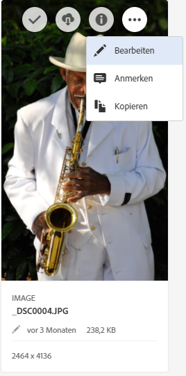
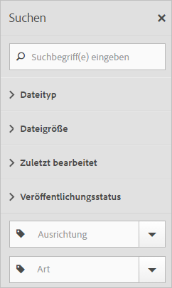
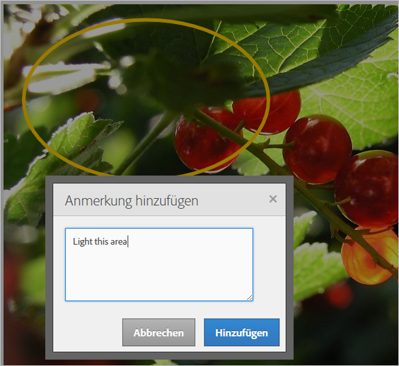
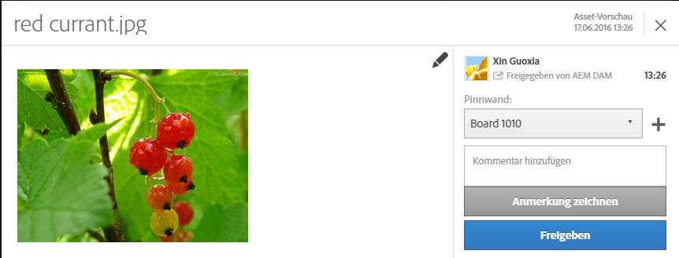
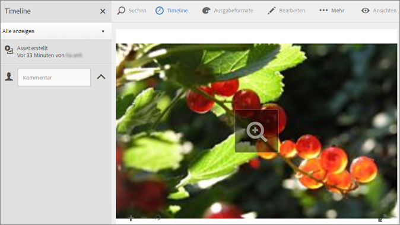
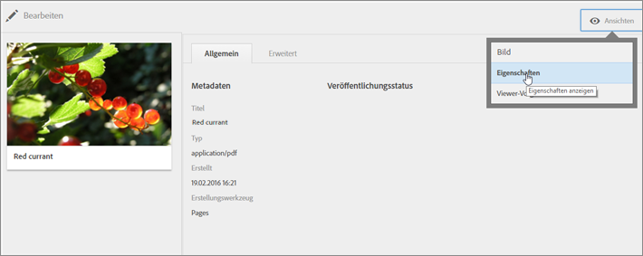
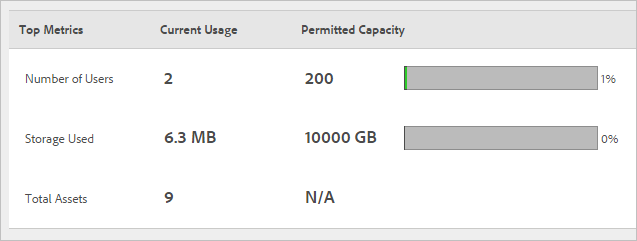

# Assets

Experience Cloud Assets bietet ein zentrales Repository marketingfähiger Assets, die Sie in all Ihren Lösungen nutzen können. Ein Asset ist ein digitales Dokument, Bild, Video oder Audioaufzeichnungsdokument (oder ein Teil davon), das über mehrere Ausgabeformate und Teil-Assets (z. B. Ebenen in einer Photoshop-Datei, Folien in einer PowerPoint-Datei, Seiten in einem PDF-Dokument, Dateien in einer ZIP-Datei) verfügen kann.

<!-- asset.xml -->
Zu den Asset-Diensten zählen:

* Asset-Speicher, Verwaltungsschnittstelle, integrierte Auswahlschnittstelle (Zugriff über Lösungen).
* Integration mit Creative Cloud, Zusammenarbeit in der Experience Cloud und in Experience Cloud-Lösungen

Assets vereinheitlichen das Erscheinungsbild, fördern die Markenkonformität und beschleunigen die Markteinführungszeiten. Mit Assets lassen sich Arbeitsabläufe in Lösungen straffen:

* **[!DNL Social]**: Veröffentlichen Sie in sozialen Eigenschaften, auf Facebook, in Twitter, LinkedIn und Google+.
* **[!DNL Target]**: Erstellen Sie Erfahrungen für A/B- und multivariate Tests.
* **[!DNL Media Optimizer]**: Entwickeln Sie Anzeigeneinheiten über verschiedene Kanäle und Kampagnen hinweg.
* **[!DNL Campaign]**: Fügen Sie Assets in E-Mail-Newslettern und Kampagnen ein.

In [!UICONTROL Experience Cloud Assets] haben Sie folgende Möglichkeiten:

* [Zu Experience Cloud Assets navigieren](../experience-cloud-assets/experience-cloud-assets.md#section_3657039DD3524F2AA88753BFF4781125)
* [Zugriff auf die Symbolleiste](../experience-cloud-assets/experience-cloud-assets.md#section_EC2E401D225148818F3753248556BE6B)
* [Asset bearbeiten](../experience-cloud-assets/experience-cloud-assets.md#section_CD3C55A9D4574455B94D0955391C8FEC)
* [Suche nach Assets](../experience-cloud-assets/experience-cloud-assets.md#section_50FE049010B446FC9640AA6A30E5A730)
* [Anmerkungen zu Assets](../experience-cloud-assets/experience-cloud-assets.md#section_67FE1DFAAB744DA5B1CD3AD3CCEABF7A)
* [Asset für ein Feed freigeben](../experience-cloud-assets/experience-cloud-assets.md#section_2CD53A99600D4A3D9AA82C3CDA666E6B)
* [Assets im Vollbildmodus anzeigen und Zoomen](../experience-cloud-assets/experience-cloud-assets.md#section_A9F50D7D6BE341A2AB8244A4E42A4EF7)
* [Asset-Eigenschaften anzeigen](../experience-cloud-assets/experience-cloud-assets.md#section_FED28711DAB14E1BBEEA7CA890EE9573)
* [Gebrauchsberichte ausführen](../experience-cloud-assets/experience-cloud-assets.md#section_15D782FFB8D74CF4A735116CC03AD902)
* [Asset-Freigabe mit Experience Manager](../experience-cloud-assets/experience-cloud-assets.md#section_45C1B72F4D274F54BC6CCB64D2580AC5)

## Zu Experience Cloud Assets navigieren {#section_3657039DD3524F2AA88753BFF4781125}

## Auf die Symbolleiste zugreifen {#section_EC2E401D225148818F3753248556BE6B}

Navigieren Sie zu einem Asset (oder Asset-Verzeichnis) und klicken Sie auf **[!UICONTROL Auswählen]**.

Die Symbolleiste ermöglicht schnellen Zugriff auf Funktionen, z. B. auf Suche, Timeline, Ausgabemöglichkeiten, Bearbeitung, Anmerkungen und Herunterladen.

## Asset bearbeiten {#section_CD3C55A9D4574455B94D0955391C8FEC}

Bei der Bearbeitung werden unter anderem folgende Funktionen aktiviert:

* Zuschneiden
* Drehen
* Flip

## Nach Assets suchen {#section_50FE049010B446FC9640AA6A30E5A730}

Sie können nach Keyword, Dateityp, Größe, Änderungsdatum, Veröffentlichungsstatus, Ausrichtung und Stil suchen.

## Anmerkungen hinzufügen {#section_67FE1DFAAB744DA5B1CD3AD3CCEABF7A}

Klicken Sie auf **[!UICONTROL Anmerken]und zeichnen Sie Kreise oder Pfeile auf ein Bild und fügen Sie in das Asset Anmerkungen für Ihre Kollegen ein.**

## Asset für Ihren Feed freigeben {#section_2CD53A99600D4A3D9AA82C3CDA666E6B}

Klicken **[!UICONTROL Sie]** in der Symbolleiste auf Freigeben, um das Asset als [Feed](../feed.md#concept_9256B8768A294009A777282DD8719213) für andere Experience Cloud-Benutzer freizugeben.

Durch das Freigeben wird das Bild auf Ihrer Feed-Seite und für alle, für die Sie die Karte freigegeben haben, angezeigt.

## Anzeigen von Vollbildassets und Zoomen {#section_A9F50D7D6BE341A2AB8244A4E42A4EF7}

Klicken **[!UICONTROL Sie auf Ansichten]** &gt; **[!UICONTROL Bild]** , um das vollständige Bild des Assets anzuzeigen und Zoom zu aktivieren.

## Anzeigen von Asset-Eigenschaften {#section_FED28711DAB14E1BBEEA7CA890EE9573}

Treffen Sie eine Auswahl zwischen der Kartenansicht mit Eigenschaften, der Listenansicht und der Spaltenansicht, um Ihr Asset möglichst schnell zu finden.

Klicken **[!UICONTROL Sie auf Ansichten]** &gt; **[!UICONTROL Eigenschaften]** , um die Eigenschaften eines Assets anzuzeigen:

## Nutzungsberichte ausführen {#section_15D782FFB8D74CF4A735116CC03AD902}

Anzahl der Benutzer, belegten Speicherplatz und Gesamtzahl der Assets anzeigen.

Klicken **[!UICONTROL Sie auf Tools]** &gt; **[!UICONTROL Berichte]** &gt; **[!UICONTROL Gebrauchsbericht]**

