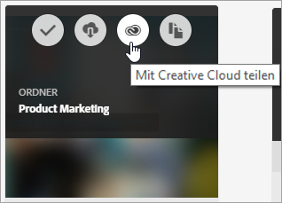
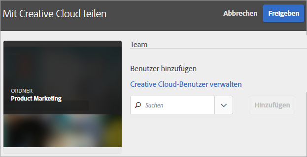
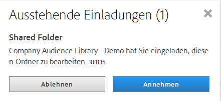
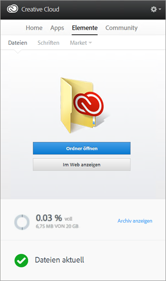
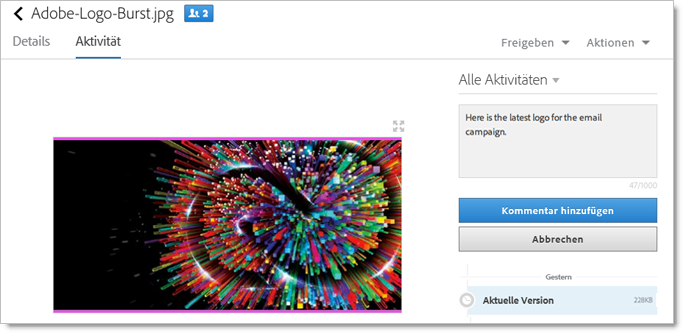
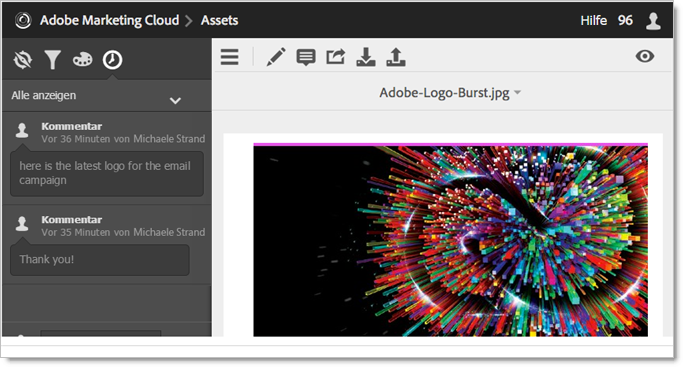
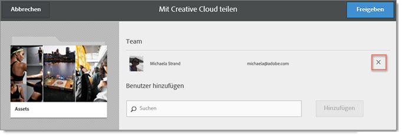
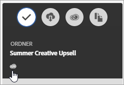

# Experience Cloud-Asset-Ordner freigeben

Geben Sie einen Experience Cloud-Asset-Ordner für Benutzer der Creative Cloud frei.

1. Klicken Sie in einem Asset-Ordner auf **[!UICONTROL &quot;Für Creative Cloud freigeben]**«.

   
1. Suchen Sie auf der Seite &quot;Auf Creative Cloud teilen&quot; nach dem Benutzer und klicken Sie dann auf **[!UICONTROL Hinzufügen]**.

   

1. Klicken Sie auf **[!UICONTROL Freigabe]**.
1. Starten Sie den [!DNL Creative Cloud]-Desktop (oder navigieren Sie in einem Browser zur Seite [!UICONTROL Creative Cloud-Dateien]) und suchen Sie nach der Benachrichtigung zur Anforderung.

   
1. Öffnen Sie die Anforderung und klicken Sie auf **[!UICONTROL Akzeptieren]**.

   
1. Um den Ordnerinhalt aufzurufen, klicken Sie auf &quot;Ordner **[!UICONTROL öffnen&quot;]** (oder **[!UICONTROL &quot; Im Web]** anzeigen&quot; ).

   
1. Sie können dem freigegebenen Asset nun Kommentare hinzufügen:

   Klicken Sie in Creative Cloud auf ein Bild und dann auf **[!UICONTROL Aktivität], um dem Bild einen Kommentar hinzuzufügen.** Kommentare werden auf den Assets im und [!DNL Creative Cloud][!DNL Experience Cloud].

   

   Klicken Sie in der Experience Cloud auf ein Bild und dann auf das Zeitachsensymbol, um dem Bild einen Kommentar hinzuzufügen. Kommentare zu Assets werden in der Creative Cloud und der Experience Cloud synchronisiert.

   

1. Um die Freigabe eines Ordners aufzuheben, klicken Sie auf **[!UICONTROL Freigeben mit Creative Cloud]** (ähnlich wie [Schritt 3](../experience-cloud-assets/t-share-creative-cloud.md#step_BA17CFA185284641A9B878BA29551996)) und entfernen Sie dann Benutzer, indem Sie auf X klicken und dann **[!UICONTROL auf Freigeben]** klicken.

Wenn Sie alle Creative Cloud-Benutzer aus der Freigabe entfernt haben, wird die Freigabe des gesamten Ordners aufgehoben. Die Creative Cloud-Benutzer haben dann keinen Zugriff mehr auf diesen Ordner.
Freigegebene Assets können Sie auch wie folgt verwenden:

* Verwenden Sie Assets in der [!UICONTROL Asset-Auswahl] in [!DNL Adobe Social] für Social-Beiträge. Siehe [Seite „Publisher“](https://marketing.adobe.com/resources/help/en_US/social/?f=c_pub_publisher).
* Laden Sie Assets in der [Inhaltsbibliothek](https://marketing.adobe.com/resources/help/en_US/target/target/?f=c_manage_content) in [!DNL Adobe Target] oder tauschen Sie sie dort aus, um Bilder für Aktivitäten hinzuzufügen.

Wenn Sie einen Ordner in der Creative Cloud freigegeben haben, erscheint auf dem Ordner das Creative Cloud-Logo.

Verwandte Hilfe:

* [Creative Cloud-Hilfe – Dateiverwaltung und -synchronisierung](https://helpx.adobe.com/creative-cloud/help/sync-files.html)
* [Creative Cloud-Hilfe – Zusammenarbeit im Team](https://helpx.adobe.com/creative-cloud/help/collaboration.html)
* [Creative Cloud-Hilfe – Häufig gestellte Fragen zur Zusammenarbeit](https://helpx.adobe.com/creative-cloud/help/collaboration-faq.html)
