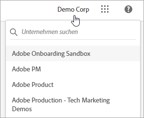
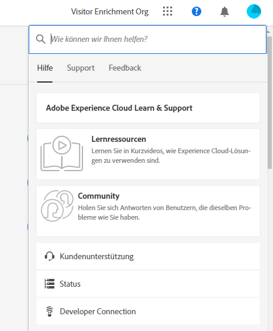
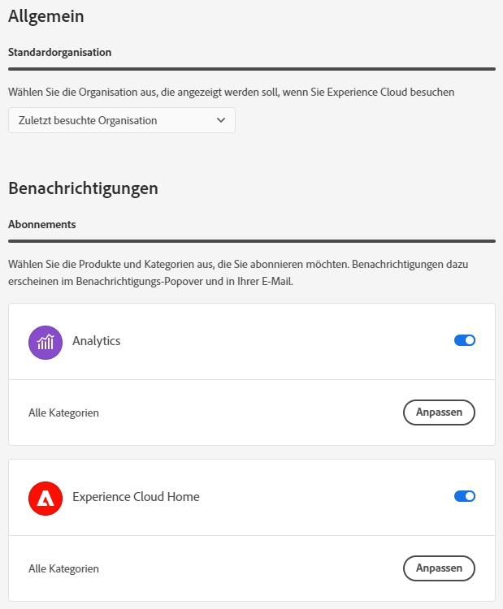
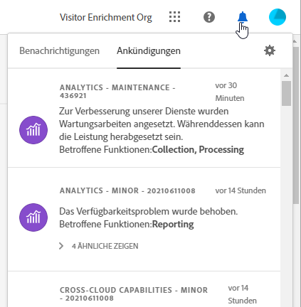

# Zentrale Komponenten der Experience Cloud-Benutzeroberfläche

Die zentralen Komponenten der Benutzeroberfläche von Experience Cloud umfassen Funktionen, mit denen Sie:

* sich anmelden und auf Ihre Anwendungen und Dienste zugreifen können
* der globalen Suche nach Produkthilfe und Geschäftsobjekten suchen können
* Kontoeinstellungen verwalten können (Warnhinweise, Benachrichtigungen und Abonnements)

## Browser-Unterstützung in Experience Cloud

Für eine optimale Performance wurde Experience Cloud für die beliebtesten Browser optimiert, jeweils sowohl für deren neueste Version als auch für die beiden Vorgängerversionen.

* Chrome
* Edge
* Firefox
* Opera
* Safari

Wenn Ihr Browser nicht aufgeführt ist, wird er möglicherweise trotzdem unterstützt. Es wird jedoch empfohlen, einen der aufgelisteten Browser zu verwenden.

>[!NOTE]
>
>Nicht alle Anwendungen, die auf der Experience Cloud-Domain ausgeführt werden, unterstützen alle Browser. Wenn Sie sich nicht sicher sind, lesen Sie die Dokumentation zu einem bestimmten Programm.

## Sprachunterstützung in Experience Cloud

Experience Cloud unterstützt bevorzugte Sprachen für jeden Benutzer, wie in den Voreinstellungen Ihres Adobe-Benutzerkontos festgelegt. Derzeit werden folgende Sprachen unterstützt:

* Chinesisch
* Englisch
* Französisch
* Deutsch
* Italienisch
* Japanisch
* Koreanisch
* Portugiesisch
* Spanisch
* Taiwanesisch

Obwohl sich alle Programm-Teams zur globalen Sprachunterstützung verpflichten, werden nicht alle Programme in allen oben genannten Sprachen angeboten. Wenn Ihre Primärsprache in einem Experience Cloud-Programm nicht unterstützt wird, können Sie auch eine sekundäre Sprache so einstellen, dass sie ggf. auf Standard gesetzt wird. Dies kann unter [Benutzervoreinstellungen für Experience Cloud](https://experience.adobe.com/preferences) durchgeführt werden.

## Melden Sie sich bei Experience Cloud an

Melden Sie sich an und stellen Sie sicher, dass Sie sich in der richtigen Organisation befinden.

1. Navigieren Sie zur [Adobe Experience Cloud](https://experience.adobe.com).
1. Klicken Sie auf **[!UICONTROL Sign in with an Adobe ID]**.
1. Stellen Sie sicher, dass Sie sich in der richtigen Organisation befinden.

   

   Um sicherzustellen, dass Sie sich bei Ihrer richtigen Organisation angemeldet haben, klicken Sie auf **[!UICONTROL Profile]**, um den Organisationsnamen anzuzeigen. Wenn Sie Zugriff auf mehr als eine Organisation haben, können Sie mit der **[!UICONTROL Organization]** auch eine andere Organisation anzeigen und zu ihr wechseln.

   Wenn Ihr Unternehmen Federated IDs verwendet, können Sie sich durch ein Single Sign-on Ihres Unternehmens bei Experience Cloud anmelden, ohne Ihre E-Mail-Adresse und Ihr Passwort eingeben zu müssen. Fügen Sie `#/sso:@domain` zur Experience Cloud-URL (`https://experience.adobe.com`) hinzu, um diese Aufgabe zu erfüllen.

   Setzen Sie beispielsweise für eine Organisation mit Federated IDs und der Domain `adobecustomer.com` Ihren URL-Link auf `https://experience.adobe.com/#/sso:@adobecustomer.com`. Sie können auch direkt zu einem bestimmten Programm gehen, indem Sie diese URL, an die der Programmpfad angehängt ist, als Lesezeichen speichern. (Beispiel für Adobe Analytics: `https://experience.adobe.com/#/sso:@adobecustomer.com/analytics`.)

## Zugriff auf Experience Cloud-Anwendungen

Nach der Anmeldung bei Experience Cloud können Sie über den einheitlichen Header schnell auf alle Ihre Anwendungen, Dienste und Organisationen zugreifen.

Klicken Sie auf die Programmauswahl , um auf die von Ihnen verwalteten Experience Cloud-Services zuzugreifen.

## Suche und Support in Experience Cloud

Mit der Experience Cloud-Suche können Sie nach Hilfe (Dokumentation, Tutorials und Kurse) auf [Experience League](https://experienceleague.adobe.com/?lang=de#home) suchen.

Das [!UICONTROL Help] Menü bietet außerdem Zugriff auf:

* **[!UICONTROL Support]:** Erstellen Sie ein Support-Ticket oder kontaktieren Sie [!UICONTROL Support] über Twitter.
* **[!UICONTROL Feedback]:** Kontaktieren Sie Adobe mithilfe von Feedback und teilen Sie uns Ihre Meinung mit.
* **[!UICONTROL Status]:** Navigieren Sie zu `https://status.adobe.com/experience_cloud` und überprüfen Sie den Betriebsstatus und die [!UICONTROL Manage Subscriptions] des Produkts.
* **[!UICONTROL Developer Connection]:** Navigation zum `adobe.io` und zur Entwicklerdokumentation.

## Kontoeinstellungen

Im Menü „Kontoeinstellungen“ haben Sie folgende Möglichkeiten:

* Festlegen eines dunklen Designs (nicht alle Anwendungen unterstützen dieses Design)
* Suchen nach Organisationen
* Abmelden
* [Einstellungen, Benachrichtigungen und Abonnements](#preferences) für das Konto konfigurieren

### Verwalten von Experience Cloud [!UICONTROL Preferences]

Zu den Einstellungen im Experience Cloud gehören Benachrichtigungen, Abonnements und Warnhinweise.

* Klicken Sie im Kontomenü **[!UICONTROL Preferences]** Einstellungen , um die Einstellungen zu verwalten.

In [!UICONTROL Experience Cloud preferences] können Sie die folgenden Funktionen konfigurieren:

| Funktion | Beschreibung |
|--- |--- |
| Standardorganisation | Wählen Sie die Organisation aus, die beim Starten von Experience Cloud angezeigt werden soll. |
| [!UICONTROL Subscriptions] | Wählen Sie die Produkte und Kategorien aus, die Sie abonnieren möchten. Benachrichtigungen im Pop-up &quot;[!UICONTROL Notifications]&quot; und in Ihrer E-Mail. |
| [!UICONTROL Priority] | Wählen Sie die Kategorien aus, die eine hohe Priorität erhalten sollen. Diese Kategorien sind mit dem Tag Hoch gekennzeichnet und können zur Zustellung wie Warnhinweise konfiguriert werden. |
| [!UICONTROL Alerts] | Wählen Sie die Benachrichtigungen aus, für die Warnhinweise in Ihrem Browser angezeigt werden sollen. Warnhinweise werden einige Sekunden lang in der oberen rechten Ecke des Fensters angezeigt. |
| E-Mails | Geben Sie die Häufigkeit an, mit der Sie Benachrichtigungs-E-Mails erhalten möchten. (Nicht gesendet, unmittelbar, täglich oder wöchentlich) |

{style="table-layout:auto"}

## Benachrichtigungen und Ankündigungen

Klicken Sie auf **[!UICONTROL Notifications]** , um Benachrichtigungen, die für Sie wichtig sind, sowie Ankündigungen von Adobe anzuzeigen.

Sie können Benachrichtigungen unter [Experience Cloud-Einstellungen](#preferences) konfigurieren.
