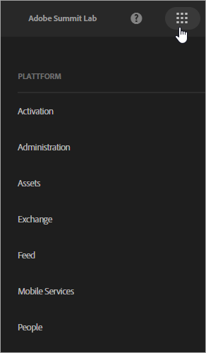

# Hilfe für Experience Cloud und Hauptdienste

Bei der Experience Cloud handelt es sich um die integrierte Adobe-Lösungs- und -Dienstfamilie für digitales Marketing. Außerdem handelt es sich hierbei um eine intuitive Schnittstelle, mit deren Hilfe Sie schnell auf Ihre Cloud-Lösungen und Hauptdienste zugreifen können.

Hilfe für alle Lösungen finden Sie in [Experience Cloud – Produktdokumentation](landing/experience-cloud-home.md).

## Produktdokumentation der Hauptdienste

| Service | Beschreibung |
|--- |--- |
| [Activation](activation/activation.md) | Bei Activation handelt es sich um den Hauptdienst, mit dessen Hilfe Sie Experience Cloud-Lösungen implementieren und bereitstellen können. Zu diesem Dienst gehören:<ul><li>[Starten von Adobe](https://docs.adobelaunch.com/) (die neueste Tag-Management-Lösung)</li><li>[Dynamischer Tag-Manager](https://marketing.adobe.com/resources/help/en_US/dtm/)</li><li>[Triggers](activation/triggers.md)</li><li>[Auditor](https://marketing.adobe.com/resources/help/en_US/auditor/)</li><li>[Experience Cloud-Debugger](https://marketing.adobe.com/resources/help/en_US/experience-cloud-debugger/)</li></ul> |
| [Administration](admin-getting-started/admin-getting-started.md) | Verwalten Sie Benutzerrechte und Produktprofile der Experience Cloud. |
| [Assets](experience-cloud-assets/experience-cloud-assets.md) | Experience Cloud Assets bietet ein zentrales Repository marketingfähiger Assets, die Sie in all Ihren Lösungen nutzen können. |
| [Exchange](https://experiencecloud.adobeexchange.com/) | Bauen Sie die Funktionen Ihrer Adobe Experience Cloud durch marktführende Erweiterungen, Skripte und vieles mehr aus. Nutzen Sie die Suchleiste oder sortieren Sie die Optionen nach Produkt- oder Anwendungstyp. |
| [Feed](feed.md) | Geben Sie Assets und Analytics-Berichte für andere Nutzer Ihres Experience Cloud-Feeds frei oder posten Sie sie. |
| [Mobile Services](https://marketing.adobe.com/resources/help/en_US/mobile/) | Mobile Services führen mobile Marketingfunktionen für mobile Anwendungen aus der ganzen Adobe Experience Cloud zusammen, sodass Sie Einblicke in die Benutzerinteraktionen Ihrer mobilen Anwendungen erhalten und gegebenenfalls Verbesserungen vornehmen können. |
| [„Personen“](audience-library/audience-library.md) | In der Zielgruppenbibliothek können Sie Zielgruppen erstellen, bestehende Zielgruppen zu gemischten Zielgruppen kombinieren und alle freigegebenen Zielgruppen einsehen. In den [Kundenattributen](attributes/attributes.md) können Sie zudem Enterprise-Kundendaten in die Experience Cloud hochladen. |

## Administration und Aktivierung

* [Benutzer- und Produktverwaltung](admin-getting-started/admin-getting-started.md) (Admin Console)
* [Lösungen für Hauptdienste aktivieren](core-services/core-services.md)
* [Häufig gestellte Fragen](admin-getting-started/admin-getting-started.md)
* [Organisationen und Kontoverknüpfung](admin-getting-started/organizations.md)
* [Experience Cloud ID-Dienst](https://marketing.adobe.com/resources/help/en_US/mcvid/)
* [Integrationen](marketing-cloud-integrations.md)
* [Integration von Adobe Target in die Experience Cloud](https://marketing.adobe.com/resources/help/en_US/target/a4t/c_integrating_target_with_mac.html)
* [Überblick über den Datenschutz und Sicherheitsmaßnahmen in der Experience Cloud](assets/Adobe-Marketing-Cloud-Privacy-and-Security-Overview.pdf)
* [Profilverwaltung in Adobe Experience Cloud](https://theblog.adobe.com/profile-management-adobe-marketing-cloud-comes-together/) (Blog)
* [DNS-Vorabruf](admin-getting-started/admin-getting-started.md#concept_6BC8C6856E3644F8956D7AD0A96383B7)

## Versionshinweise

* [Neue Funktionen in der Experience Cloud](marketing-cloud-interface/marketing-cloud-interface.md#concept_9A4370BD59744928BDC9F87E978798B3)
* [Versionshinweise – Kumulative Fehlerbehebungen](marketing-cloud-interface/release-notes.md#concept_F5C9FF69A5B44395BB5FA0552F4E9175)

## Community-Ressourcen und Blogs

* [Experience Cloud-Schulungen und -Support](https://helpx.adobe.com/support/experience-cloud.html)
* [Experience League](https://landing.adobe.com/experience-league/)
* [Support kontaktieren](https://helpx.adobe.com/contact/enterprise-support.ec.html)
* [Experience Cloud-Community](https://forums.adobe.com/community/experience-cloud)
* [Adobe-Schulungen und -Lernprogramme](https://helpx.adobe.com/learning.html?promoid=KAUDK)
* [Adobe Customer Experience Blog (blog)](https://theblog.adobe.com/customer-experience/)
* [Übersicht über die Hauptdienste](https://theblog.adobe.com/part-2-capturing-leveraging-consumer-behavior-adobe-marketing-cloud/) (Blog)
