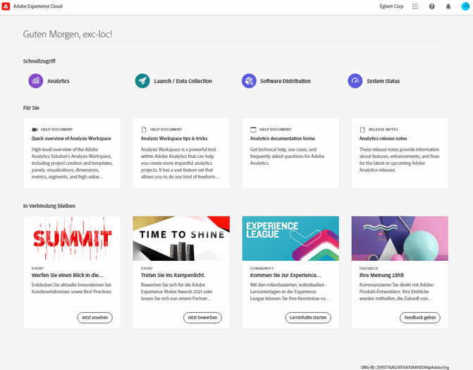
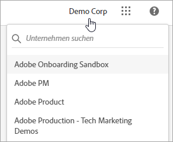
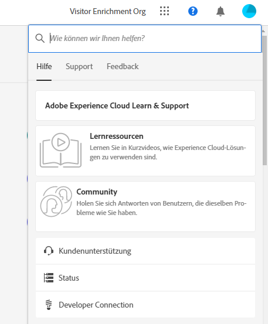
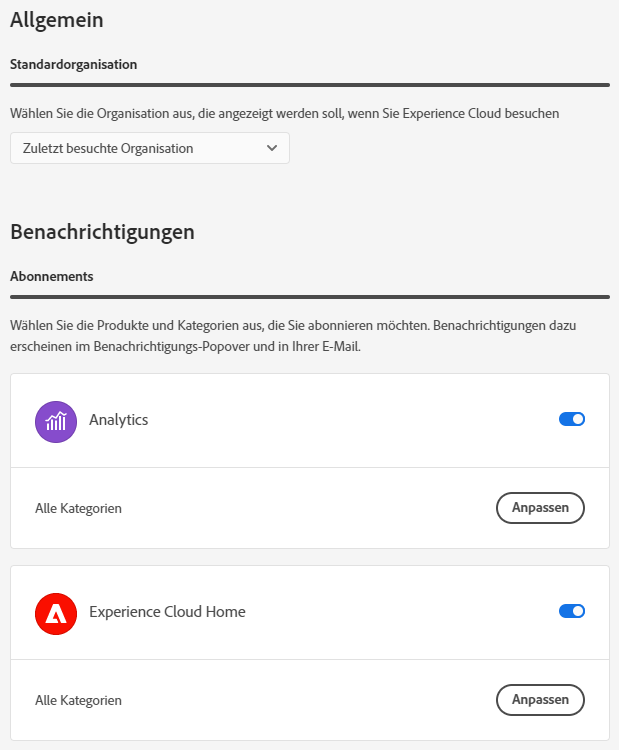
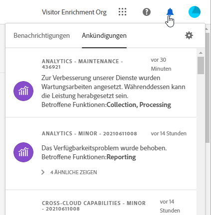

# Handbuch für Komponenten der Experience Cloud Zentrale Schnittstelle

[Experience Cloud](https://experience.adobe.com) umfasst die Digital-Marketing-Programme, -Produkte und -Services von Adobe. Über die intuitive Benutzeroberfläche können Sie schnell auf Ihre Cloud-Programme, Produktfunktionen und Services zugreifen.

In der Kopfzeile von Experience Cloud haben Sie folgende Möglichkeiten:

* Greifen Sie auf Ihre Programme und Services zu.
* Suchen Sie nach Produktdokumentation, Tutorials und Community-Posts.
* Suchen Sie global nach Unternehmensobjekten mithilfe einer globalen Suche (nur Experience Platform-Benutzer)
* Kontoeinstellungen verwalten können (Warnhinweise, Benachrichtigungen und Abonnements)

## Melden Sie sich bei Experience Cloud an {#signin}

Melden Sie sich an und stellen Sie sicher, dass Sie sich in der richtigen [Organisation](organizations.md) befinden.

1. Navigieren Sie zur [Adobe Experience Cloud](https://experience.adobe.com).
1. Wählen Sie **[!UICONTROL Anmelden mit einer Adobe ID]** aus.
1. Stellen Sie sicher, dass Sie sich in der richtigen Organisation befinden.

   

   **Organisation überprüfen**

   Um sicherzustellen, dass Sie sich bei Ihrer richtigen [Organisation](organizations.md) angemeldet haben, klicken Sie auf Ihren Profilavatar, um den Organisationsnamen anzuzeigen. Wenn Sie Zugriff auf mehr als eine Organisation haben, können Sie rechts in der Kopfzeilenleiste auch eine andere Organisation anzeigen und zu dieser wechseln.

   Wenn Ihr Unternehmen Federated IDs verwendet, können Sie sich mit Experience Cloud beim Single Sign-on Ihres Unternehmens anmelden, ohne Ihre E-Mail-Adresse und Ihr Passwort eingeben zu müssen. Fügen Sie dazu `#/sso:@domain` zur Experience Cloud-URL (`https://experience.adobe.com`) hinzu.

   Setzen Sie beispielsweise für eine Organisation mit Federated IDs und der Domäne `adobecustomer.com` Ihren URL-Link auf `https://experience.adobe.com/#/sso:@adobecustomer.com`. Sie können auch direkt zu einer bestimmten Anwendung gehen, indem Sie diese URL mit einem Lesezeichen versehen, das an den Anwendungspfad angehängt ist. (Beispiel: für Adobe Analytics `https://experience.adobe.com/#/sso:@adobecustomer.com/analytics`.)

## Zugriff auf Experience Cloud-Anwendungen {#navigation}

Nach der Anmeldung bei Experience Cloud können Sie über den einheitlichen Header schnell auf alle Ihre Anwendungen, Dienste und Organisationen zugreifen.

Rufen Sie die Anwendungsauswahl  auf, um auf die in Ihrem Unternehmen für Sie bereitgestellten Experience Cloud-Anwendungen und -Dienste zuzugreifen.

## Browserunterstützung in Experience Cloud {#browser}

Für optimale Leistung wurde Experience Cloud für die beliebtesten Browser optimiert, einschließlich der neuesten Version und der beiden Vorgängerversionen.

* Chrome
* Edge
* Firefox
* Opera
* Safari

Wenn Ihr Browser nicht aufgeführt ist, wird er möglicherweise weiterhin unterstützt. Es wird jedoch empfohlen, einen der aufgelisteten Browser zu verwenden.

>[!NOTE]
>
>Nicht alle Anwendungen, die auf der Experience Cloud-Domäne ausgeführt werden, unterstützen alle Browser. Wenn Sie sich nicht sicher sind, lesen Sie die Dokumentation zu einer bestimmten Anwendung.

## Sprachunterstützung in Experience Cloud {#languages}

Experience Cloud unterstützt bevorzugte Sprachen für jeden Benutzer, wie in den Voreinstellungen Ihres Adobe-Benutzerkontos festgelegt. Derzeit werden folgende Sprachen unterstützt:

* Chinesisch
* Englisch
* Französisch
* Deutsch
* Italienisch
* Japanisch
* Koreanisch
* Portugiesisch
* spanisch
* Taiwanisch

Obwohl sich alle Anwendungsteams zur globalen Sprachunterstützung verpflichten, werden nicht alle Anwendungen in allen oben genannten Sprachen angeboten. Wenn Ihre Primärsprache in einer Experience Cloud App nicht unterstützt wird, können Sie auch eine sekundäre Sprache so einstellen, dass sie ggf. auf Standard gesetzt wird. Dies kann unter [Benutzereinstellungen für Experience Clouden](https://experience.adobe.com/preferences) durchgeführt werden.

## Erhalten Sie Hilfe und Support {#support}

Greifen Sie mithilfe des Hilfesymbols () in der Kopfzeile auf Lernmaterialien und Hilfe zu, einschließlich Hilfeinhalten (Dokumentation, Tutorials und Kurse) zu [Experience League](https://experienceleague.adobe.com/?lang=de#home) sowie zusätzlichen Ressourcen für einzelne Anwendungen. Sie können auch ein unverbindliches Feedback senden und priorisierte Support-Tickets erstellen.

Das Menü [!UICONTROL Hilfe] bietet Ihnen außerdem Zugriff auf:

* **[!UICONTROL Support]:** Erstellen Sie ein Support-Ticket oder kontaktieren Sie den [!UICONTROL Support] über Twitter.
* **[!UICONTROL Feedback]:** Teilen Sie Feedback zu Ihrem Experience Cloud-Erlebnis. Ihr Feedback wird verwendet, um die Produkte und Services von Adobe zu verbessern.
* **[!UICONTROL Status]:** Navigieren Sie zu `https://status.adobe.com/experience_cloud` und prüfen Sie den Betriebsstatus des Produkts und [!UICONTROL verwalten Sie Abonnements].
* **[!UICONTROL Developer Connection]:** Navigation zu `adobe.io` und Entwicklerdokumentation.

## Globale Suche nach Objekten und Entitäten {#search}

Die globale Suche ermöglicht es Ihnen, durchsuchbare Geschäftsobjekte oder Entitäten in einem nahtlosen, konsistenten 1-Klick-Erlebnis zu finden. Diese Suche überdeckt Ihre zuletzt aufgerufenen Objekte.

>[!NOTE]
>
>Die globale Suche ist nicht in allen Experience Cloud-Applikationen verfügbar, wird aber aufgrund der Indexierung von mehr Inhalten zu den entsprechenden Applikationen hinzugefügt. Verfügbarkeit ab Juli 2021:

* Experience Platform
* Journey Optimizer

## Benutzerprofil- und Kontovoreinstellungen {#preferences}

Zu den Einstellungen im Experience Cloud gehören Benachrichtigungen, Abonnements und Warnhinweise. Im Menü „Kontoeinstellungen“ haben Sie folgende Möglichkeiten:

* Festlegen eines dunklen Designs (nicht alle Anwendungen unterstützen dieses Design)
* Suchen nach [Organisationen](organizations.md)
* Abmelden
* Einstellungen, Benachrichtigungen und Abonnements für das Konto konfigurieren

Um die Voreinstellungen zu verwalten, wählen Sie **[!UICONTROL Voreinstellungen]** aus dem Kontomenü  aus.

Unter [!UICONTROL Experience Cloud-Einstellungen] können Sie die folgenden Funktionen konfigurieren:

| Funktion | Beschreibung |
|--- |--- |
| Standard[organisation](organizations.md) | Wählen Sie die Organisation aus, die beim Starten von Experience Cloud angezeigt werden soll. |
| [!UICONTROL Abonnements] | Wählen Sie die Produkte und Kategorien aus, die Sie abonnieren möchten. Benachrichtigungen im Pop-Over [!UICONTROL Benachrichtigungen] und in Ihren E-Mails. |
| [!UICONTROL Priorität] | Wählen Sie die Kategorien aus, die eine hohe Priorität erhalten sollen. Diese Kategorien sind mit dem Tag Hoch gekennzeichnet und können zur Zustellung wie Warnhinweise konfiguriert werden. |
| [!UICONTROL Warnhinweise] | Wählen Sie die Benachrichtigungen aus, für die Warnhinweise in Ihrem Browser angezeigt werden sollen. Warnhinweise werden einige Sekunden lang in der oberen rechten Ecke des Fensters angezeigt. |
| E-Mails | Geben Sie die Häufigkeit an, mit der Sie Benachrichtigungs-E-Mails erhalten möchten. (Nicht gesendet, unmittelbar, täglich oder wöchentlich) |

{style=&quot;table-layout:auto&quot;}

## Benachrichtigungen und Ankündigungen {#notifications}

Wählen Sie **[!UICONTROL Benachrichtigungen]** aus, um über relevante und umsetzbare Aktualisierungen, einschließlich Produktversionen, Wartungshinweisen, freigegebenen Elementen und Genehmigungsanfragen, benachrichtigt zu werden.

## Experience Cloud-Domänen {#domains}

Experience Cloud verwendet die folgenden Hosts, um die Anwendung bereitzustellen, die Leistung zu verbessern und das Produkterlebnis zu verbessern. Adobe empfiehlt, diese Domänen zur Zulassungsliste Ihrer Firewall hinzuzufügen, um ein optimales Erlebnis zu erzielen. Zusätzliche Domänen können auch für bestimmte Experience Cloud-Anwendungen wie Adobe Analytics verwendet werden. Weitere Informationen finden Sie in der Dokumentation für diese Anwendungen .

| Technologie | Domains |
|--- |--- |
| Adobe Experience Cloud-Domänen | `adobe.com`, `adobe.net`, `adobe.io` |
| Adobe Identity Management Service (IMS) | `adobelogin.com` |
| Experience Cloud-Schriftarten | `typekit.net` |
| Gainsight (für Produktanleitungen und Hilfe) | `esp.aptrinsic.com` |

## Hilfe zu Administrations- und anwendungsübergreifenden Diensten

Dieses Handbuch bietet Hilfe zur Verwaltung von Experience Cloud-Benutzern und -Produkten in der Admin Console und ermöglicht Lösungen für Plattformdienste. Sie können auch auf die Hilfe über die Zielgruppenbibliothek, Kundenattribute, Experience Cloud-Kreativelemente und mehr zugreifen:

* [[!UICONTROL Zielgruppenbibliothek]](audience-library.md)
* [[!UICONTROL Kundenattribute]](attributes.md)
* [[!UICONTROL Triggers]](triggers.md)
* [Experience Cloud-[!UICONTROL Assets]](experience-cloud-assets.md)
* [Cookies in Experience Cloud](cookies-privacy.md)
* [Benutzer- und Produktverwaltung](admin-getting-started.md) (Admin Console)
* [Lösungen für zentrale Dienste aktivieren](core-services.md)
* [Häufig gestellte Fragen](admin-getting-started.md)
* [Organisationen und Kontoverknüpfung](organizations.md)
* [Integrationen](marketing-cloud-integrations.md)
* [Integrieren von Adobe Target in Experience Cloud](https://experienceleague.adobe.com/docs/target/using/integrate/a4t/a4t.html?lang=de)
* [Überblick über den Datenschutz und Sicherheitsmaßnahmen in Experience Cloud](assets/Adobe-Marketing-Cloud-Privacy-and-Security-Overview.pdf)
* [DNS-Vorabruf](admin-getting-started.md#concept_6BC8C6856E3644F8956D7AD0A96383B7)

## Handbücher

Weitere Experience Cloud-Handbücher:

* [Adobe Mobile](https://experienceleague.adobe.com/docs/mobile-services/using/home.html?lang=de)
* [Experience Platform Co-op Graph](https://experienceleague.adobe.com/docs/device-co-op/using/home.html?lang=de)
* [Exchange](https://exchange.adobe.com/experiencecloud)
* [Experience Cloud ID-Dienst](https://experienceleague.adobe.com/docs/id-service/using/home.html?lang=de)
* [ Experience Platform-Datenerfassung/Launch](https://experienceleague.adobe.com/docs/launch.html?lang=de)
* [Experience Cloud Debugger](https://experienceleague.adobe.com/docs/debugger/using/experience-cloud-debugger.html?lang=de)
* [Datenschutz-Grundverordnung-API (DSGVO-API)](https://www.adobe.io/apis/experiencecloud/gdpr.html)
* [[!UICONTROL Dynamic Tag Management]](https://experienceleague.adobe.com/docs/experience-platform/tags/home.html?lang=en)

## Tutorials

Nutzen Sie die Vorteile von Selbsthilfe-Tutorials und Schnellanleitungen in Experience League:

* [Alle Tutorials in Experience League](https://experienceleague.adobe.com/?lang=de#quick-how-tos)
* [Experience Platform-Tutorials](https://experienceleague.adobe.com/docs/launch-learn/tutorials/overview.html?lang=de)
* [Echtzeit-Kundendatenplattform](https://experienceleague.adobe.com/docs/platform-learn/tutorials/application-services/rtcdp/understanding-the-real-time-customer-data-platform.html?lang=de)

## Versionshinweise und zugehörige Experience Cloud-Hilfe

* [Versionshinweise und Produkt-Updates](https://experienceleague.adobe.com/docs/home.html?lang=de) – Neue Funktionen in Experience Cloud und Abonnieren von Updates
* [Versionshinweise und Produktupdates](https://experienceleague.adobe.com/docs/release-notes/experience-cloud/current.html?lang=de) – Neue Funktionen in der Experience Cloud und Abonnieren von Updates
* [Übungen zur Implementierung der zentralen Dienste](https://experienceleague.adobe.com/docs/launch-learn/tutorials/overview.html?lang=en) – Videos und Übungen zu den zentralen Diensten
* [Expertenhilfe bei Experience League](https://experienceleague.adobe.com/?lang=de) – Lernen Sie von Experten und der Community
* [Ausbildung und Schulung](https://helpx.adobe.com/de/learning.html?promoid=KAUDK) – Wenden Sie sich an Adobe, um sicherzustellen, dass Sie die Produkte von Adobe optimal nutzen
* [Customer Experience-Blog](https://blog.adobe.com/de/topics/digital-transformation.html) – Lesen Sie den Experience Cloud-Blog
* [Kundenunterstützung](https://experienceleague.adobe.com/?support-solution=General&amp;lang=de#support) – Wenden Sie sich an die Adobe-Kundenunterstützung
