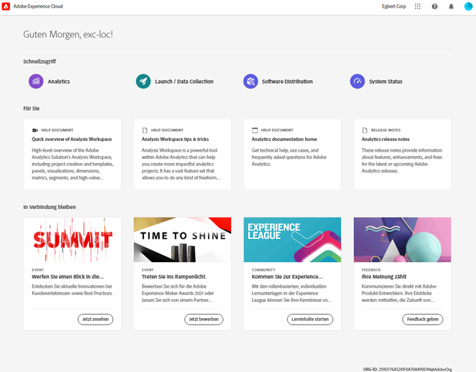

# Benutzeroberfläche und Verwaltung von Experience Cloud

[Experience Cloud](https://experience.adobe.com) umfasst die Digital-Marketing-Programme, -Produkte und -Services von Adobe. Über die intuitive Benutzeroberfläche können Sie schnell auf Ihre Cloud-Programme, Produktfunktionen und Services zugreifen.

In der Kopfzeile von Experience Cloud haben Sie folgende Möglichkeiten:

* Zugriff auf alle Experience Cloud-Anwendungen und -Services
* Suchen Sie über das Menü „Hilfe“ nach Produktdokumentationen, Tutorials und Community-Beiträgen. Lassen Sie sich Ergebnisse in Experience League anzeigen.
* Suchen Sie global nach Geschäftsobjekten, indem Sie eine globale Suche (nur für Nutzerinnen und Nutzer der Experience Platform) im Feld „Suche“ verwenden.
* Verwalten der [Einstellungen](features/account-preferences.md) des Kontos (Warnhinweise, Benachrichtigungen und Abonnements)

## Melden Sie sich bei Experience Cloud an

Melden Sie sich an und stellen Sie sicher, dass Sie sich in der richtigen [Organisation](administration/organizations.md) befinden.

1. Navigieren Sie zur [Adobe Experience Cloud](https://experience.adobe.com).
1. Geben Sie Ihre Adobe-E-Mail-Adresse ein und klicken Sie dann auf **[!UICONTROL Continue]**.
1. Klicken Sie auf ein Konto.
1. Geben Sie Ihr Passwort ein.
1. Stellen Sie sicher, dass Sie sich in der richtigen Organisation befinden.

   

   **Organisation überprüfen**

   Die [Organisation](administration/organizations.md) wird in der Kopfzeile der Benutzeroberfläche angezeigt.

   Wenn Ihr Unternehmen Federated IDs verwendet, können Sie sich durch ein Single Sign-on Ihres Unternehmens bei Experience Cloud anmelden, ohne Ihre E-Mail-Adresse und Ihr Passwort eingeben zu müssen. Fügen Sie `#/sso:@domain` zur Experience Cloud-URL (`https://experience.adobe.com`) hinzu, um diese Aufgabe zu erfüllen.

   Setzen Sie beispielsweise für eine Organisation mit Federated IDs und der Domain `example.com` Ihren URL-Link auf `https://experience.adobe.com/#/sso:@example.com`. Sie können auch direkt zu einem bestimmten Programm gehen, indem Sie diese URL, an die der Programmpfad angehängt ist, als Lesezeichen speichern. (Beispiel für Adobe Analytics: `https://experience.adobe.com/#/sso:@example.com/analytics`.)

   **Hinweis:** Der Administrator Ihres Unternehmens kann den Zugriff auf Adobe-Produkte anhand von IP-Adressen einschränken. Wenn ja, erhalten Sie möglicherweise eine Fehlermeldung, nachdem Sie sich bei Experience Cloud angemeldet haben oder zu einem Unternehmen gewechselt haben, für das diese Option aktiviert ist. Weitere Informationen finden Sie unter [Produktzugriff nach IP-Adressen beschränken](https://helpx.adobe.com/de/enterprise/using/ip-based-access.html).

## Zugriff auf Experience Cloud-Anwendungen

Nach der Anmeldung bei Experience Cloud können Sie über den einheitlichen Header schnell auf alle Ihre Anwendungen, Dienste und Organisationen zugreifen.

Rufen Sie die das  der Programmauswahl auf, um auf die in Ihrem Unternehmen für Sie bereitgestellten Experience Cloud-Programme und -Services zuzugreifen.

## Hilfe und Support

Greifen Sie mithilfe der **[!UICONTROL Help center]** () in der Kopfzeile auf Lernmaterialien und Hilfe zu, einschließlich Hilfeinhalten (Dokumentation, Tutorials und Kurse) zu [Experience League](https://experienceleague.adobe.com/de#home) sowie zusätzlichen Ressourcen für einzelne Programme. Sie können auch ein unverbindliches Feedback senden und priorisierte Support-Tickets erstellen.

Das [!UICONTROL Help] Menü bietet außerdem Zugriff auf:

* **[!UICONTROL Support]:** Erstellen Sie ein Support-Ticket oder kontaktieren Sie [!UICONTROL Support] über Twitter.
* **[!UICONTROL Feedback]:** Geben Sie Feedback zu Ihrem Experience Cloud-Erlebnis. Ihr Feedback wird verwendet, um die Produkte und Services von Adobe zu verbessern.
* **[!UICONTROL Status]:** Navigieren Sie zu `https://status.adobe.com/experience_cloud` und überprüfen Sie den Betriebsstatus und die [!UICONTROL Manage Subscriptions] des Produkts.
* **[!UICONTROL Developer Connection]:** Navigation zum `adobe.io` und zur Entwicklerdokumentation.

## Verwalten des Benutzerprofils

Im Menü [!UICONTROL Profile] haben Sie folgende Möglichkeiten:

* Festlegen eines dunklen Designs (nicht alle Anwendungen unterstützen dieses Design)
* Verwalten von Experience Cloud [-Einstellungen](features/account-preferences.md)
* Auswählen von oder Suchen nach [Organisationen](administration/organizations.md)
* [!UICONTROL Legal Notices] anzeigen
* Abmelden
* Einstellungen, Benachrichtigungen und Abonnements für das Konto konfigurieren

## Anzeigen von Benachrichtigungen und Ankündigungen im Produkt

Klicken Sie auf das Glockensymbol, um Benachrichtigungen und Ankündigungen anzuzeigen. Bei Ankündigungen kann es sich um relevante und umsetzbare Aktualisierungen handeln, einschließlich Produktversionen, Wartungshinweisen, freigegebenen Elementen und Genehmigungsanfragen.

Informationen zum Verwalten von Benachrichtigungen und Warnhinweisen finden Sie unter [Kontoeinstellungen und Benachrichtigungen](features/account-preferences.md).

