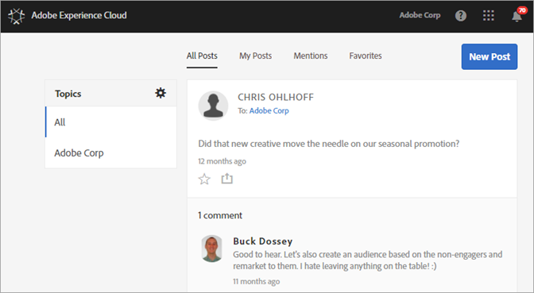

# Feed

**Experience Cloud-Feed wird ab dem 01. November 2019 nicht mehr unterstützt und wird bis Dezember 2019 eingestellt.**

Erfahren Sie mehr über das Posten und die Freigabe von Assets und Analytics-Berichten für andere Nutzer Ihres Experience Cloud-Feeds.

Der Feed kann beim ersten Anmelden in der Experience Cloud leer sein. Wenn Sie Beiträge erstellen und etwas freigeben und andere Benutzer Inhalte für Sie freigeben, füllt sich der Feed automatisch, damit Sie und Ihre Team-Mitglieder auf dem Laufenden bleiben.

Zu den Feed-Einstellungen gehören die folgenden:

* **Themen: Alle \&lt;Name des Unternehmens \&gt;:** Zeigt alle Beiträge an, die für Sie freigegeben wurden, sowie alle Beiträge, auf die Sie Zugriff haben.
* **Themen verwalten:** Hier können Sie Themen folgen, nicht mehr folgen oder Themen vorschlagen. Darüber hinaus können Administratoren Themen genehmigen, ablehnen, deaktivieren und erstellen.
* **Neuer Beitrag:** Beiträge erstellen, die von Mitgliedern oder Gruppen gesehen werden können.
* **Alle Beiträge:** Alle Beiträge in Ihrem Feed anzeigen.
* **Meine Beiträge:** Nur Ihre Beiträge anzeigen.
* **Erwähnungen:** Beiträge anzeigen, in denn Sie oder Ihre Gruppe erwähnt werden.
* **Favoriten:** Beiträge anzeigen, die als Favoriten gekennzeichnet wurden.

## Ein Analytics-Projekt im Feed freigeben {#section_F2BDF9FEF4394686BAC5051CBE913EE5}

**Experience Cloud-Feed wird ab dem 01. November 2019 nicht mehr unterstützt und wird bis Dezember 2019 eingestellt.**

Sie können Berichte aus [!UICONTROL Reports &amp; Analytics] im Experience Cloud-Feed freigeben.

1. Sie können sich mit Ihrer Adobe ID in der Experience Cloud [anmelden](admin-getting-started/getting-started-experience-cloud.md#topic_AC564B6795334DE39359ADD87F52F2E0).

1. Navigieren Sie zu Reports &amp; Analytics und [erstellen Sie ein Projekt](https://marketing.adobe.com/resources/help/en_US/analytics/analysis-workspace/freeform_overview.html).

1. Klicken Sie auf **[!UICONTROL Mehr]** &gt; **[!UICONTROL Freigaben]**.

   

1. Fügen Sie im Freigabefenster Empfänger hinzu und klicken Sie auf **[!UICONTROL Freigeben]**.
