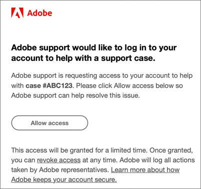

# Häufig gestellte Fragen zu Experience Cloud

Erfahren Sie mehr über Browser-Unterstützung und häufig gestellte Fragen und Antworten für Admins in Experience Cloud.

+++Welche Browser werden in Experience Cloud unterstützt?

Adobe unterstützt die aktuelle und die beiden vorherigen Versionen der folgenden Browser:

* Microsoft® Edge
* Google Chrome
* Mozilla Firefox
* Safari
* Opera

Die Verwendung eines anderen Browsers ist möglich, aber die Unterstützung ist nicht garantiert.

>[!NOTE]
>
>Nicht alle Anwendungen, die auf der Experience Cloud-Domain ausgeführt werden, unterstützen alle Browser. Wenn Sie sich nicht sicher sind, lesen Sie die Dokumentation zu einem bestimmten Programm.

+++

+++Welche Sprachen werden unterstützt?

Experience Cloud unterstützt bevorzugte Sprachen für jeden Benutzer, wie in den Voreinstellungen Ihres Adobe-Benutzerkontos festgelegt. Derzeit werden folgende Sprachen unterstützt:

* Chinesisch
* Englisch
* Französisch
* Deutsch
* Italienisch
* Japanisch
* Koreanisch
* Portugiesisch
* Spanisch
* Taiwanesisch

Obwohl sich Anwendungsteams zur globalen Sprachunterstützung verpflichten, werden nicht alle Anwendungen in allen oben genannten Sprachen angeboten. Wenn Ihre Primärsprache in einem Experience Cloud-Programm nicht unterstützt wird, können Sie auch eine sekundäre Sprache so einstellen, dass sie ggf. auf Standard gesetzt wird. Dies kann unter [Benutzervoreinstellungen für Experience Cloud](https://experience.adobe.com/preferences) durchgeführt werden.

+++

+++Verrechnet Adobe meinem Unternehmen den Zugriff auf Adobe Experience Cloud?

Nein. Das Adobe Experience Cloud ist ohne Aufpreis im Preis inbegriffen. Bestimmte zentrale Dienste könnten jedoch zusätzliche Kosten verursachen.

+++

+++Warum muss sich mein Unternehmen über die Experience Cloud-Oberfläche anmelden?

Die Funktionen der Experience Cloud-Oberfläche bieten Ihrem Unternehmen einen neuen Mehrwert. Dies wird künftig auch der Standardpfad für den Zugriff auf Programme sein und letztlich andere individuelle Programmanmeldevorgänge ersetzen. Das Anmelden über Experience Cloud erleichtert später eine reibungslosere Transition.

+++

+++Wie kann Adobe auf meine Adobe-Cloud-Umgebung zugreifen, um ein Problem zu beheben?

Die Adobe-Kundenunterstützung kann eine Identitätsanfrage senden, für die Sie eine E-Mail mit dem Adobe-Markenlogo erhalten (Beispiel unten), in der Ihre ausdrückliche Autorisierung angefordert wird. Der Zugriff wird für eine begrenzte Zeit gewährt. Nach der Gewährung können Sie den Zugriff jederzeit widerrufen. Adobe protokolliert alle von Adobe-Mitarbeitern getroffenen Maßnahmen.

+++

+++Was ist „Bereitstellung“?

Bereitstellung in Experience Cloud bedeutet:

* Ihre Benutzer können mit der Anmeldung bei der Experience Cloud und der Verknüpfung von Programmen beginnen.
* Sie können mit der Nutzung der Funktionen beginnen, die über Experience Cloud verfügbar sind.
* Sie können sich darauf vorbereiten, Ihren programmspezifischen Anmeldeprozess aufzugeben.
* Sie können die Zugangssteuerung für Programme beibehalten.

+++

+++Wie verwalte ich Benutzereinstellungen, Benachrichtigungen und Warnhinweise?

* Siehe [Kontovoreinstellungen und Benachrichtigungen](/help/interface/features/account-preferences.md)

+++

+++Wie verwalte ich Produktprofile und Anmeldedaten für Benutzerkonten?

* Hilfe finden Sie im [Admin Console-Benutzerhandbuch](https://helpx.adobe.com/de/enterprise/admin-guide.html).

* Die Zuweisung von Benutzerrechten und die Produktverwaltung erfolgen über die [Adobe Admin Console](https://adminconsole.adobe.com/enterprise) (Produktlink).

* **Wichtig:** Analytics-Admins finden unter [Verwalten von Analytics-Benutzenden in der Admin Console](https://experienceleague.adobe.com/docs/analytics/admin/user-product-management/migrate-users/c-migration-tool.html?lang=de) Informationen zur Migration von Benutzer-IDs aus den Analytics Admin-Tools in die Admin Console.

+++

+++Was kann ich tun, wenn sich jemand nicht bei Experience Cloud anmelden kann?

Admin Console-Administratoren können Benutzern Zugriff gewähren. Benutzern werden E-Mails mit Anweisungen zum Anmelden gesendet.

Möglicherweise müssen Sie sich zunächst [an den Adobe-Support wenden](https://experienceleague.adobe.com/de?support-solution=General&lang=de#support), um zu bestätigen, dass Ihrem Unternehmen die entsprechenden Lösungen bereitgestellt wurden.

+++

+++Wo können Benutzer die Kontoverknüpfung verwalten?

Einige Benutzende müssen unter Umständen ihr Programmkonto (Analytics) mit der Adobe ID oder Enterprise ID verknüpfen.

Siehe [Verknüpfen von Programmkonten mit einer Adobe ID](../administration/organizations.md).

+++

+++Wie verwalte ich Benutzerkontoprofile und Organisationen?

Siehe [Verwalten von Benutzerkonten](../administration/organizations.md).

+++

+++Was ist eine Organisation?

Eine [Organisation](../administration/organizations.md) ist die Einheit, die es Admins ermöglicht, Gruppen und Benutzende zu konfigurieren und das Single-Sign-on in Experience Cloud zu steuern. Die Organisation funktioniert wie ein Unternehmen mit Anmeldung, das alle Experience Cloud-Produkte und -Programme umfasst. Normalerweise besitzt eine Organisation den Namen Ihres Unternehmens. Ein Unternehmen kann jedoch über mehrere Organisationen verfügen.

+++

+++Wo finde ich meine IMS-Organisations-ID?

Details hierzu finden Sie unter [Organisations-ID anzeigen](../administration/organizations.md).

+++

+++Was muss ich tun, wenn einer meiner Benutzer meine Organisation verlässt?

Dessen Zugang sollte direkt im Programm entfernt werden. Sie können auf das Produkt nicht über Experience Cloud oder die direkte Anmeldung zugreifen. Sie sollten sie auch auf Ebene von Experience Cloud entfernen.

+++

+++Was ist eine Adobe ID?

Siehe [Identitätstypen](https://helpx.adobe.com/de/enterprise/using/identity.html).

+++

+++Kann ich für meine Benutzer Programmkonten verknüpfen?

Nein. Benutzer müssen ihre eigenen Programme mit ihren Benutzernamen und Kennwörtern verknüpfen.

+++

