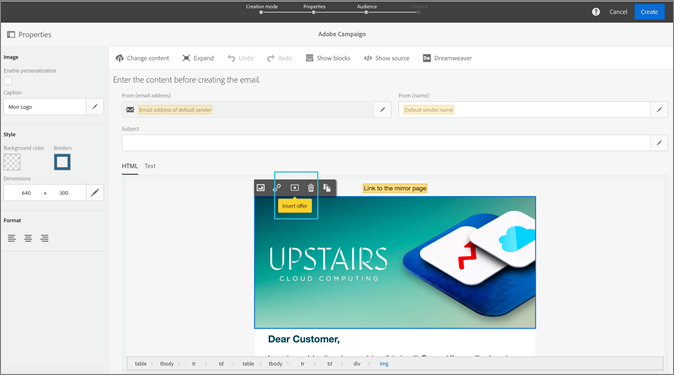

# Kampagne{#campaign}

Erfahren Sie, wie Sie Angebote verwenden und Felder in Adobe Campaign Standard freigeben.

Nachdem Sie mindestens ein Ausweichangebot und ein allgemeines Angebot erstellt haben, können Sie eine Angebotsaktivität mit einer E-Mail in Campaign Standard erstellen. Eine Angebotsaktivität kann nur in einer normalen E-Mail-Kampagne erstellt werden. Es kann nicht zu einer transaktionalen E-Mail-Kampagne hinzugefügt werden (z. B. eine wiederkehrende E-Mail, die durch ein Ereignis ausgelöst wird, z. B. eine E-Mail zum Warenkorbabbruch).

Eine Angebotsaktivität fordert Sie auf, eine Angebotsgruppe und ein Ausweichangebot auszuwählen, das an einem Ort in einer E-Mail-Vorlage angezeigt werden kann. Das beste Angebot, das bereitgestellt werden soll, wird aus diesen Angeboten zur Zeit der E-Mail-Vorbereitung ausgewählt, basierend auf der Platzierung, dem Datum, dem Angebotstatus und den Kundenprofildaten.

## Freigeben von Attributen von Kampagne zu [!UICONTROL Angebotsverwaltung]{#task_4DFA9A20D7B04E1F9AFF4774D67B6EBC}

Beim Erstellen eines Angebots in der [!UICONTROL Angebotsverwaltung]können Sie Berechtigungsregeln festlegen, die beschränken, welche Profile bestimmte Angebote erhalten können. Diese Berechtigungsregeln können auf Grundlage von Attributen (oder Feldern) festgelegt werden, die im Kampagnenprofil vorhanden sind. Diese Felder müssen von Campaign freigegeben werden, bevor sie im Regelaufbau für die [!UICONTROL Angebotsverwaltung] angezeigt werden.

>[!NOTE]
>
>Um Attribute freizugeben, müssen Sie über Administratorrechte in Campaign verfügen.

1. Klicken Sie auf **[!UICONTROL Adobe Campaign]**, um die Navigation aufzurufen.
1. Navigieren Sie zu **[!UICONTROL Administration]**>**[!UICONTROL  Instanzeinstellungen]** > **[!UICONTROL Angebotsverwaltung]**und klicken Sie auf**[!UICONTROL  Attribute]**.

   Auf dieser Seite werden Attribute angezeigt, die bereits freigegeben wurden. Sie können diese Attribute bearbeiten oder löschen.

   

   >[!NOTE]
   >
   >Wenn ein Attribut derzeit von der [!UICONTROL Angebotsverwaltung] in einer Berechtigungsregel verwendet wird, kann es nicht gelöscht werden.

1. Klicken Sie auf **[!UICONTROL Erstellen]**.

1. Klicken Sie auf das Ordnersymbol, um die Kampagnendatenquelle zu definieren, und wählen Sie das freizugebende Element aus.

   

1. Wählen Sie eine Zieldatenbeschriftung aus.

   Dies ist der Name des Attributs, das im Berechtigungsregel-Builder in [!UICONTROL Angebotsverwaltung]angezeigt wird.

1. Klicken Sie auf **[!UICONTROL Erstellen]**.

   Das Attribut wird beim Erstellen und Bearbeiten von Angeboten im Regelaufbau für die [!UICONTROL Angebotsverwaltung] angezeigt.

   

## Create an offer activity {#task_F63ADDA52BD949779DB491E4D56E664E}

Fügen Sie in Campaign Standard eine Angebotsaktivität in ein beliebiges Bild oder einen Textblock in einer E-Mail-Vorlage ein.

1. Um eine Angebotsaktivität an einer Bildposition einzufügen, klicken Sie einmal auf das Bild, um das Symbol &quot;Angebot einfügen&quot;aufzurufen.

   

1. (Alternative): Um eine Angebotsaktivität in einen Textblock einzufügen, klicken Sie zweimal auf den Textblock, um das Symbol &quot;Angebot einfügen&quot;aufzurufen.

1. Füllen Sie die Details auf der Registerkarte [!UICONTROL Aktivitätsdetails] im Bildschirm [!UICONTROL Angebotsaktivität] erstellen aus:

   | Feld | Beschreibung |
   |---|---|
   | Aktivitätsname | Vergeben Sie einen Namen für Ihre Aktivität. Sie können keinen Aktivitätsnamen eingeben, der bereits in einer anderen Angebotsaktivität verwendet wurde. |
   | Platzierung | Wählen Sie die Platzierung aus, die für diesen Ort verwendet werden soll. Dadurch wird sichergestellt, dass nur Angebote mit einer Inhaltsdarstellung, die dieser Platzierung entspricht, einem Benutzer bereitgestellt werden. Nur Angebote mit dieser Platzierung werden während der verbleibenden Zeit der Aktivitätserstellung in den Angebotslisten angezeigt. |

1. Wählen Sie auf der Registerkarte Angebote [!UICONTROL auswählen] die Angebote aus, die Sie in die Aktivität aufnehmen möchten.

   Sie können Angebotsgruppen mit Bezeichnungen oder einzelnen Angeboten einzeln auswählen.

   * **Auswählen von Angebotsgruppen mit Beschriftungen:**

      Um Angebotsgruppen mithilfe von Bezeichnungen auszuwählen, klicken Sie auf die Registerkarte **[!UICONTROL Regelaufbau]**und dann auf**[!UICONTROL  Bezeichnungsregel]**hinzufügen. Um Regeln zu erstellen, mit denen bestimmt wird, welche Angebote in die Angebotsaktivität aufgenommen werden sollen, wählen Sie die Bezeichnung aus. Zwischen den Beschriftungen wird ein _AND_ -Operator angezeigt. Um den Operator von _AND_ in _OR_ zu ändern, klicken Sie auf den Operator.

      

   * **Auswahl einzelner Angebote:**

      Um einzelne Angebote auszuwählen, klicken Sie auf die Registerkarte **[!UICONTROL Angebotsbestand]**. Ein Benutzer kann in der Angebotsliste nach Angebotsnamen, Angebots-ID oder Bezeichnungen suchen, die dem Angebot hinzugefügt wurden.

      Klicken Sie auf das Pluszeichen, um die Angebote dem Abschnitt Ausgewählte Angebote der Liste hinzuzufügen.

      

      Damit ein Angebot sowohl in Rule Builder als auch in Ihrem Angebotsbestand verfügbar ist, muss es

   * Stimmt mit dem heutigen Datum überein.
   * Sie haben den Status &quot;Genehmigt&quot;.
   * Führen Sie eine Inhaltsdarstellung mit einer Platzierung durch, die der in Schritt 1 ausgewählten entspricht.

      >[!NOTE]
      >
      >Die auf der Registerkarte &quot;Angebotsinventar&quot;aufgelisteten Angebote werden nur nach Position und Genehmigungsstatus gefiltert. Sie wurden nicht entsprechend den Targeting-Kriterien gefiltert, die für die E-Mail in Adobe Campaign festgelegt wurden.

1. Wählen Sie auf der Registerkarte [!UICONTROL Fallback-Angebot] ein Ausweichangebot aus. Das Ausweichangebot wird nur an einen Kunden gesendet, wenn dieser nicht für andere Angebote berechtigt ist. Sie können nur ein Ausweichangebot in der Liste auswählen.
1. Zeigen Sie die Zusammenfassung Ihrer Angebotsaktivität an und klicken Sie auf **[!UICONTROL Fertig]**.

   Das beste Angebot, das jedem Benutzer zur Verfügung steht, wird zur Zeit der E-Mail-Vorbereitung durch Bewertung folgender Punkte bestimmt:

* **** Platzierungsüberprüfung: Alle Angebote müssen eine Inhaltsdarstellung haben, die mit der Platzierung übereinstimmt, die im Rahmen der Angebotsaktivität ausgewählt wurde. Wenn eine Platzierung für ein Angebot zwischen der Erstellungszeit der Aktivität und der Vorbereitungszeit gelöscht wird (wenn die Zeit länger als drei Minuten ist), wird dieses Angebot nicht berücksichtigt.
* **** Datumsüberprüfung: Alle Angebote müssen für das aktuelle Datum gültig sein (dies ist _nicht_ das Angebotsversenddatum). Das Datum, an dem Sie die E-Mail-Kampagne vorbereiten, ist das Datum, an dem festgelegt wird, welches Angebot bereitgestellt werden soll. Wenn Sie beispielsweise am 15.01.17 eine E-Mail-Kampagne vorbereiten und eines der ausgewählten Angebote erst am 16.17.2017 gültig ist, wird das Angebot nicht bereitgestellt.

* **** Überprüfung der Förderfähigkeitsregel: Alle Angebote müssen die [Förderkriterien](offers.md)erfüllen.

* **** Prioritätsprüfung: Wenn ein Benutzer für mehrere Angebote berechtigt ist, bestimmt die [!UICONTROL Angebotsverwaltung] anhand der Benutzersatzpriorität, welches Angebot den einzelnen Benutzern angezeigt werden soll.

   Ihre E-Mail kann jetzt gesendet werden. Wählen Sie auf der [!UICONTROL  Homepage die Registerkarte &quot; ]Berichte[!DNL Adobe Campaign] &quot;aus, um die Leistung Ihrer Angebote zu überprüfen.

   Weitere Informationen zur Verwendung von Adobe Campaign finden Sie in den folgenden Handbüchern:

* [Erstellen einer E-Mail](https://docs.campaign.adobe.com/doc/standard/en/CHA_Email_messages_Creating_an_email.html)
* [Senden einer E-Mail](https://docs.adobe.com/content/help/en/campaign-standard/using/testing-and-sending/about-sending-messages-with-campaign.html)
* [Grundlagen zu dynamischen Berichten](https://docs.campaign.adobe.com/doc/standard/en/RPT_About_reporting_About_dynamic_reports.html)

## Angebotsberichte

Adobe Campaign bietet Ihnen drei Angebotsdimensionen (Angebot, Angebotsaktivität, Angebotsplatzierung) und eine Metrik (Angebotsklicks), mit der Sie Ihre Angebote überwachen und deren Auswirkungen messen können. Um Berichte anzuzeigen, besuchen Sie die Registerkarte Berichte in Adobe Campaign Standard. Sie können Ihren Bericht erstellen und verschiedene Angebotsdimensionen per Drag &amp; Drop in Ihr Berichtsbedienfeld ziehen, um Ihre Daten zu filtern.

Weitere Informationen zum Erstellen dynamischer Berichte in Kampagnen finden Sie unter [Grundlagen zu dynamischen Berichten](https://docs.campaign.adobe.com/doc/standard/en/RPT_About_reporting_About_dynamic_reports.html).