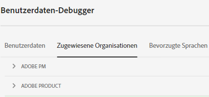
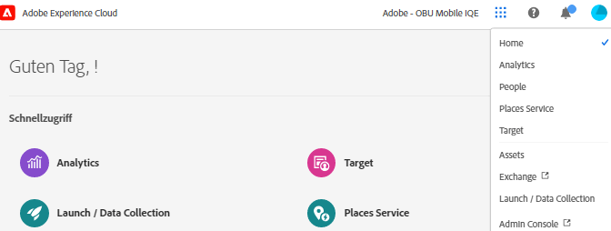
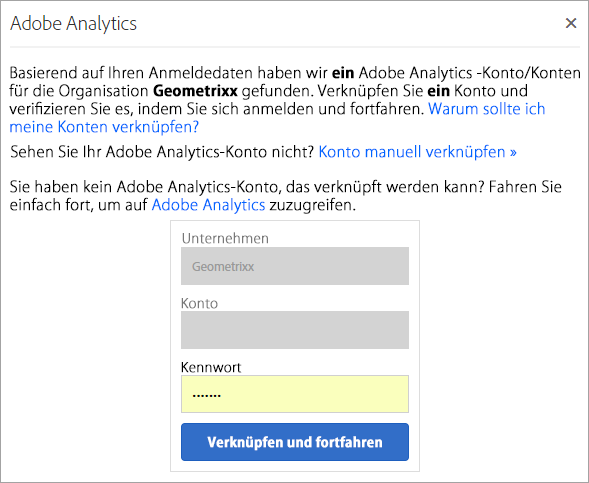

# Organisationen in Experience Cloud

Erfahren Sie mehr über das Verwalten und das Wechseln von Organisationen in Experience Cloud.

## Organisation identifizieren {#concept_384D169B0B724B799D573B8ECB5C39BF}

Eine *Organisation* ist die Einheit, die es einem Administrator ermöglicht, Gruppen und Benutzer zu konfigurieren und das Single-Sign-on in Experience Cloud zu steuern. Die Organisation funktioniert wie ein Unternehmen mit Anmeldung, das alle Experience Cloud-Produkte und -Programme umfasst. Normalerweise besitzt eine Organisation den Namen Ihres Unternehmens. Ein Unternehmen kann jedoch über mehrere Organisationen verfügen.

Um sicherzustellen, dass Sie sich bei Ihrer richtigen Organisation angemeldet haben, klicken Sie auf Ihren Profilavatar, um den Organisationsnamen anzuzeigen. Wenn Sie Zugriff auf mehr als eine Organisation haben, können Sie rechts in der Kopfzeilenleiste auch eine andere Organisation anzeigen und zu dieser wechseln.

Wenn Ihr Unternehmen Federated IDs verwendet, können Sie sich mit Experience Cloud beim Single Sign-on Ihres Unternehmens anmelden, ohne Ihre E-Mail-Adresse und Ihr Passwort eingeben zu müssen. Um diese Funktion zu verwenden, fügen Sie `#/sso:@domain` zur Experience Cloud-URL hinzu (`https://experience.adobe.com`).

Setzen Sie beispielsweise für eine Organisation mit Federated IDs und der Domain `adobecustomer.com` Ihren URL-Link auf `https://experience.adobe.com/#/sso:@adobecustomer.com`. Sie können auch direkt zu einem bestimmten Programm gehen, indem Sie diese URL, an die der Programmpfad angehängt ist, als Lesezeichen speichern. (Beispiel für Adobe Analytics: `https://experience.adobe.com/#/sso:@adobecustomer.com/analytics`.)

## Organisations-ID ermitteln {#concept_EA8AEE5B02CF46ACBDAD6A8508646255}

Möglicherweise müssen Sie auch zu Supportzwecken Ihre Organisations-ID suchen. Mit dem Menü **[!UICONTROL Organisation]** können Sie prüfen, ob Sie sich in der richtigen Organisation befinden, und Organisationen wechseln.

Die Organisations-ID ist die ID, die Ihrem freigeschalteten Experience Cloud-Unternehmen zugeordnet ist. Diese ID besteht aus einer 24-stelligen alphanumerischen Zeichenfolge gefolgt von (und muss enthalten) `@AdobeOrg`.

Sie können Ihre Organisations-ID zusammen mit anderen Kontoinformationen mithilfe des Tastaturbefehls anzeigen **Strg+i** von jeder Seite aus `https://experience.adobe.com`und klicken Sie dann auf **[!UICONTROL Zugewiesene Organisationen]** im Dialogfeld.

Alternativ können sich Administratoren auch bei der Admin Console anmelden (navigieren Sie zu [https://adminconsole.adobe.com](https://adminconsole.adobe.com)) und zeigen Sie Ihre IMS-Organisations-ID in der URL an.

Beispielsweise in der folgenden URL:

`https://adminconsole.adobe.com/C538193582390300A495CC9@AdobeOrg/overview`

Hier lautet die ID:

`C538193582390300A495CC9@AdobeOrg`

## Verknüpfen eines Programmkontos mit einer Adobe ID {#task_FD389E78640848919E247AC5E95B8369}

In der Regel gewähren Experience Cloud-Administratoren Zugriff auf Programme und Services. In seltenen Fällen müssen Sie eventuell die Anmeldeinformationen eines Programms mit einer Adobe ID verknüpfen.

1. Befolgen Sie die Anweisungen in Ihrer E-Mail-Einladung zur Experience Cloud.
1. Melden Sie sich mit Ihrer Adobe ID oder Enterprise ID an.
1. Klicken Sie auf die Programmauswahl ().

   

   Die Programme, auf die Sie Zugriff haben, sind farbig dargestellt.
1. Wählen Sie das gewünschte Programm aus.

   

   Diese Art Nachricht wird angezeigt, wenn Sie der entsprechenden Gruppe angehören (und über Zugriff auf das Programm verfügen), Ihre Kontoanmeldeinformationen jedoch noch nicht mit Ihrer Adobe ID verknüpft haben.
1. Klicken Sie auf **[!UICONTROL Konto verknüpfen]** und geben Sie Ihre Anmeldeinformationen ein.

## Standardorganisation und -Landingpage festlegen {#concept_6A191B42A9874A9780882903BA18F071}

Sie können bei der Anmeldung eine Standardorganisation und eine Landingpage angeben.

Klicken Sie in Ihrem Profil auf **[!UICONTROL Profil bearbeiten]**.

Unter „Standardorganisation und Landingpage“ können Sie Ihren Anmeldevorgang anpassen.

## Problembehebung für Kontoverknüpfungen {#concept_DFCB29A3B4834FC59AA29E0BBA301584}

Hilfe zu Problemen, die sich aus der Kontoverknüpfung ergeben.

In der Regel schlägt die Kontoverknüpfung fehl, da die Adobe ID mit einem vorherigen Benutzer verknüpft ist. Wenn die Kontoverknüpfung fehlschlägt, können Sie Folgendes tun:

* [Wenden Sie sich an den Adobe Support](https://experienceleague.adobe.com/?support-solution=General&amp;lang=de#support).
* Greifen Sie über die Standardanmeldung auf das Programm zu, solange das Problem nicht behoben ist.
