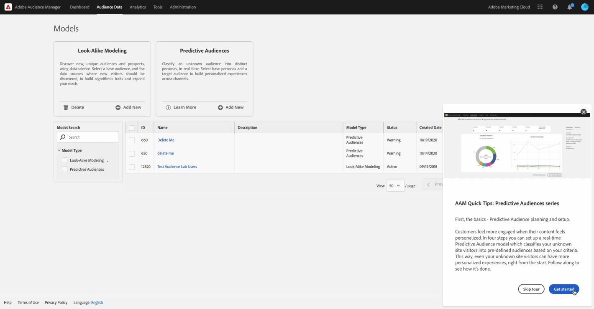

# Empfehlungen und Promotions für personalisiertes Lernen

Sie können es uns ermöglichen, Ihnen hilfreiche, auf Ihre Adobe zugeschnittene Inhalte bereitzustellen. Wählen Sie Ihre Voreinstellungen aus den unten stehenden Optionen aus und Sie erhalten Lerninformationen, die für Folgendes relevant sind:

* Ihre Kompetenz und Rolle
* Ihre Workflows
* Wahrscheinlich verwendete Funktionen
* Und mehr!

[Anpassen meines Lernens](https://experience.adobe.com/?shell_forceuserconsent=true#/home)

Sie können Ihre Auswahl jederzeit in [Benutzereinstellungen](https://experience.adobe.com/preferences/).

| Personalisierte Schulungs- und Support-Empfehlungen für Ihre Adobe-Produkte und -Dienstleistungen |  |  |
| Erhalten Sie relevante Best Practices, Tipps und Tricks, hilfreiche Durchläufe und mehr basierend auf Ihrer Verwendung Ihrer Adobe-Produkte auf allen diesen drei Möglichkeiten.. |  |  |
|--- |--- |--- |
| In Ihren Adobe-Produkten ... | Informationen zur Echtzeit-Hilfe finden Sie unter Popups und QuickInfos . | Dies könnte ... <ul><li>Schrittweise Anleitungen und hilfreiche Tipps für Adobe-Experten</li> <li>Video-Tutorials und Informationsexemplare</li> <li>Detaillierte Aus- und Weiterbildung</li> <li>Recommendations für Videos und Beiträge</li></ul> |
| In E-Mail sendet Ihnen Adobe ... | Anzeigen von Lerninhalten, die sich auf Ihre Arbeit in Ihren Produkten beziehen. | ^ |
| In den Experience League Communities ... | Sehen Sie personalisierte Empfehlungen für Beiträge und Artikel basierend auf dem, was Sie jetzt tun. | ^ |

{style=&quot;table-layout:auto&quot;}

| Personalisierte Informationen über Adobe-Produkte, -Dienste, -Veranstaltungen und -Promotions |  |  |
| Sie erhalten maßgeschneiderte Möglichkeiten für Lernveranstaltungen, Forschungssitzungen und Integrationen, die auf Ihrer Arbeit basieren...   |  |  |
|--- |--- |--- |
| In Ihren Adobe-Produkten ... | Unter Pop-ups und QuickInfos finden Sie für Sie relevante Einladungen und Möglichkeiten. | Dies könnte ... <ul><li>Einladungen zu Schulungs-Webinaren und -Veranstaltungen</li> <li>Möglichkeiten zum Testen und Input für zukünftige Versionen der von Ihnen verwendeten Funktionen</li> <li>Tipps zur Verwendung von Integrationen zwischen Produkten, die Sie besitzen</li> <li>Highlights für wichtige Tagungen auf der Adobe Summit-Konferenz auf der Grundlage Ihrer Arbeit</li></ul> |
| In E-Mail sendet Ihnen Adobe ... | Erhalten Sie aktuelle Informationen aus der Adobe über zusätzliche Lernmöglichkeiten. | ^ |
| In den Experience League Communities ... | Sehen Sie sich personalisierte Empfehlungen für Ereignisse und Dienste an, um Ihr Lernen zu verbessern. | ^ |

{style=&quot;table-layout:auto&quot;}

## Sehen Sie sich Beispiele dafür an, wie diese benutzerdefinierten Lerninformationen aussehen könnten.

### In Ihren Adoben

### In E-Mail sendet Ihnen die Adobe

### In der Experience League Communities

