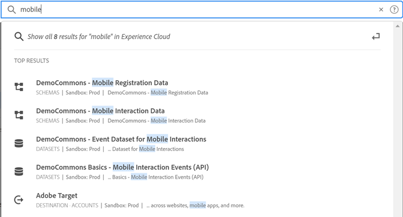

# [!UICONTROL Einheitliche Suche] für Objekte und Entitäten {#globally-search}

Die [!UICONTROL Einheitliche Suche] Mit der Suche können Sie durchsuchbare Geschäftsobjekte oder Entitäten in einem nahtlosen, konsistenten 1-Klick-Erlebnis finden. Diese Suche überdeckt Ihre zuletzt aufgerufenen Objekte.

## Zugriff auf die einheitliche Suche

Einheitliche Suche ist auf jeder Seite in der Kopfzeile des Experience Cloud am oberen Seitenrand verfügbar. Sie können auch den Tastaturbefehl `command /` oder `ctrl /` , um auf die Suche zuzugreifen.

Diese Funktion ist nur für unterstützte Produkte verfügbar, die derzeit sind:

* Experience Platform (AEP)
* Journey Optimizer (AJO)

Da mehr Inhalte indiziert werden, wird diese Funktion relevanten Anwendungen hinzugefügt.

## Durchsuchbare Objekte und Felder

Während der Eingabe werden die passenden Ergebnisse aus den Objekten, auf die Sie Zugriff haben, angezeigt.

Unsere Algorithmen zeigen zuerst die relevantesten Datensätze. Die Reihenfolge der Ergebnisse hängt von verschiedenen Faktoren ab, z. B.:

Ihre Funktionen und Objektberechtigungen Übereinstimmung in Prozent Ob eine exakte Übereinstimmung vorliegt

Zu den durchsuchbaren Geschäftsobjekten gehören:

* Segmente (Name, Beschreibung)
* Schema (Name, Beschreibung)
* Datensätze (Name, Beschreibung)
* Quellen (Name, Beschreibung)
* Ziele (Name, Beschreibung)
* Abfragen (Name, Beschreibung)
* Nachrichten (Name, Beschreibung)
* Angebote (Name, Beschreibung)
* Komponenten (Name, Beschreibung)
* Journey (Name, Beschreibung)

Wenn ein Keyword mit einer Navigationsseite übereinstimmt, können Sie einen Schnellzugriff-Link zu den Beispieldatensätzen der Navigationsseite erhalten. Im oberen Bereich der Ergebnisse werden die Top-30-Ergebnisse angezeigt.

Sie finden die Hilfeartikel auch aus Experience League und Communities. Natürliche Sprachabfragen werden unterstützt.

Beispiel: _Erstellen eines Schemas_ Ergebnisse aus der Experience League unter _[!UICONTROL Lernen]_:

Suchalgorithmen zeigen zuerst die relevantesten Datensätze an. Die Reihenfolge der Ergebnisse hängt von verschiedenen Faktoren ab, z. B.:

* Benutzerberechtigungen für den Zugriff auf Objekte
* Übereinstimmender Prozentsatz
* Exakte Übereinstimmungen
* Die _[!UICONTROL Top-Ergebnisse]_ zeigt die Top-30-Ergebnisse.

Um die Suche zu verfeinern, klicken Sie auf eine der folgenden Optionen:

* **[!UICONTROL All Learning]**: Öffnet die Suche in Experience League.
* **[!UICONTROL Alle anzeigen...]**: Ermöglicht die weitere Verfeinerung und Filterung der Ergebnisse.

## Einheitliche Suchfunktionen

Die folgenden Funktionen sind in der einheitlichen Suche verfügbar.

| Funktion | Beschreibung |
| ------- | ------- |
| Globale Sprachunterstützung | Die globale Suche versteht Abfragen und liefert Ergebnisse für Deutsch, Spanisch, Französisch, Italienisch, Japanisch, Koreanisch, Portugiesisch und Chinesisch. |
| Typo-Toleranz | Einheitliche Suche bietet eine robuste Typo-Toleranz unter Verwendung erweiterter Algorithmen. Diese Algorithmen berechnen Bearbeitungen und liefern geeignete Ergebnisse. |
| Hervorhebung | In der Suchanfrage wird der übereinstimmende Suchbegriff hervorgehoben, sodass Sie den Abschnitt und die Wörter, die Ihrer Abfrage entsprechen, einfach finden können. Die Hervorhebung funktioniert auch bei falsch geschriebenen Wörtern. |
| Snippets | In der Suchantwort sehen Sie einen Ausschnitt des Ergebnisses. Snippets geben die entsprechenden Wörter und einige Inhalte rund um die entsprechenden Suchbegriffe zurück. |
| Stoppwörter | Einige häufig verwendete englische Wörter werden als _Stoppwörter_. Wenn Stoppwörter in der Suchabfrage enthalten sind, wird ihnen weniger Gewicht gegeben.  Stoppwörter beinhalten: _a, an und sind, wie es ist, aber durch, ob es, in, in, ist, nein, nicht, auf, oder so, dass die, ihre, dann, dort, diese, dies, zu, mit_.  Stoppwörter werden in anderen globalen Sprachen nicht unterstützt. |
| Natürliche Sprachabfragen | Wenn Sie in Experience League Communities nach einem Hilfeartikel oder einer Diskussion suchen, können Sie Ihre Frage in eine natürliche Sprache eingeben und die Antwort erhalten. Beispielsuche: &quot;Wie erstelle ich ein Schema?&quot; |
| Exakte Suche in Anführungszeichen | Mithilfe von Anführungszeichen in der Abfrage können Sie eine genaue Suche durchführen. Bei exakten Übereinstimmungsabfragen wird keine Typo-Korrektur vorgenommen. Beispiel: &quot;Luma Journey 2022&quot;. |
| Filter | Sie können Filter wie _Objekttyp_ und anderen objektspezifischen Filtern im Popup mit den vollständigen Suchergebnissen. Wenn Sie die Eingabetaste drücken, nachdem Sie die Suchabfrage angeglichen haben, wird ein Popup mit einer vollständigen Seite mit den Filtern geöffnet. |

{style=&quot;table-layout:auto&quot;}

## Kann es nicht finden?

Probieren Sie die folgenden Tipps aus:

* Spezifischere Suchbegriffe eingeben
* Rechtschreibprüfung
* Versuchen Sie, den vollständigen Suchbegriff zu schreiben
* Stellen Sie sicher, dass Sie über Berechtigungen für Objekte verfügen, nach denen Sie suchen

