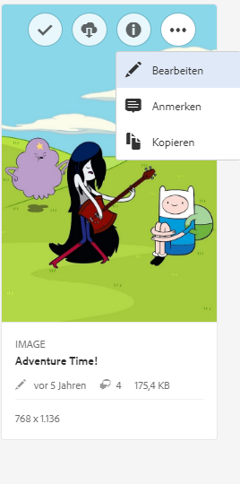
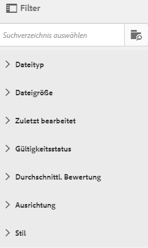
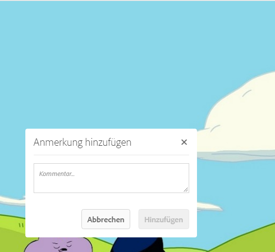
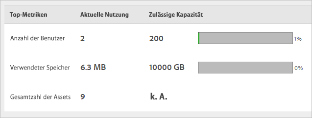

# Überblick über CX Enterprise Assets

CX Enterprise Assets bietet ein zentrales Repository Marketing-fähiger Assets, die Sie programmübergreifend freigeben können. Ein Asset ist ein digitales Dokument, Bild, Video oder eine digitale Audiodatei (oder ein Teil davon), das bzw. die mehrere Darstellungen aufweisen und über untergeordnete Assets verfügen kann (z. B. Ebenen in einer [!DNL Photoshop]-Datei, Folien in einer [!DNL PowerPoint]-Datei, Seiten in einer PDF-Datei, Dateien in einer ZIP-Datei).

Zu den Asset-Services gehören:

* Asset-Speicherung, Verwaltungsschnittstelle, eingebettete Auswahlschnittstelle (Zugriff erfolgt über Programme).
* Integrationen mit Creative Cloud, CX Enterprise Collaboration und CX Enterprise-Anwendungen.

Die Verwendung von Assets verbessert die Konsistenz und Markenkonformität und beschleunigt die Markteinführung. Sie können Workflows in Programmen optimieren:

* **[!DNL Adobe Target]**: Erstellen Sie Erfahrungen für A/B- und multivariate Tests
* **[!DNL Ad Cloud]**: Entwickeln Sie Werbeeinheiten für verschiedene Kanäle und Kampagnen
* **[!DNL Adobe Campaign]**: Fügen Sie Assets in E-Mail-Newslettern und Kampagnen ein.

## Zu CX Enterprise Assets navigieren

## Auf die Symbolleiste zugreifen

Navigieren Sie zu einem Asset (oder Asset-Verzeichnis) und klicken Sie auf **[!UICONTROL Select]**.

Die Symbolleiste bietet schnellen Zugriff auf Funktionen, einschließlich Suche, Timeline, Darstellungen, Bearbeiten, Anmerkungen und Herunterladen.

>[!NOTE]
>
>Assets müssen aus Adobe Target-Aktivitäten entfernt werden, bevor Sie sie erfolgreich aus [!DNL Target] löschen können.

## Assets bearbeiten

Die Bearbeitung eines Assets ermöglicht Funktionen wie:

* Beschneiden
* Drehen
* Spiegeln

## Nach Assets suchen

Sie können nach Keyword, Dateityp, Größe, Änderungsdatum, Veröffentlichungsstatus, Ausrichtung und Stil suchen.

## Anmerkungen zu Assets vornehmen

Klicken Sie auf **[!UICONTROL Annotate]**, indem Sie Kreise oder Pfeile auf ein Bild zeichnen, und fügen Sie in das Asset Anmerkungen für Ihre Kollegen ein.

## Assets im Vollbildmodus anzeigen und Zoomen

Klicken Sie auf **[!UICONTROL Views]** > **[!UICONTROL Image]** , um das vollständige Bild des Assets anzuzeigen und das Zoomen zu aktivieren.

## Asset-Eigenschaften anzeigen

Treffen Sie eine Auswahl zwischen der Kartenansicht mit Eigenschaften, der Listenansicht und der Spaltenansicht, um Ihr Asset möglichst schnell zu finden.

Klicken Sie auf **[!UICONTROL Views]** > **[!UICONTROL Properties]** , um die Eigenschaften eines Assets anzuzeigen:

## Gebrauchsberichte ausführen

Anzahl der Benutzer, belegten Speicherplatz und Gesamtzahl der Assets anzeigen.

Klicken Sie auf **[!UICONTROL Tools]** > **[!UICONTROL Reports]** > **[!UICONTROL Usage Report]**

