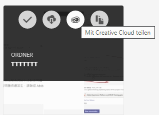
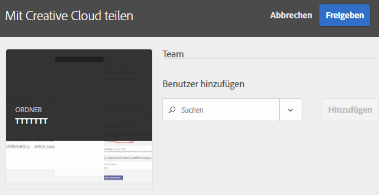
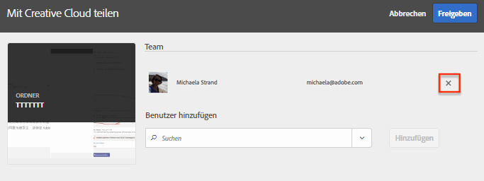
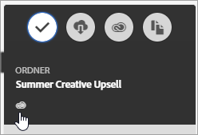

# Experience Cloud-Asset-Ordner freigeben

Geben Sie Ordner und Assets sowohl in Experience Cloud als auch in Creative Cloud frei. Sie können an gemeinsamen Assets zusammenarbeiten, sie kommentieren und in Experience Cloud-Programmen wie Adobe Target verwenden. Der freigegebene Ordner muss aus Experience Cloud stammen.

**Vorteile der Freigabe**

* Optimierung der kreativen Produktions-Workflows in der Review-, Genehmigungs- und Veröffentlichungsphase
* Weniger Zeitaufwand für die Verwaltung von prozessinternen Dateien und Versionen an mehreren Speicherorten
* Effizientere Verfolgung und Verwaltung von Kreativ-Assets
* Mehr Sicherheit für Unternehmen
* Einfaches Freigeben, Speichern und Senden von Dateien zwischen Creatives und Marketingfachleuten

Bevor Creative Cloud-Benutzer Zugriff auf Assets haben, müssen sie in Experience Cloud auf die Zulassungsliste gesetzt werden. Siehe [Verwalten von Creative Cloud-Benutzern](manage-cc-users.md).

**So geben Sie einen Experience Cloud Asset-Ordner frei**

1. Klicken Sie in einem Asset-Ordner auf **[!UICONTROL Share to Creative Cloud]**.

   
1. Suchen Sie auf der Seite Für Creative Cloud freigeben nach dem Benutzer und klicken Sie dann auf **[!UICONTROL Add]**.

   

1. Klicken Sie auf **[!UICONTROL Share]**.
1. Starten Sie den [!DNL Creative Cloud]-Desktop (oder navigieren Sie in einem Browser zur [!UICONTROL Creative Cloud Files] Seite) und suchen Sie nach der Anfragebenachrichtigung.

   
1. Öffnen Sie die Anfrage und klicken Sie dann auf **[!UICONTROL Accept]**.

   
1. Um auf Ordnerinhalte zuzugreifen, klicken Sie auf **[!UICONTROL Open Folder]** (oder **[!UICONTROL View on Web]**).

   
1. Sie können nun Kommentare zu dem freigegebenen Asset hinzufügen:

   In Creative Cloud können Sie ein Bild auswählen und dann auf **[!UICONTROL Activity]** klicken, um dem Bild einen Kommentar hinzuzufügen. Kommentare zu Assets werden in [!DNL Creative Cloud] und in [!DNL Experience Cloud] synchronisiert.

   

   Klicken Sie in Experience Cloud auf ein Bild und dann auf das Zeitleistensymbol, um dem Bild einen Kommentar hinzuzufügen. Kommentare werden mit den Assets in Creative Cloud und Experience Cloud synchronisiert.

   

1. Um die Freigabe eines Ordners aufzuheben, klicken Sie auf **[!UICONTROL Share Using Creative Cloud]** (ähnlich wie [Schritt 3](share.md)), entfernen Sie dann Benutzer, indem Sie auf das X klicken, und klicken Sie dann auf **[!UICONTROL Share]**.

   

   Wenn Sie alle Creative Cloud-Benutzer entfernt haben, wird die Freigabe des Ordners aufgehoben. Die Creative Cloud-Benutzer haben dann keinen Zugriff mehr auf diesen Ordner.

Zu den weiteren Möglichkeiten, ein freigegebenes Asset zu verwenden, gehören das Laden oder Austauschen von Assets in der [Angebotsbibliothek](https://experienceleague.adobe.com/docs/target/using/experiences/offers/manage-content.html) in Adobe Target für Bilder in -Aktivitäten.

Wenn Sie einen Ordner für Creative Cloud freigegeben haben, erscheint auf dem Ordner das Creative Cloud-Logo.

Zugehörige Hilfe:

* [Creative Cloud-Hilfe – Verwalten und Synchronisieren von Dateien](https://helpx.adobe.com/de/creative-cloud/help/sync-creative-cloud-files.html)
* [Creative Cloud-Hilfe – Zusammenarbeiten mit anderen](https://helpx.adobe.com/de/creative-cloud/help/collaboration.html)
* [Creative Cloud-Hilfe – Häufig gestellte Fragen zur Zusammenarbeit](https://helpx.adobe.com/de/creative-cloud/help/collaboration-faq.html)

## Informationen zur Asset-Freigabe für Adobe Target

Beim Erstellen von Aktivitäten in [!DNL Adobe Target] können Sie ein freigegebenes Bild-Asset verwenden, wenn Sie Bilder im [!UICONTROL Offers Library] austauschen.

Siehe [Angebotsbibliothek](https://experienceleague.adobe.com/docs/target/using/experiences/offers/manage-content.html) in der [!DNL Target]-Hilfe.
