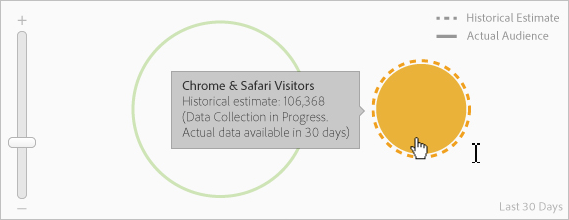

# Erstellen einer Zielgruppe

In [!UICONTROL Audience Library] können Sie Attributregeln verwenden, um eine Zielgruppe zu erstellen und eine gemischte Zielgruppe zu definieren, die in CX Enterprise-Programmen freigegeben werden kann.

In diesem Artikel lernen Sie Folgendes:

* Erstellen einer Zielgruppe
* Erstellen einer Regel
* Verwenden von Regeln zum Definieren einer gemischten Zielgruppe

Die folgende Grafik stellt zwei Regeln in einer gemischten Zielgruppe dar.

Jeder Kreis steht für eine Regel, die die Zugehörigkeit zu einer Zielgruppe definiert. Besucher, die sich in beiden Zielgruppenregeln qualifizieren, überschneiden sich und werden so zur gemischten, definierten Zielgruppe.

>[!NOTE]
>
>Die Zielgruppe ist erst nach Ablauf des für die Datenerfassung angegebenen Zeitraums vollständig definiert.

Das folgende Beispiel zeigt, wie die Regeln für eine gemischte Zielgruppe erstellt werden. Diese Zielgruppe umfasst Folgendes:

* Abschnitt „Home &amp; Garden“, der von Seitendaten oder Analyse-Rohdaten abgeleitet wurde.
* Chrome- und Safari-Benutzer, die von einem [!DNL Adobe Analytics] Segment abgeleitet [veröffentlicht](overview.md) in [!DNL CX Enterprise].

  

**Erstellen einer Zielgruppe**

1. Klicken Sie auf [!DNL CX Enterprise] Apps  und dann auf **[!UICONTROL People]** > **[!UICONTROL Audience Library].**

1. Klicken Sie auf der [!UICONTROL Audiences] Seite auf **[!UICONTROL New]**. 

   

1. Füllen Sie auf der Seite [!UICONTROL Create New Audience] die Felder **[!UICONTROL Title]** und **[!UICONTROL Description]** aus.
1. Wählen Sie unter [!UICONTROL Rules] eine Referenz-Report Suite und dann eine Attributquelle aus:

   * **[!UICONTROL Real-Time Analytics Data:]** (oder Rohdaten) Hierbei handelt es sich um Attributdaten, die aus Real-Time Analytics-Bildanforderungen abgeleitet wurden. Sie enthält eVars und Ereignisse. Sie müssen bei Verwendung dieser Attributquelle eine Report Suite auswählen und die einzuschließende Dimension oder das einzuschließende Ereignis definieren. Diese Report Suite-Auswahl stellt die von der Report Suite verwendete Variablenstruktur bereit.

     >[!NOTE]
     >
     >Aufgrund des Caching benötigen gelöschte Report Suites in Analytics 12 Stunden, bevor die Löschung in CX Enterprise angezeigt wird.

   * **[!UICONTROL CX Enterprise:]** aus [!DNL CX Enterprise] Quellen abgeleitete Attributdaten. Hierbei kann es sich z. B. um Daten aus Zielgruppensegmenten handeln, die Sie in [!DNL Analytics] erstellen, oder Daten aus [!DNL Audience Manager].

1. Definieren Sie Zielgruppenregeln und klicken Sie dann auf **[!UICONTROL Save].**

**Beispiel: Definieren von Regeln für eine gemischte Zielgruppe**

>[!NOTE]
>
>Für die Erstellung von Zielgruppenregeln sollten Sie Ihre Implementierungsvariablen unbedingt kennen.

Definieren Sie unter [!UICONTROL Rules] die Auswahl der *`Home & Garden`* Attribute:

* **[!UICONTROL Attribute Source:]** von Analytics-Rohdaten
* Report Suite 31 **[!UICONTROL Report Suite:]**
* Dimension = **[!UICONTROL Store (Merch) (v6)]** > **[!UICONTROL Equals]** > **[!UICONTROL Home & Garden]**

Die *Besucher von Chrome und Safari* sind ein in Analytics freigegebenes Zielgruppensegment:

* **[!UICONTROL Attribute Source:]** CX Enterprise
* Besuchende von Chrome und Safari **[!UICONTROL Dimension:]**

Zum Vergleich können Sie eine *OR*-Regel hinzufügen, um alle Besucher eines Site-Bereichs wie „Terrasse &amp; Möbel“ anzuzeigen.

Die resultierende Regel ist eine definierte Zielgruppe mit Chrome &amp; Safari-Benutzern, die Home &amp; Garden besucht haben. Der Abschnitt „Patio &amp; Furniture“ bietet zusätzliche Einblicke in alle Besucher, die diesen Site-Abschnitt besuchen.

* **Historische Schätzdaten:** (Gepunkteter Kreis) Stellt Regeln dar, die basierend auf [!DNL Analytics]-Daten erstellt wurden.
* **Tatsächliche Zielgruppe:** (Durchgehender Kreis) Eine erstellte Regel, die 30 Tage lang Daten aus Audience Manager enthält. Wenn die Audience Manager-Daten 30 Tage erreichen, ist die Zeile durchgehend gefüllt und stellt die tatsächlichen Zahlen dar.

Nachdem die Datenerfassung für den angegebenen Zeitraum abgeschlossen wurde, werden die Kreise zu einer definierten Zielgruppe kombiniert.

Nachdem die Zielgruppe gespeichert wurde, ist sie für andere CX Enterprise-Programme verfügbar. Sie können beispielsweise eine freigegebene Zielgruppe in eine Adobe Target-Aktivität ([) &#x200B;](https://experienceleague.adobe.com/de/docs/target/using/activities/activities).
