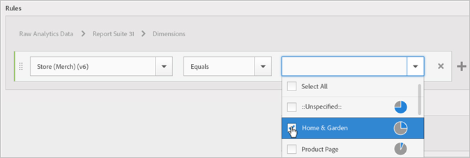

# Erstellen einer Zielgruppe

Hier erfahren Sie, wie Sie in Experience Cloud mit Attributregeln eine Zielgruppe erstellen und eine gemischte Zielgruppe definieren.

In diesem Artikel lernen Sie Folgendes:

* Erstellen einer Zielgruppe
* Erstellen einer Regel
* Verwenden von Regeln zum Definieren einer gemischten Zielgruppe

Die folgende Grafik stellt zwei Regeln in einer gemischten Zielgruppe dar.

Jeder Kreis steht für eine Regel, die die Mitgliedschaft in einer Zielgruppe definiert. Besucher, die sich in beiden Zielgruppenregeln qualifizieren, überschneiden sich und werden so zur gemischten, definierten Zielgruppe.

>[!NOTE]
>
>Die Zielgruppe ist erst nach Ablauf des für die Datenerfassung angegebenen Zeitraums vollständig definiert.

Das folgende Beispiel zeigt, wie die Regeln für eine gemischte Zielgruppe erstellt werden. Diese Zielgruppe umfasst Folgendes:

* Abschnitt „Home &amp; Garden“, der von Seitendaten oder Analyse-Rohdaten abgeleitet wurde.
* Chrome- und Safari-Benutzer, die einem [!DNL Adobe Analytics]-Segment entnommen wurden, das in der [!DNL Experience Cloud] [veröffentlicht](overview.md) wurde.

  

**Erstellen einer Zielgruppe**

1. Klicken Sie in der [!DNL Experience Cloud] unter [!DNL Experience Platform] auf **[!UICONTROL Personen]** > **[!UICONTROL Zielgruppenbibliothek].**
1. Klicken Sie auf [!UICONTROL  Seite ]Zielgruppen **[!UICONTROL auf „Neu]**. 

   

1. Geben Sie auf der Seite [!UICONTROL Neue Zielgruppe erstellen] einen Titel und eine Beschreibung an.
1. Wählen Sie unter [!UICONTROL Regeln] eine Attributquelle aus:

   * **[!UICONTROL Daten von Real-Time Analytics:]** Hierbei handelt es sich um Attributdaten, die aus Bildanfragen in Real-Time Analytics gewonnen werden und Daten wie eVars und Ereignisse enthalten. Sie müssen bei Verwendung dieser Attributquelle eine Report Suite auswählen und die einzuschließende Dimension oder das einzuschließende Ereignis definieren. Diese Report Suite-Auswahl stellt die von der Report Suite verwendete Variablenstruktur bereit.
   >[!NOTE]
   >
   >Aufgrund des Caching benötigen gelöschte Report Suites in Analytics 12 Stunden, bevor die Löschung in Experience Cloud angezeigt wird.

   * **[!UICONTROL Experience Cloud:]** Attributdaten, die aus den [!DNL Experience Cloud] Quellen abgeleitet werden. Hierbei kann es sich z. B. um Daten aus Zielgruppensegmenten handeln, die Sie in [!DNL Analytics] erstellen, oder Daten aus [!DNL Audience Manager].

1. Definieren Sie Zielgruppenregeln und klicken Sie dann auf **[!UICONTROL Speichern].**

>[!NOTE]
>
>Für die Erstellung von Zielgruppenregeln sollten Sie Ihre Implementierungsvariablen unbedingt kennen.

Definieren Sie unter [!UICONTROL Regeln] die *`Home & Garden`*-Attributauswahl:

* **[!UICONTROL Attributquelle:]** Analytics-Rohdaten
* **[!UICONTROL Report Suite:]** Report Suite 31
* Dimension = **[!UICONTROL Store (Merch) (v6)]** > **[!UICONTROL Entspricht]** > **[!UICONTROL Home &amp; Garden]**

Die *Besucher von Chrome und Safari* sind ein in Analytics freigegebenes Zielgruppensegment:

* **[!UICONTROL Attributquelle:]** Experience Cloud
* **[!UICONTROL Dimension:]** Besucher von Chrome &amp; Safari

Zum Vergleich können Sie eine *OR*-Regel hinzufügen, um alle Besucher eines Site-Bereichs wie „Terrasse &amp; Möbel“ anzuzeigen.

Die resultierende Regel ist eine definierte Zielgruppe mit Chrome &amp; Safari-Benutzern, die Home &amp; Garden besucht haben. Der Abschnitt „Patio &amp; Furniture“ bietet zusätzliche Einblicke in alle Besucher, die diesen Site-Abschnitt besuchen.

* **Historische Schätzdaten:** (Gepunkteter Kreis) Stellt Regeln dar, die basierend auf [!DNL Analytics]-Daten erstellt wurden.
* **Tatsächliche Zielgruppe:** (Durchgehender Kreis) Eine erstellte Regel, die 30 Tage lang Daten aus Audience Manager enthält. Wenn die Audience Manager-Daten 30 Tage erreichen, ist die Zeile durchgehend gefüllt und stellt die tatsächlichen Zahlen dar.

Nachdem die Datenerfassung für den angegebenen Zeitraum abgeschlossen wurde, werden die Kreise zu einer definierten Zielgruppe kombiniert.

Nach dem Speichern der Zielgruppe ist sie für andere Programme verfügbar. Sie können beispielsweise eine freigegebene Zielgruppe in eine Adobe Target-Aktivität aufnehmen.
