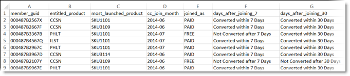

# [!DNL Customer Attributes] in Experience Cloud

Mit [!DNL Customer Attributes] in Experience Cloud können Sie Ihre erfassten Unternehmensdaten aus einer CRM-Datenbank (Customer Relationship Management) hochladen. Sie können die Daten in eine Datenquelle für Kundenattribute in Experience Cloud hochladen und dann die Daten in [!DNL Adobe Analytics] und [!DNL Adobe Target] verwenden.

## Suchen Sie die Funktion [!DNL Customer Attributes]

1. Melden Sie sich bei Experience Cloud an.

1. Navigieren Sie zu **[!DNL Experience Platform]** > **[!UICONTROL Personen]** > **[!UICONTROL Kundenattribute]**.

## Voraussetzungen zum Hochladen von [!DNL Customer Attributes] {#section_BD38693AFBF34926BA28E964963B4EA0}

* **Gruppenmitgliedschaft:** Um Kundenattributdaten hochzuladen, müssen Benutzer Mitglieder der Gruppe Kundenattribute sein. Sie müssen auch einer Adobe Analytics-Gruppe oder einer Adobe Target-Gruppe angehören.

  Um herauszufinden, ob Ihr Unternehmen Zugang zu Kundenattributen hat, muss sich Ihr [!DNL Experience Cloud]-Administrator bei [Experience Cloud](https://experience.adobe.com) anmelden. Navigieren Sie zu **[!UICONTROL Administration]** > **[!UICONTROL Admin Console]** > **[!UICONTROL Produkte]**. Wenn *[!DNL Customer Attributes]* als eines der [!UICONTROL Produktprofile] angezeigt wird, können Sie beginnen.

  Benutzerinnen und Benutzer, die den [!DNL Customer Attributes] hinzugefügt wurden, sehen auf der linken Seite der Experience Cloud-Benutzeroberfläche das Menüelement [!UICONTROL Kundenattribute].

* **Adobe Target** `at.js` (beliebige Version) oder `mbox.js` Version 58 oder höher ist für Kundenattribute erforderlich.

  Siehe [Bereitstellen von at.js](https://experienceleague.adobe.com/docs/target-dev/developer/client-side/overview.html).

## Was sind Enterprise-Kundendaten? {#section_6F34C29F11414842AA57D2B1248FA3C6}

Enterprise-Daten befinden sich in anderen Systemen. Sie können komplex sein und verschiedene Bedeutungen für verschiedene Personen haben. Diese Daten können Informationen wie Mitgliedschaften, Treueebene, Alter, Geschlecht, eigene Produkte, Interessen und Lebenszeitwert beinhalten.

Das folgende Bild ist ein Beispiel für eine Datendatei mit Abonnentendaten zu Produkten, einschließlich Mitglieds-IDs, Produkten mit Berechtigung, den am häufigsten gestarteten Produkten usw.

Nach Erstellung der Datendatei können Sie sie in eine Kundenattributquelle hochladen, die Sie unter **[!UICONTROL Experience Cloud]** > **[!UICONTROL Kundenattribute]** erstellen.

Weitere Informationen zu diesem Workflow finden Sie unter [Hochladen von Kundenattributdaten](t-crs-usecase.md).

## Beispiele für Kundenattribute in Analytics und Target {#section_4E77650F6CEE4C4ABCD0B3221A5AE5D9}

Nachdem sich die Daten in Experience Cloud befinden, können Sie sie anpassen und für Lösungen für Berichte, Segmentierung, Aktivitäten und Kampagnen freigeben.

Beispiel:

| Lösung | Vorteile und Anwendungsfälle |
|--- |--- |
| Adobe Analytics | Marketing-Experten und Analysten können Folgendes nachvollziehen:<ul><li>Die Online-Kampagnen, die bei Ihren Gold-Kunden am effektivsten sind.</li><li>Die Produkte, nach denen Gold-Kunden suchen, im Vergleich zu Produkten, nach denen Platin-Kunden suchen.</li><li>Ob Ihre Site-Neugestaltung positive Auswirkungen auf die Konversionsraten älterer Kunden hat.</li><li>Die Produkte, nach denen Kunden mit einem niedrigem Lifetime Value auf meiner Seite suchen.</li></ul> |
| Adobe Target | Attributdaten ermöglichen Benutzern von Adobe Target Folgendes:<ul><li>Anzeigen von Sonderrabatten und -angeboten für Treueclub-Mitglieder.</li><li>Senden von Empfehlungen teurerer Produkte an Luxuskunden.</li><li>Anzeigen von Up-Sell-Angeboten für Kunden, die bereits E-Mails erhalten, an der Stelle, die normalerweise für E-Mail-Anmeldungen reserviert ist.</li></ul> |

{style="table-layout:auto"}
