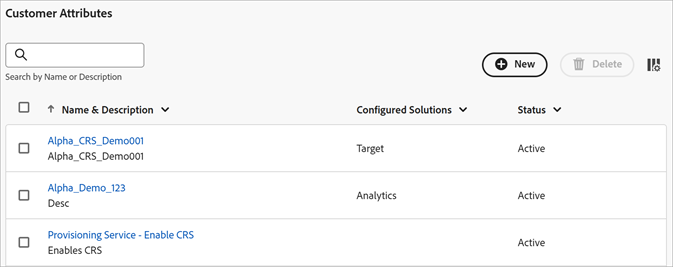

# Erstellen einer Datenquelle und Hochladen der Datei

Erstellen Sie die Kundenattributquelle (`.csv`- und `.fin`) und laden Sie die Daten hoch. Sobald Sie dazu bereit sind, aktivieren Sie die Datenquelle. Nachdem die Datenquelle aktiv ist, geben Sie die Attributdaten für [!DNL Analytics] und [!DNL Target] frei.

**[!DNL Customer Attributes]Workflow**


## [!DNL Customer Attributes] suchen

Klicken Sie [!DNL Experience Cloud] auf **[!UICONTROL Apps]**  > **[!DNL Customer Attributes]**.

## Voraussetzungen für die Verwendung von [!DNL Customer Attributes] {#prerequisites}

* **Gruppenmitgliedschaft:** Um die Daten hochzuladen, müssen Benutzer Mitglieder der [!DNL Customer Attributes] sein. Sie müssen auch einer Adobe Analytics-Gruppe oder einer Adobe Target-Gruppe angehören.

  Um herauszufinden, ob Ihr Unternehmen Zugriff auf Kundenattribute hat, muss sich Ihr [!DNL Experience Cloud]-Administrator bei der [Experience Cloud](https://experience.adobe.com) anmelden. Navigieren Sie zu **[!UICONTROL Admin Console]** > **[!UICONTROL Produkte]**. Wenn *[!DNL Customer Attributes]* als eines der [!UICONTROL Produktprofile] angezeigt wird, können Sie beginnen.

  Benutzende, die hinzugefügt wurden, [!DNL Customer Attributes] das [!DNL Customer Attributes] Menüelement auf der linken Seite der Experience Cloud-Benutzeroberfläche zu sehen.

* **Adobe Target** `at.js` (beliebige Version) oder `mbox.js` Version 58 oder höher ist für Kundenattribute erforderlich.

  Siehe [Bereitstellen von at.js](https://experienceleague.adobe.com/docs/target-dev/developer/client-side/overview.html).

## Erstellen Sie eine Datendatei {#create-data}

Diese Daten sind Unternehmenskundendaten aus Ihrem CRM-System. Die Daten können Abonnentendaten für Produkte wie Mitglieds-IDs, berechtigte Produkte, am häufigsten gestartete Produkte usw. enthalten.

1. Erstellen Sie eine `.csv`.

   >[!NOTE]
   >
   >Später werden Sie die `.csv`-Datei per Drag-and-Drop hochladen. Wenn Sie jedoch [per FTP hochladen](t-upload-attributes-ftp.md#task_591C3B6733424718A62453D2F8ADF73B), benötigen Sie auch eine `.fin`-Datei mit dem gleichen Namen wie die `.csv`.

   Beispiel für die Kundendatendatei eines Unternehmens:

   

1. Überprüfen Sie vor dem Hochladen der Datei die wichtigen Informationen in den [Datendateivoraussetzungen](crs-data-file.md).
1. [Erstellen Sie eine Kundenattributquelle und laden Sie wie nachfolgend beschrieben die Daten hoch](t-crs-usecase.md#create-source).

## Erstellen Sie die Attributquelle und laden Sie die Datendatei hoch {#create-source}

Führen Sie diese Schritte auf der Seite [!UICONTROL Kundenattribut-Source erstellen] in Experience Cloud aus.

>[!IMPORTANT]
>
>Beim Erstellen, Ändern oder Löschen von Kundenattributquellen dauert es bis zu einer Stunde, bis die IDs mit der neuen Datenquelle synchronisiert werden. Sie müssen über Administratorrechte in Audience Manager verfügen, um Kundenattributquellen zu erstellen oder zu ändern. Wenden Sie sich an die Audience Manager-Kundenunterstützung oder -Beratung, um Administratorrechte zu erhalten.

1. Klicken Sie [!DNL Experience Cloud] auf **[!UICONTROL Apps]**  > **[!DNL Customer Attributes]**.

   

1. Klicken Sie auf **[!UICONTROL Neu]**.

   

1. Konfigurieren [!UICONTROL  auf der Seite „Kundenattribut-Source erstellen] die folgenden Felder:

   * **[!UICONTROL Name:]** Ein Anzeigename für die Datenattributquelle. Bei [!DNL Adobe Target] dürfen Attributnamen keine Leerzeichen enthalten. Wenn ein Attribut mit Leerzeichen übergeben wird, wird es von [!DNL Target] ignoriert. Weitere nicht unterstützte Zeichen: `< , >, ', "`.

   * **[!UICONTROL Beschreibung:]** (Optional) Eine Beschreibung der Quelle des Datenattributs.

   * **[!UICONTROL Alias-ID:]** Gibt die Quelle der Kundenattributdaten an, beispielsweise ein CRM-System. [!UICONTROL Alias-ID] ist eine eindeutige ID, die im Code [!UICONTROL Kundenattribut-Source&quot; ] wird. Die ID muss eindeutig sein und darf nur Kleinbuchstaben, aber keine Leerzeichen enthalten. Der Wert, der für eine Kundenattributquelle in Experience Cloud im Feld [!UICONTROL Alias-ID] eingegeben wird, sollte mit den Werten übereinstimmen, die von der Implementierung übergeben werden (über die Platform-Datenerfassung oder JavaScript der Mobile SDK).

     >[!IMPORTANT]
     >
     >Durch das Löschen einer mit einer Alias-ID verknüpften Datenquelle wird die Alias-ID nicht verfügbar, da die Alias-ID in mehreren Services gespeichert und zur Zuordnung von Profilen zwischen ihnen verwendet wird.

     Die Alias-ID entspricht bestimmten Bereichen, in denen Sie zusätzliche Werte für die Kunden-ID festlegen. Beispiel:

      * **Tags:** Die Alias-ID entspricht dem Wert *Integrationscode* unter [!UICONTROL Kundeneinstellungen] im Tool [Experience Cloud ID Service](https://experienceleague.adobe.com/docs/experience-platform/tags/home.html?lang=de).

      * **Besucher-API:** Die Alias-ID entspricht den zusätzlichen [Kunden-IDs](https://experienceleague.adobe.com/docs/id-service/using/reference/authenticated-state.html), die Sie mit jedem Besucher verknüpfen können.

        Beispiel: *„crm_ id“* in:

        ```
        "crm_id":"67312378756723456"
        ```

      * **iOS:** Die Alias-ID entspricht *„idType“* in [visitorSyncIdentifiers:identifiers](https://experienceleague.adobe.com/docs/mobile-services/ios/overview.html?lang=de).

        Beispiel:

        `[ADBMobile visitorSyncIdentifiers:@{@<`**`"idType"`**`:@"idValue"}];`

      * **Android:** Die Alias-ID entspricht *„idType“* in [syncIdentifiers](https://experienceleague.adobe.com/docs/mobile-services/android/overview.html?lang=de).

        Beispiel:

        `identifiers.put(`**`"idType"`**`, "idValue");`

        Unter [Nutzen mehrerer Datenquellen](crs-data-file.md#section_76DEB6001C614F4DB8BCC3E5D05088CB) finden Sie zusätzliche Informationen zur Datenverarbeitung für das Alias-ID-Feld und Kunden-IDs.

   * **[!UICONTROL Namespace-Code:]** Verwenden Sie diesen Wert, um die Kundenattributquelle bei Verwendung der [IdentityMap](https://experienceleague.adobe.com/en/docs/experience-platform/web-sdk/identity/overview) als Teil einer AEP WebSDK-Implementierung zu identifizieren.

1. Klicken Sie auf **[!UICONTROL Speichern]**.

## Datei hochladen {#upload}

Der Kundenattributdatensatz wird erstellt, und Sie können die Datei hochladen, indem Sie das Kundenattribut bearbeiten.

1. Klicken Sie auf der Seite [!DNL Customer Attributes] auf die Attributquelle.

1. Klicken Sie auf [!UICONTROL  Seite „Kundendaten-Source bearbeiten] auf **[!UICONTROL Datei-Upload]**.

   

1. Ziehen Sie die `.csv` oder `.zip` oder `.gzip` Datendatei per Drag-and-Drop in das Drag-and-Drop-Fenster.

>[!IMPORTANT]
>
>Für die Datendatei bestehen bestimmte Voraussetzungen. Weitere Informationen finden Sie unter [Datendateivoraussetzungen](crs-data-file.md).

Nach dem Hochladen der Datei werden die Tabellendaten unter der Überschrift [!UICONTROL Datei-Upload] auf dieser Seite angezeigt. Sie können das Schema validieren, Abonnements konfigurieren oder den FTP einrichten.


* **[!UICONTROL Unique Customer ID:]** Zeigt an, wie viele eindeutige IDs Sie in diese Attributquelle hochgeladen haben.

* **[!UICONTROL Vom Kunden bereitgestellte IDs, die zu Experience Cloud-Besucher-IDs alias sind]** Zeigt an, wie viele IDs zu Experience Cloud-Besucher-IDs alias wurden.

* **[!UICONTROL Vom Kunden bereitgestellte IDs mit hoher Alias-Anzahl:]** Zeigt die Anzahl der vom Kunden bereitgestellten IDs mit 500 oder mehr Besucher-IDs mit Alias für Experience Cloud an. Diese vom Kunden bereitgestellten IDs stellen höchstwahrscheinlich keine Einzelpersonen dar, sondern eine Art freigegebene Anmeldung. Das System verteilt die mit diesen IDs verknüpften Attribute auf die 500 zuletzt als Alias gespeicherten Experience Cloud-Besucher-IDs, bis die Aliasanzahl 10.000 erreicht hat. Dann erklärt das System die vom Kunden bereitgestellte ID als ungültig und verteilt nicht mehr die zugehörigen Attribute. —>

## Prüfen Sie das Schema {#validate-schema}

Der Prüfungsprozess ermöglicht die Zuordnung von Anzeigenamen und Beschreibungen zu den hochgeladenen Attributen (Zeichenfolgen, Ganzzahlen, Zahlen usw.). Sie können Attribute auch löschen, indem Sie das Schema aktualisieren.

Siehe [Prüfen Sie das Schema](validate-schema.md).

Informationen zum Löschen von Attributen finden Sie unter [Schema aktualisieren (Attribute löschen)](t-crs-usecase.md).

## (Optional) Schema aktualisieren (Attribute löschen) {#task_6568898BB7C44A42ABFB86532B89063C}

So löschen Sie Attribute und ersetzen Attribute im Schema.

1. Entfernen Sie auf der Seite [!UICONTROL „Kunden-Attributquelle bearbeiten“] das **[!UICONTROL Target]**- oder **[!UICONTROL Analytics]**-Abonnement (unter **[!UICONTROL Abonnements konfigurieren]**).

1. [Laden Sie eine neue Datendatei mit aktualisierten Feldern hoch](t-crs-usecase.md).

## Konfigurieren Sie Abonnements und aktivieren Sie die Attributquelle {#task_1ACA21198F0E46A897A320C244DFF6EA}

Mit der Konfiguration eines Abonnements wird der Datenfluss zwischen Experience Cloud und Programmen eingerichtet. Durch die Aktivierung der Attributquelle können die Daten an die abonnierten Programme übertragen werden. Die von Ihnen hochgeladenen Kundeneinträge werden mit den von Ihrer Website oder Anwendung eingehenden ID-Signalen abgeglichen.

Siehe [Konfigurieren von Abonnements und Aktivieren der Datenquelle](subscription.md).

## Verwenden von [!DNL Customer Attributes] in Adobe Analytics {#task_7EB0680540CE4B65911B2C779210915D}

Jetzt, wo die Daten in Programmen wie Adobe Analytics verfügbar sind, können Sie Berichte zu den Daten erstellen, sie analysieren und in Ihren Marketing-Kampagnen die entsprechenden Maßnahmen ergreifen.

Folgendes Beispiel zeigt ein [!DNL Analytics]-Segment, das auf den hochgeladenen Attributen basiert. Dieses Segment zeigt [!DNL Photoshop Lightroom]-Abonnenten, deren am häufigsten geladenes Produkt Photoshop ist.


Wenn Sie ein Segment in Experience Cloud veröffentlichen, wird es in Experience Cloud Audiences und Audience Manager verfügbar.

## Verwenden von [!DNL Customer Attributes] in Adobe Target {#task_FC5F9D9059114027B62DB9B1C7D9E257}

In [!DNL Target] können Sie beim Erstellen einer Zielgruppe im Bereich [!UICONTROL Besucherprofil] ein Kundenattribut auswählen. Alle Kundenattribute haben das Präfix `crs.` in der Liste. Sie können die Attribute beim Aufbau von Zielgruppen beliebig mit anderen Datenattributen kombinieren.


Siehe [Erstellen einer Zielgruppe](https://experienceleague.adobe.com/docs/target/using/audiences/create-audiences/audiences.html?lang=de) in [!DNL Target] Hilfe.
