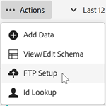

# Datendatei via FTP hochladen (optional)

Wenn Sie die Kundenattributdaten nicht per Drag-and-Drop in Experience Cloud hochladen, können Sie sie auch via FTP hochladen.

Sie können die Daten hochladen, nachdem Sie eine Kundenattributquelle und ein FTP-Konto in Experience Cloud erstellt haben. Pro Attributquelle erstellen Sie ein FTP-Konto. Die hochgeladenen Dateien werden im Stammordner dieses Kontos gespeichert. Die Daten müssen im `.csv`-Format übertragen werden, wobei eine zweite `.fin`-Datei am Ende angibt, dass das Hochladen abgeschlossen ist.

>[!IMPORTANT]
>
>Überprüfen Sie [Kundenattributdatendateien und -quellen](crs-data-file.md) bevor Sie die Datei hochladen.

Datei-Uploads auf die FTP-Site der Kundenattribute können über FTP oder SFTP durchgeführt werden:

* Sie benötigen einen Client, der SFTP-Verbindungen unterstützt.
* Sie können eine Verbindung mit SFTP entweder mit dem Benutzernamen/Kennwort oder ohne Kennwort herstellen, wie [hier](https://experienceleague.adobe.com/docs/analytics/export/ftp-and-sftp/secure-file-transfer-protocol/ftp-sftp-cert-auth.html?lang=de) beschrieben.

**So laden Sie die Datendatei via FTP hoch**

1. [Erstellen einer Kundenattributquelle und Hochladen der Datendatei...](t-crs-usecase.md).

   Vergewissern Sie sich, dass Sie unter `ftp.adobe.com/<sftpname>` bei Ihrer FTP-Site angemeldet sind.

1. Klicken Sie auf **[!UICONTROL Actions]** > **[!UICONTROL File Upload]**.

1. Laden Sie eine `.fin`-Datei hoch, damit Ihre Datei abgerufen werden kann.

   Der Dateityp `.fin` wird vom Benutzer erstellt und signalisiert, dass das Hochladen abgeschlossen ist. Sie kann eine leere Editor-Datei sein. Wenn Sie beispielsweise `crs123.csv` hochladen, wird auch `crs123.fin` hochgeladen.

   Wenn der Upload erfolgreich war, werden beide Dateien in einen Ordner mit dem Namen **verarbeitet** verschoben.

   Siehe [Kundenattributdatendateien und -quellen](crs-data-file.md) für wichtige Informationen zu Dateinamen und -struktur.

## FTP-Konto einrichten

Richten Sie pro Attributquelle ein FTP-Konto ein.

Klicken Sie auf der [!UICONTROL File Upload and Schema Validation] Seite auf **[!UICONTROL FTP Setup]**.

Die hochgeladenen Dateien werden im Stammordner dieses Kontos gespeichert. Die Daten müssen im `.csv`-Format übertragen werden, wobei eine zweite `.fin`-Datei am Ende angibt, dass das Hochladen abgeschlossen ist.

Die Namen, die Sie den Zeichenfolgen, Ganzzahlen und Nummern geben, werden zur Erstellung der [!DNL Analytics]-Metriken verwendet.

* **[!UICONTROL attribute:]** Attributdaten werden aus der hochgeladenen `.csv` gelesen.

* **[!UICONTROL Type:]** Der Datentyp, z. B.:

   * **Zeichenfolge:** Eine Folge von Zeichen.

   * **Ganzzahlen:** Ganze Zahlen.

   * **Zahlen:** Kann bis zu zwei Dezimalstellen haben.

* **[!UICONTROL Display Name:]** Ein benutzerfreundlicher Name für das Attribut. Sie können beispielsweise das Attribut *Kundenalter) in* Kunde seit *ändern*.

* **[!UICONTROL Description:]** Eine benutzerfreundliche Beschreibung des Attributs.

