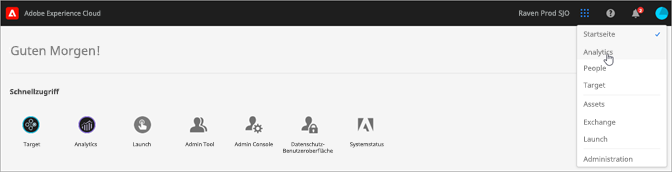

# Über die neuen Cloud-Namen der Experience Cloud {#topic_BD726D3A649E4FC49063029E86B70C62}

Hier erfahren Sie mehr über die neuesten Branding-Änderungen der Clouds, über die Navigation mithilfe der Benutzeroberfläche sowie dazu, wo Sie Hilfestellung zu Lösungen und Hauptdiensten erhalten.

## Neue Cloud-Namen {#concept_3D567681C3C94989AD1A30A1C5C41609}

Die aktuellsten Cloud-Namen und die Lösungen der jeweiligen Cloud:

 [Experience Cloud](https://www.adobe.com/experience-cloud.html?promoid=FZPQZ2HS&mv=other)

Ersetzt *Experience Cloud* als übergreifenden Cloud-Namen für alle digitalen Erlebnislösungen und -dienste von Adobe.

>[!NOTE]
>
>Sie können weiterhin Verweise auf *Experience Cloud* im vorherigen und umfassenderen Kontext anzeigen, bis alle Lösungsschnittstellen in *Enterprise Cloud* umbenannt werden.

 [Experience Cloud](https://www.adobe.com/marketing-cloud.html)

Umfasst folgende Lösungen:

* Adobe Experience Manager
* Adobe Campaign
* Adobe Target
* Adobe Primetime
* Adobe Social

 [Analytics Cloud](https://www.adobe.com/data-analytics-cloud.html)

Umfasst folgende Lösungen:

* Adobe Analytics
* Adobe Audience Manager

 [Advertising Cloud](https://www.adobe.com/advertising-cloud.html)

Umfasst Media Optimizer und TubeMogul

## Welche Lösungen gibt es?  {#concept_4F52341A45DC49B2B216824B14D54FDA}

In der folgenden Tabelle werden die Lösungen kurz beschrieben und Links zur jeweiligen Hilfe bereitgestellt. [Anwendungsfallbeispiele](https://helpx.adobe.com/marketing-cloud/how-to/use-cases.html) werden ebenfalls bereitgestellt und sollen Sie bei digitalen Marketing-Arbeitsabläufen unterstützen.

 [Adobe Analytics](https://docs.adobe.com/content/help/en/analytics/landing/home.html)

Erste Schritte mit Analytics:

1. Erstellen Sie mithilfe der im Abschnitt über [erste Schritte mit Adobe Analytics](https://docs.adobe.com/content/help/en/analytics/analyze/analysis-workspace/home.html) genannten Anweisungen Ihre erste Analytics-Report Suite (Datenverzeichnis).
1. Stellen Sie dann Analytics-Code mit [Experience Platform Launch](https://docs.adobe.com/content/help/en/launch/using/intro/get-started/quick-start.html)bereit.

Experience Platform Launch ist die nächste Generation des Tag-Managements und bietet Ihnen eine einfache Möglichkeit, alle Analyse-, Marketing- und Anzeigen-Tags bereitzustellen und zu verwalten.

Siehe auch:

* [Welche Analytics-Produkte sollte ich verwenden?](https://docs.adobe.com/content/help/en/analytics/admin/admin-overview/which-analytics-tool.html)
* [Analytics – Produktvergleich und Voraussetzungen](https://docs.adobe.com/content/help/en/analytics/admin/admin-overview/analytics-product-comparison.html)

 [Adobe Target](https://docs.adobe.com/content/help/en/target/using/target-home.html)

Adobe Target lässt sich mit Analytics und anderen Haupdiensten der Experience Cloud integrieren. Nützliche Themen für Einsteiger:

* [Einrichten von Target](https://docs.adobe.com/content/help/en/target/using/administer/administrating-target.html)
* [Funktionsweise von Target](https://docs.adobe.com/content/help/en/target/using/introduction/how-target-works.html)
* [Erste Schritte für Administratoren](https://docs.adobe.com/content/help/en/target/using/administer/start-target.html)
* [Verwendung von Analytics als Berichterstellungsquelle für Target](https://docs.adobe.com/content/help/en/target/using/integrate/a4t/a4t.html)

 [Adobe Social](https://docs.adobe.com/content/help/en/social/using/home.html)

Social bietet eine gehostete, Abonnement-basierte Lösung, mit der Sie Ihre Social-Media-Ziele erreichen und Ihre Strategie und Performance verbessern können. Sie können Ihr Social Marketing mit einer umfangreichen Plattform verwalten, die soziales Listening, Publishing und Analysen ermöglicht.

 [Adobe Experience Manager](https://helpx.adobe.com/support/experience-manager/6-5.html)

Als Content Management-Lösung erleichtert Adobe Experience Manager die Verwaltung Ihrer Assets und Inhalte für Ihre Websites, mobilen Apps, Communities und Formulare.

Weitere Angaben finden Sie unter [Adobe Experience Manager 6.5](https://helpx.adobe.com/support/experience-manager/6-5.html).

 [Adobe Audience Manager](https://docs.adobe.com/content/help/en/audience-manager/user-guide/aam-home.html)

Als Datenverwaltungsplattform erleichtert Adobe Audience Manager den Aufbau von eindeutigen Zielgruppenprofilen. Damit können Sie auf jedem Kanal Ihre wertvollsten Kundensegmente erkennen und ansprechen.

 [Adobe Advertising Cloud](https://docs.adobe.com/content/help/en/release-notes/experience-cloud/current.html#adcloud)

Adobe Advertising Cloud ist eine Programmlösung zum Einkauf von Werbung. Sie hilft beim Finden und Vorhersagen der besten Mischung von Werbekanälen auf der Grundlage Ihres Budgets und automatisiert dann die Bereitstellungen von Inhalten direkt für Ihre Zielgruppe.

 [Adobe Campaign](https://docs.adobe.com/content/help/en/campaign-standard/using/getting-started/about-adobe-campaign/campaign-orchestration.html)

Mit Adobe Campaign können Sie über sämtliche Online- und Offline-Kanäle Kampagnen planen, durchführen und messen. Dies unterstützt Sie bei der Steigerung Ihrer Produktivität und der Bereitstellung von relevanten Inhalten für Ihre Kunden.

 [Adobe Primetime](https://help.adobe.com/en_US/primetime/)

Adobe Primetime ist eine TV-Plattform für mehrere Bildschirme, mit der Anbieter beeindruckende und für beliebige Zielgruppen personalisierte TV-Sendungen und Filme erstellen können.

## Was sind Hauptdienste?  {#concept_38AC4888C3F84694AE4F60311C21B9C2}

[Hauptdienste](core-services/core-services.md#concept_07ED1D5C64234E77976E6D572E78FB9C) enthalten Funktionen, die die Produktimplementierung vereinfachen und lösungsübergreifende Arbeitsabläufe – wie Zielgruppensegmentierung, Hochladen von Kundenattributen und Tools für die Zusammenarbeit – bieten.

| Hauptdienst | Beschreibung |
|--- |--- |
| [Activation](activation/activation.md) | Tag-Management-Systeme (Experience Platform Launch und Dynamisches Tag-Management). Mit Triggers können Sie auf Basis von Adobe Analytics-Einblicken in Adobe Campaign Aktionen in Echtzeit durchführen. |
| [Administration](admin-getting-started/admin-getting-started.md) | Verwalten Sie Benutzer- und Produktrechte für alle Adobe-Clouds und -Lösungen. |
| [Assets](experience-cloud-assets/experience-cloud-assets.md) | Alle digitalen Assets können einfach gespeichert, synchronisiert und freigegeben werden. Dies spart Zeit und trägt zu einem konsistenten Kundenerlebnis bei. |
| [Launch](https://docs.adobe.com/content/help/en/launch/using/overview.html) | Launch ist mit Adobe-Tag-Management-Funktionen der nächsten Generation ausgestattet.  Launch bietet Kunden eine einfache Möglichkeit zum Bereitstellen und Verwalten aller Analyse-, Marketing- und Werbe-Tags, die für relevante Kundenerlebnisse benötigt werden. |
| [Reisebegleitung](https://docs.adobe.com/content/help/en/journeys/using/journey-orchestration-home.html) | Erstellen Sie in Echtzeit-Orchesteringanwendungsfällen mithilfe von Kontextdaten, die in Ereignissen oder Datenquellen gespeichert werden. [!UICONTROL Journey Orchestration] ist ein in die Experience Platform integrierter Applikationsdienst. |
| [Standortdienst](https://docs.adobe.com/content/help/en/places/using/home.html) | Adobe Experience Platform Location Service (Location Service) ist ein Geo-Location-Service, mit dem mobile Apps mit Standortbewusstsein den Standortkontext verstehen können. Dazu werden umfangreiche und benutzerfreundliche SDK-Schnittstellen sowie eine flexible Datenbank mit POIs (Points of Interest) verwendet. |
| Angebote | Mithilfe der Angebotsverwaltung können Sie in Experience Cloud Angebote für alle Kanäle erstellen, verwalten und planen. |
| [Exchange](exchange.md) | Suchen, Durchsuchen, Auswählen, Bezahlen und Herunterladen von Digital Marketing-Erweiterungen über Apps. |
| [Mobile Services](https://docs.adobe.com/content/help/en/mobile-services/using/home.html) | Adobe Mobile Services führen mobile Marketingfunktionen für mobile Anwendungen aus der ganzen Adobe Experience Cloud zusammen, sodass Sie Einblicke in die Benutzerinteraktionen Ihrer mobilen Anwendungen erhalten und gegebenenfalls Verbesserungen vornehmen können. |
| „Personen“ | Erstellen Sie eine umfassende Ansicht einzelner Kunden, indem Sie Daten aus Adobe-Produkten und den Produkten anderer Anbieter in Ihre Experience Cloud-Lösungen aufnehmen. Finden Sie heraus, was für Ihre Kunden am meisten von Interesse ist, wenn sie über Touchpoints interagieren. Erkennen Sie bekannte Kunden, die Ihre Site über unbekannte Geräte besuchen. Sie können sogar Benutzer in Zielgruppen zusammenfassen, um gezielte Marketing-Maßnahmen zu starten. [Zielgruppen](audience-library/audience-library.md) – Kategorisieren verschiedener Kundentypen in Zielgruppen und diese Zielgruppen über Experience Cloud-Lösungen freigeben [Kundenattribute](attributes/attributes.md) – Eine Erweiterung der Zielgruppe, mit der Sie eine Verbindung mit Kundeninformationen herstellen können, die außerhalb von Experience Cloud erfasst wurden [Gerätediagramm](https://landing.adobe.com/en/na/events/summit/275658-summit-co-op.html) – Zusammenarbeit mit den weltweit bekanntesten Marken zur Erkennung eines bekannten Kunden hinter einem unbekannten Gerät (in der Beta-Version, nur für Experience Cloud Device Co-op-Mitglieder) |
