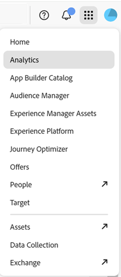
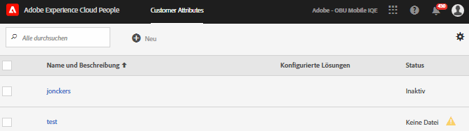
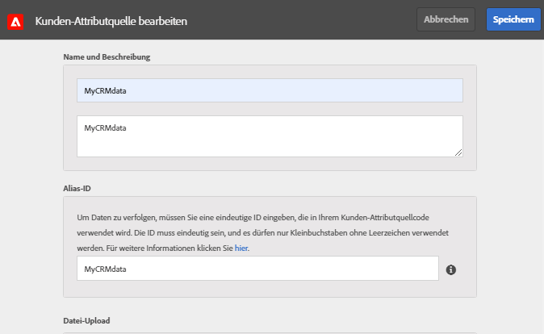
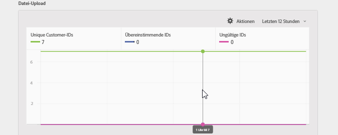
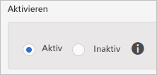
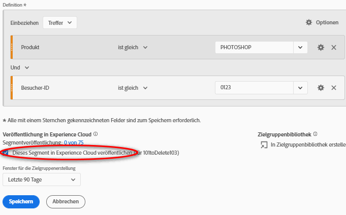
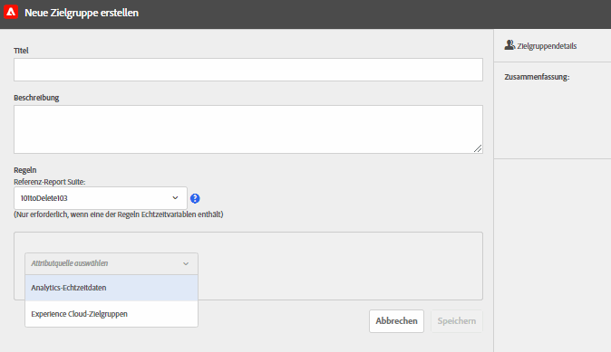

# Erstellen einer Kundenattributquelle und Hochladen der Datendatei

Erstellen Sie die Kundenattributquelle (CSV- und FIN-Dateien) und laden Sie die Daten hoch. Sobald Sie dazu bereit sind, aktivieren Sie die Datenquelle. Geben Sie die Attributdaten nach Aktivierung der Datenquelle an Analytics und Target weiter.

## Arbeitsablauf für Kundenattribute {#concept_BF0AF88E9EF841219ED4D10754CD7154}


1. [Erstellen Sie eine Datendatei](t-crs-usecase.md#task_B5FB8C0649374C7A94C45DCF2878EA1A)
1. [Erstellen Sie die Attributquelle und laden Sie die Datendatei hoch](t-crs-usecase.md#task_09DAC0F2B76141E491721C1E679AABC8)
1. [Prüfen Sie das Schema](t-crs-usecase.md#task_09DAC0F2B76141E491721C1E679AABC8)
1. [Konfigurieren Sie Abonnements und aktivieren Sie die Attributquelle](t-crs-usecase.md#task_1ACA21198F0E46A897A320C244DFF6EA)

Sobald die Datenquelle aktiv ist, können Sie folgende Aufgaben ausführen:

* [Kundenattribute in Adobe Analytics verwenden](t-crs-usecase.md#task_7EB0680540CE4B65911B2C779210915D)
* [Kundenattribute in Adobe Target verwenden](t-crs-usecase.md#task_FC5F9D9059114027B62DB9B1C7D9E257)

>[!IMPORTANT]
>
>Um auf diese Funktion zugreifen zu können, müssen Benutzer dem Produktprofil „Kundenattribute“ zugewiesen sein (Kundenattribute – Standardzugriff). Navigieren Sie zu **[!UICONTROL Administration]** > **[!UICONTROL Admin Console]** > **[!UICONTROL Produkte]**. Falls *Kundenattribute* als eines der [!UICONTROL Produktprofile] angezeigt wird, können Sie beginnen. Benutzer, die der Gruppe der Kundenattribute hinzugefügt wurden, sehen auf der linken Seite der linken Seite der Experience Cloud-Benutzeroberfläche das Menü [!UICONTROL Kundenattribute].
>
>Um die Kundenattribut-Funktion verwenden zu können, müssen Benutzer auch zu Gruppen auf Lösungsebene (Analytics oder [!DNL Target]) gehören.

Siehe [Verwalten von Experience Cloud-Benutzern und -produkten](admin-getting-started.md#task_3295A85536BF48899A1AB40D207E77E9).

## Erstellen Sie eine Datendatei {#task_B5FB8C0649374C7A94C45DCF2878EA1A}

Diese Daten sind Unternehmenskundendaten aus Ihrem CRM-System. Die Daten können Abonnentendaten für Produkte wie Mitglieds-IDs, berechtigte Produkte, am häufigsten gestartete Produkte usw. enthalten.

1. Erstellen Sie eine `.csv`.

   >[!NOTE]
   >
   >Später werden Sie diese `.csv`-Datei per Drag-and-Drop hochladen. Wenn Sie jedoch [per FTP hochladen](t-upload-attributes-ftp.md#task_591C3B6733424718A62453D2F8ADF73B), benötigen Sie auch eine `.fin`-Datei mit dem gleichen Namen wie die `.csv`.

   Beispiel für die Kundendatendatei eines Unternehmens:

   

1. Überprüfen Sie vor dem Hochladen der Datei die wichtigen Informationen in den [Datendateivoraussetzungen](crs-data-file.md#concept_DE908F362DF24172BFEF48E1797DAF19).
1. [rstellen Sie eine Kundenattributquelle und laden Sie wie nachfolgend beschrieben die Daten](t-crs-usecase.md#task_BCC327B2A0EF4A1BBB2934013AB92B78) hoch.

## Erstellen Sie die Attributquelle und laden Sie die Datendatei hoch {#task_09DAC0F2B76141E491721C1E679AABC8}

Führen Sie diese Schritte auf der Seite „Neue Kunden-Attributquelle erstellen“ der Experience Cloud aus.

>[!IMPORTANT]
>
>Beim Erstellen, Ändern oder Löschen von Kundenattributquellen dauert es bis zu einer Stunde, bis die IDs mit der neuen Datenquelle synchronisiert werden. Sie müssen über Administratorrechte in Audience Manager verfügen, um Kundenattributquellen zu erstellen oder zu ändern. Wenden Sie sich an die Audience Manager-Kundenunterstützung oder -Beratung, um Administratorrechte zu erhalten.

1. Klicken Sie in [!DNL Experience Cloud] im Menü auf das -Symbol.
1. Klicken Sie unter **[!DNL Experience Platform]** auf **[!UICONTROL Personen]** > **[!UICONTROL Kundenattribute]**.

   Auf der Seite [!UICONTROL „Kundenattribute“] können Sie vorhandene Datenattributquellen verwalten und bearbeiten.

   
1. Wählen Sie **[!UICONTROL Neu]** aus.

   
1. Konfigurieren Sie auf der Seite [!UICONTROL „Kunden-Attributquelle bearbeiten“] die folgenden Felder:

   * **[!UICONTROL Name:]** Ein Anzeigename für die Datenattributquelle. Bei [!DNL Adobe Target] dürfen Attributnamen keine Leerzeichen enthalten. Wenn ein Attribut mit Leerzeichen übergeben wird, wird es von [!DNL Target] ignoriert. Weitere nicht unterstützte Zeichen: `< , >, ', "`.

   * **[!UICONTROL Beschreibung:]** (Optional) Eine Beschreibung der Quelle des Datenattributs.

   * **[!UICONTROL Alias-ID:]** Gibt die Quelle der Kundenattributdaten an, beispielsweise ein CRM-System. Die [!UICONTROL Alias-ID] ist eine eindeutige ID, die im Code Ihrer Kundenattributquelle verwendet wird. Die ID muss eindeutig sein und darf nur Kleinbuchstaben, aber keine Leerzeichen enthalten. Der Wert, der auf der Experience Cloud-Benutzeroberfläche für eine Kundenattributquelle im Feld „[!UICONTROL Alias-ID]“ eingegeben wird, sollte mit den Werten übereinstimmen, die von der Implementierung übergeben werden (über die Daten-Erfassung (Launch), Dynamic Tag Management oder JavaScript des Mobile SDK).

      Die Alias-ID entspricht bestimmten Bereichen, in denen Sie zusätzliche Kunden-ID-Werte festlegen. Beispiel:

      * **Dynamic Tag Management:** Die Alias-ID entspricht dem *Integrationscode*-Wert unter [!UICONTROL Kundeneinstellungen] im Tool [Experience Cloud ID-Dienst](https://experienceleague.adobe.com/docs/experience-platform/tags/home.html?lang=en).

      * **Besucher-API:** Die Alias-ID entspricht den zusätzlichen [Kunden-IDs](https://experienceleague.adobe.com/docs/id-service/using/reference/authenticated-state.html?lang=de), die Sie den einzelnen Besuchern zuordnen können.

         Beispiel: *„crm_ id“* in:

         ```
         "crm_id":"67312378756723456"
         ```

      * **iOS:** Die Alias-ID entspricht *„idType“* in [visitorSyncIdentifiers:identifiers](https://experienceleague.adobe.com/docs/mobile-services/ios/overview.html?lang=de).

         Beispiel:

         `[ADBMobile visitorSyncIdentifiers:@{@<`**`"idType"`**`:@"idValue"}];`

      * **Android:** Die Alias-ID entspricht *„idType“* in [syncIdentifiers](https://experienceleague.adobe.com/docs/mobile-services/android/overview.html?lang=de).

         Beispiel:

         `identifiers.put(`**`"idType"`**`, "idValue");`

         Zusätzliche Informationen zur Datenverarbeitung des Alias-ID-Feldes und von Kunden-IDs finden Sie unter [Nutzen mehrerer Data Sources](crs-data-file.md#section_76DEB6001C614F4DB8BCC3E5D05088CB).
   * **[!UICONTROL Hochladen einer Datei:]** Die `.csv`-Datendatei kann per Drag &amp; Drop oder per FTP hochgeladen werden. (Beim Upload via FTP ist zusätzlich eine `.fin`-Datei erforderlich.) Siehe [Hochladen der Daten via FTP](t-upload-attributes-ftp.md#task_591C3B6733424718A62453D2F8ADF73B).

      >[!IMPORTANT]
      >
      >Für die Datendatei bestehen bestimmte Voraussetzungen. Weitere Informationen finden Sie unter [Datendateivoraussetzungen](crs-data-file.md#concept_DE908F362DF24172BFEF48E1797DAF19).


      Nach dem Hochladen der Datei werden die Tabellendaten unter der Überschrift [!UICONTROL Datei-Upload] auf dieser Seite angezeigt. Sie können das Schema validieren, Abonnements konfigurieren oder den FTP einrichten.

      **Grafik zum Datei-Upload**

      

   * **[!UICONTROL Unique-Customer-ID:]** Zeigt an, wie viele eindeutige IDs Sie in diese Attributquelle hochgeladen haben.

   * **[!UICONTROL Vom Kunden bereitgestellte IDs für Experience Cloud Besucher-IDs:]** Zeigt an, wie viele IDs für Experience Cloud Besucher-IDs bereitgestellt wurden.

   * **[!UICONTROL Vom Kunden bereitgestellte IDs mit hoher Alias-Anzahl:]** Zeigt die Anzahl der vom Kunden bereitgestellten IDs mit 500 oder mehr bereitgestellten Experience Cloud Besucher-IDs an. Diese vom Kunden bereitgestellten IDs stellen höchstwahrscheinlich keine Einzelpersonen dar, sondern eine Art freigegebene Anmeldung. Das System verteilt die mit diesen IDs verknüpften Attribute auf die 500 zuletzt als Alias gespeicherten Experience Cloud-Besucher-IDs, bis die Aliasanzahl 10.000 erreicht hat. Dann erklärt das System die vom Kunden bereitgestellte ID als ungültig und verteilt nicht länger zugewiesene Attribute.


## Prüfen Sie das Schema {#task_404AAC411B0D4E129AB3AC8B7BE85859}

Der Prüfungsprozess ermöglicht die Zuordnung von Anzeigenamen und Beschreibungen zu den hochgeladenen Attributen (Zeichenfolgen, Ganzzahlen, Zahlen usw.). Sie können Attribute auch löschen, indem Sie das Schema aktualisieren.

Siehe [Prüfen des Schemas](validate-schema.md#concept_B3A01A15D04E4F998118E09B3A9B5043).

Informationen zum Löschen von Attributen finden Sie unter [Schema aktualisieren (Attribute löschen)](t-crs-usecase.md#task_6568898BB7C44A42ABFB86532B89063C).

## (Optional) Schema aktualisieren (Attribute löschen) {#task_6568898BB7C44A42ABFB86532B89063C}

So löschen Sie Attribute und ersetzen Attribute im Schema.

1. Entfernen Sie auf der Seite [!UICONTROL „Kunden-Attributquelle bearbeiten“] das **[!UICONTROL Target]**- oder **[!UICONTROL Analytics]**-Abonnement (unter [!UICONTROL Abonnements konfigurieren]).
1. [Laden Sie eine neue Datendatei mit aktualisierten Feldern hoch](t-crs-usecase.md#task_09DAC0F2B76141E491721C1E679AABC8).

## Konfigurieren Sie Abonnements und aktivieren Sie die Attributquelle {#task_1ACA21198F0E46A897A320C244DFF6EA}

Beim Konfigurieren eines Abonnements wird der Datenfluss zwischen Experience Cloud und Lösungen eingerichtet. Durch die Aktivierung der Attributquelle können die Daten an die abonnierten Lösungen übertragen werden. Die von Ihnen hochgeladenen Kundendatensätze werden mit den von Ihrer Website oder Anwendung eingehenden ID-Signalen abgeglichen.

Siehe [Konfigurieren von Abonnements](subscription.md#concept_ECA3C44FA6D540C89CC04BA3C49E63BF).

**So aktivieren Sie eine Attributquelle**

Suchen Sie auf der Seite [!UICONTROL „Neue Kunden-Attributquelle erstellen“[ oder ]„Kunden-Attributquelle bearbeiten“] die Überschrift [!UICONTROL „Aktivieren“] und klicken Sie dann auf **[!UICONTROL „Aktiv“]**.



## Kundenattribute in Adobe Analytics verwenden {#task_7EB0680540CE4B65911B2C779210915D}

Jetzt, wo die Daten in Lösungen wie Adobe Analytics verfügbar sind, können Sie Berichte zu den Daten erstellen, sie analysieren und die entsprechenden Maßnahmen in Ihren Marketing-Kampagnen ergreifen.

Folgendes Beispiel zeigt ein [!DNL Analytics]-Segment, das auf den hochgeladenen Attributen basiert. Dieses Segment zeigt [!DNL Photoshop Lightroom]-Abonnenten, deren am häufigsten geladenes Produkt Photoshop ist.



Wenn Sie ein Segment in der Experience Cloud veröffentlichen, wird es in den Experience Cloud-Audiences und in Audience Manager verfügbar.

## Kundenattribute in Adobe Target verwenden {#task_FC5F9D9059114027B62DB9B1C7D9E257}

In [!DNL Target], können Sie beim Erstellen einer Zielgruppe im Bereich [!UICONTROL Besucherprofil] ein Kundenattribut auswählen. Alle Kundenattribute haben das Präfix `crs.` in der Liste. Sie können die Attribute beim Aufbau von Zielgruppen beliebig mit anderen Datenattributen kombinieren.



Siehe [Erstellen einer neuen Zielgruppe](https://experienceleague.adobe.com/docs/target/using/audiences/create-audiences/audiences.html?lang=de) in der [!DNL Target]-Hilfe.
