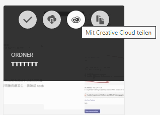
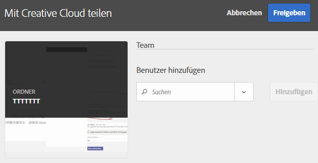
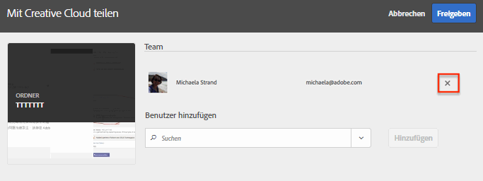
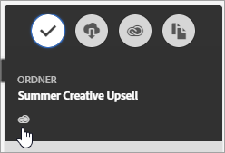

# Experience Cloud-Asset-Ordner freigeben

Geben Sie einen Experience Cloud-Asset-Ordner für Benutzer der Creative Cloud frei.

1. Wählen Sie in einem Asset-Ordner **[!UICONTROL Mit Creative Cloud teilen]** aus.

   
1. Suchen Sie auf der Seite Mit Creative Cloud teilen nach dem Benutzer und wählen Sie **[!UICONTROL Hinzufügen]** aus.

   

1. Wählen Sie **[!UICONTROL Share]** aus.
1. Starten Sie den [!DNL Creative Cloud]-Desktop (oder navigieren Sie in einem Browser zur Seite [!UICONTROL Creative Cloud-Dateien]) und suchen Sie nach der Benachrichtigung zur Anforderung.

   
1. Öffnen Sie die Anforderung und wählen Sie **[!UICONTROL Accept]** aus.

   
1. Um auf den Ordnerinhalt zuzugreifen, wählen Sie **[!UICONTROL Ordner öffnen]** (oder **[!UICONTROL Auf Web anzeigen]**).

   
1. Sie können dem freigegebenen Asset nun Kommentare hinzufügen:

   Im Creative Cloud können Sie in einem Bild auswählen und dann **[!UICONTROL Aktivität]** auswählen, um dem Bild einen Kommentar hinzuzufügen. Kommentare zu Assets werden in der [!DNL Creative Cloud] und in der [!DNL Experience Cloud] synchronisiert.

   

   Wählen Sie im Experience Cloud ein Bild aus und wählen Sie dann das Zeitleistensymbol aus, um dem Bild einen Kommentar hinzuzufügen. Kommentare werden mit den Assets in der Creative Cloud und Experience Cloud synchronisiert.

   

1. Um die Freigabe eines Ordners aufzuheben, wählen Sie **[!UICONTROL Mit Creative Cloud teilen]** (ähnlich wie [Schritt 3](t-share-creative-cloud.md#step_BA17CFA185284641A9B878BA29551996)) und entfernen Sie dann Benutzer, indem Sie X auswählen. Wählen Sie dann **[!UICONTROL Freigeben]** aus.

Wenn Sie alle Creative Cloud-Benutzer entfernt haben, wird die Freigabe des Ordners aufgehoben. Die Creative Cloud-Benutzer haben dann keinen Zugriff mehr auf diesen Ordner.

Ein freigegebenes Asset können Sie auch wie folgt verwenden:

* Verwenden Sie Assets in der [!UICONTROL Asset-Auswahl] in [!DNL Adobe Social] für Social-Beiträge.
* Laden oder tauschen Sie Assets in der [Angebotsbibliothek](https://experienceleague.adobe.com/docs/target/using/experiences/offers/manage-content.html?lang=de) in [!DNL Adobe Target] für Bilder in Aktivitäten.

Wenn Sie einen Ordner in der Creative Cloud freigegeben haben, erscheint auf dem Ordner das Creative Cloud-Logo.

Verwandte Hilfe:

* [Creative Cloud-Hilfe – Verwalten und Synchronisieren von Dateien](https://helpx.adobe.com/de/creative-cloud/help/sync-creative-cloud-files.html)
* [Creative Cloud-Hilfe – Zusammenarbeiten mit anderen](https://helpx.adobe.com/de/creative-cloud/help/collaboration.html)
* [Creative Cloud-Hilfe – Häufig gestellte Fragen zur Zusammenarbeit](https://helpx.adobe.com/de/creative-cloud/help/collaboration-faq.html)
