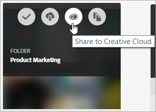

# Experience Cloud-Asset-Ordner freigeben

Geben Sie einen Experience Cloud-Asset-Ordner für Benutzer der Creative Cloud frei.

1. Klicken Sie in einem Asset-Ordner auf **[!UICONTROL Für Creative Cloud freigeben]**.

   
1. Suchen Sie auf der Seite „Für Creative Cloud freigeben“ den entsprechenden Benutzer und klicken Sie auf **[!UICONTROL Hinzufügen]**.

   

1. Wählen Sie **[!UICONTROL Freigeben]** aus.
1. Starten Sie den [!DNL Creative Cloud]-Desktop (oder navigieren Sie in einem Browser zur Seite [!UICONTROL Creative Cloud-Dateien]) und suchen Sie nach der Anfragebenachrichtigung.

   
1. Öffnen Sie die Anfrage und klicken Sie auf **[!UICONTROL Annehmen]**.

   
1. Klicken Sie zum Zugriff auf den Inhalt des Ordners auf **[!UICONTROL Ordner öffnen]** (oder **[!UICONTROL Im Web anzeigen]**).

   
1. Sie können dem freigegebenen Asset nun Kommentare hinzufügen:

   Klicken Sie in Creative Cloud auf ein Bild und dann auf **[!UICONTROL Aktivität]**, um dem Bild einen Kommentar hinzuzufügen. Kommentare zu Assets werden in [!DNL Creative Cloud] und in [!DNL Experience Cloud] synchronisiert.

   

   Klicken Sie in Experience Cloud auf ein Bild und dann auf das Zeitleistensymbol, um dem Bild einen Kommentar hinzuzufügen. Kommentare werden mit den Assets in Creative Cloud und Experience Cloud synchronisiert.

   

1. Zur Aufhebung der Freigabe eines Ordners klicken Sie auf **[!UICONTROL Mit Creative Cloud freigeben]** (wie in [Schritt 3](t-share-creative-cloud.md#step_BA17CFA185284641A9B878BA29551996)) und entfernen Sie dann Benutzer, indem Sie auf das X klicken. Klicken Sie dann auf **[!UICONTROL Freigeben]**.

Wenn Sie alle Creative Cloud-Benutzer entfernt haben, wird die Freigabe des Ordners aufgehoben. Die Creative Cloud-Benutzer haben dann keinen Zugriff mehr auf diesen Ordner.

Ein freigegebenes Asset können Sie auch wie folgt verwenden:

* Verwenden Sie Assets in der [!UICONTROL Asset-Auswahl] in [!DNL Adobe Social] für Social-Beiträge.
* Laden oder tauschen Sie Assets in der [Angebotsbibliothek](https://experienceleague.adobe.com/docs/target/using/experiences/offers/manage-content.html?lang=de) in [!DNL Adobe Target] für Bilder in Aktivitäten.

Wenn Sie einen Ordner in der Creative Cloud freigegeben haben, erscheint auf dem Ordner das Creative Cloud-Logo.

Verwandte Hilfe:

* [Creative Cloud-Hilfe – Verwalten und Synchronisieren von Dateien](https://helpx.adobe.com/de/creative-cloud/help/sync-creative-cloud-files.html)
* [Creative Cloud-Hilfe – Zusammenarbeiten mit anderen](https://helpx.adobe.com/de/creative-cloud/help/collaboration.html)
* [Creative Cloud-Hilfe – Häufig gestellte Fragen zur Zusammenarbeit](https://helpx.adobe.com/de/creative-cloud/help/collaboration-faq.html)
