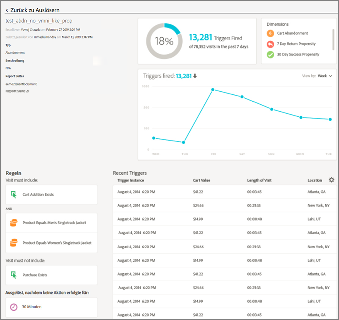
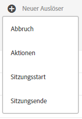
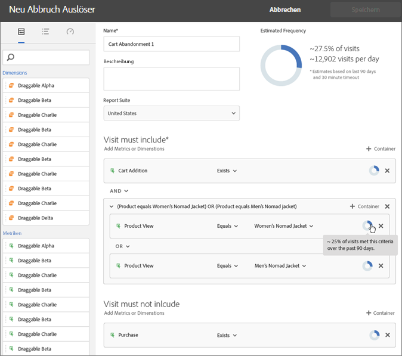
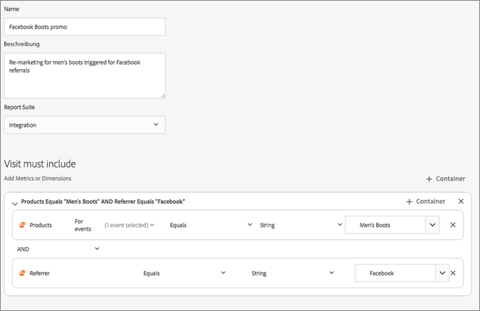

# Experience Cloud Triggers

[!UICONTROL Trigger] In Experience Cloud können Sie wichtige Verbraucherverhaltensweisen identifizieren, definieren und überwachen und dann eine anwendungsübergreifende Kommunikation generieren, um erneut mit Besuchern zu interagieren.

## Übersicht über Triggers {#topic_4F21FCE9A64E46E8B6D51F494FA652A7}

Sie können Trigger bei Echtzeit-Entscheidungen und Personalisierungen verwenden. Beispiel:

* Konfigurieren des schnellen Remarketing für Warenkorbabbrüche oder Warenkorbabbrüche mit entfernten Produkten
* Unvollständige Formulare und Anwendungen
* Aktionen oder Abfolgen von Aktionen auf der Site

>[!NOTE]
>
>Weitere Informationen zur Verwendung von [!UICONTROL Triggers] finden Sie unter [Campaign Standard](https://experienceleague.adobe.com/docs/campaign-standard/using/integrating-with-adobe-cloud/working-with-campaign-and-triggers/using-triggers-in-campaign.html?lang=de).

### Triggers-Typen

Im Allgemeinen kann ein Auslöser 15 bis 90 Minuten benötigen, um eine Marketing-Kampagne zu starten. Diese Verzögerung hängt von der Implementierung der Datenerfassung, der Auslastung der Pipeline, der benutzerdefinierten Konfiguration des definierten Triggers und dem Arbeitsablauf in Adobe Campaign ab.

* **Abbruch:** Sie können einen Auslöser für den Fall erstellen, dass ein Besucher ein Produkt anzeigt, es jedoch nicht zum Warenkorb hinzufügt.
* **Aktion:** Sie können Sie Trigger erstellen, die beispielsweise nach der Newsletter-Anmeldung, E-Mail-Abonnements oder Kreditkartenanträgen (Bestätigungen) ausgelöst werden. Wenn Sie ein Händler sind, können Sie einen Trigger für einen Besucher erstellen, der sich für ein Treueprogramm anmeldet. Erstellen Sie in Medien und Unterhaltung Trigger für Besucher, die eine bestimmte Sendung ansehen. Sie können auch mit einer Umfrage reagieren.
* **Sitzungsbeginn und Sitzungsende:** Erstellen Sie einen Trigger für die Sitzungsbeginn- und Sitzungsende-Ereignisse.

## Experience Cloud Trigger erstellen {#task_821F37183AC045E5AC8EED20317598FE}

Erstellen Sie einen Trigger und konfigurieren Sie die Bedingungen für den Trigger. Sie können beispielsweise die Kriterien für die Regeln eines Triggers während eines Besuchs angeben, z. B. Metriken wie Warenkorbabbruch oder Dimensionen wie den Produktnamen. Wenn die Regeln erfüllt sind, wird der Trigger ausgeführt.

>[!NOTE]
>
>Derzeit existiert eine technische Begrenzung von 100 Triggern.

1. Wählen Sie in Experience Cloud  und dann **[!UICONTROL Datenerfassung/Launch]** aus.
2. Wählen Sie in der Karte [!UICONTROL Triggers] die Option **[!UICONTROL Triggers verwalten]** aus.
3. Wählen Sie **[!UICONTROL Neuer Trigger]** aus und geben Sie dann den Trigger-Typ an:

   

4. Konfigurieren Sie den Auslöser, indem Sie die folgenden Felder vervollständigen und Metrik- und Dimensionselemente in die Regelbehälter ziehen:

   | Element | Beschreibung |
   |--- |--- |
   | [!UICONTROL Name] | Der Anzeigename für diesen Trigger. |
   | [!UICONTROL Beschreibung] | Die Beschreibung dieses Triggers, wie Sie ihn verwenden werden usw. |
   | [!UICONTROL Report Suite] | Die für diesen Trigger verwendete Analytics [Report Suite](https://experienceleague.adobe.com/docs/analytics/admin/manage-report-suites/report-suites-admin.html?lang=de). Diese Einstellung identifiziert die zu verwendenden Berichtsdaten. |
   | Besuch muss beinhalten Besuch darf nicht beinhalten Trigger nach ausbleibender Aktion Metadaten einschließen | Sie können Kriterien oder Besucherverhalten, das auftreten soll, sowie Verhalten, das nicht auftreten soll, definieren. Regeln für einen einfachen Warenkorbabbruchs-Trigger können beispielsweise die folgenden sein:<ul><li>Besuch muss Folgendes beinhalten: [!UICONTROL Zusatz zum Warenkorb] (Metrik) und [!UICONTROL Vorhanden]. (Sie können die Regel mit einer bestimmten Produktansicht oder mit Dimensionen wie „Browsertypen“ weiter verfeinern.)</li><li>Besuch darf Folgendes nicht beinhalten: [!UICONTROL Checkout].</li><li>Auslöser nach ausbleibender Aktion bei: 10 Minuten.</li><li>[!UICONTROL Metadaten einschließen]: Sie können eine bestimmte [!DNL Campaign]-Dimension oder Variablen, die für das Verhalten eines Besuchers relevant sind, hinzufügen. Dieses Feld kann für Adobe Campaign zum Verfassen der richtigen Remarketing-E-Mail nützlich sein.</li></ul> Sie können eine [!UICONTROL Beliebig]-, [!UICONTROL Und]- oder [!UICONTROL Oder]-Logik innerhalb oder zwischen Containern angeben, je nachdem, welche Kriterien Sie für die Regel für wichtig halten. |
   | [!UICONTROL Container] | In [!UICONTROL Containern] legen Sie Regeln, Bedingungen oder Filter zum Definieren eines Triggers fest und speichern diese. Wenn Sie Ereignisse gleichzeitig auftreten sollen, platzieren Sie sie im selben Container. Dies bedeutet, dass jeder Behälter unabhängig auf der Trefferebene arbeitet. Wenn Sie beispielsweise zwei Behälter mit dem Operator AND verbinden, treffen die Regeln zu, wenn zwei Treffer die Anforderungen erfüllen. |
   | Neue Sitzung starten nach | Erstellen Sie einen Trigger für die Ereignisse zum Sitzungsbeginn und Sitzungsende. |

   {style=&quot;table-layout:auto&quot;}

5. Wählen Sie **[!UICONTROL Speichern]** aus.
6. Verwenden Sie Trigger zum [Echtzeit-Remarketing](https://experienceleague.adobe.com/docs/campaign-standard/using/integrating-with-adobe-cloud/working-with-campaign-and-triggers/about-adobe-experience-cloud-triggers.html?lang=de) in [!DNL Adobe Campaign].

### Beispielauslöser

Beispiele für Experience Cloud-Triggers:

#### Warenkorbabbruch-Trigger

Die folgende Seite zeigt beispielsweise Regeln, die Sie für einen Trigger [!UICONTROL Warenkorbabbruch] basierend auf Produkten, die während eines Besuchs angesehen wurden, verwenden können.

#### Referrer-Trigger

Der folgende Trigger wird ausgelöst, wenn ein Treffer mit dem Produkt „Herrenstiefel“ und Referrer „Facebook“ eingeht. Für die beiden Kriterien (*Produkte* und *Referrer*), die für denselben Treffer zu bewerten sind, sollten sie demselben Container hinzugefügt werden.

